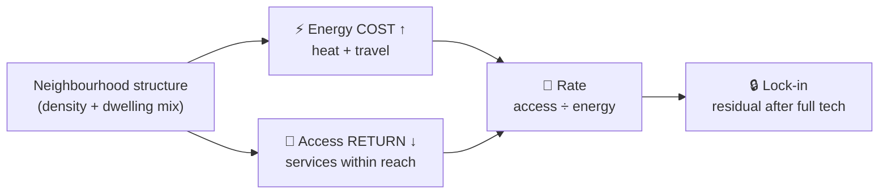
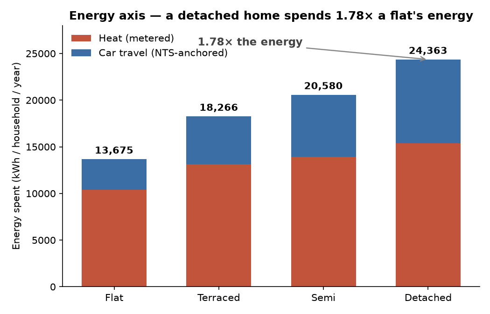
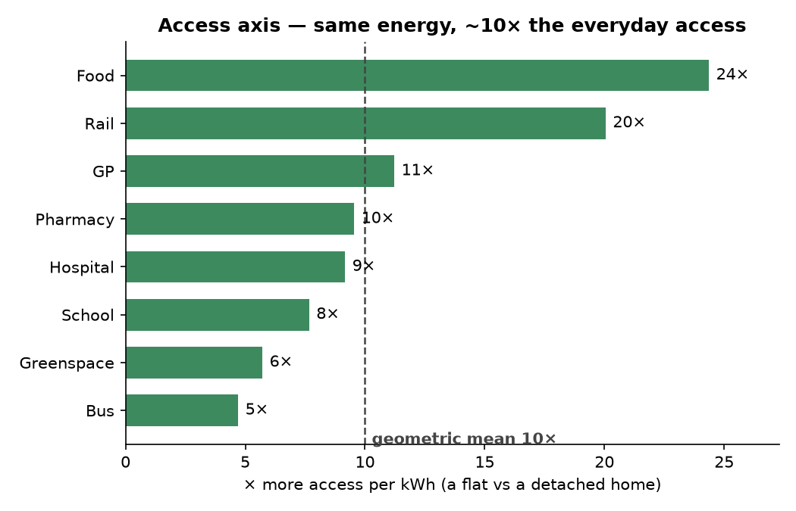

# The NEPI Argument — canonical statement

**Purpose.** Single source of truth for *what NEPI claims and why*. Everything else expands
or supports it:

| Doc | Role |
|-----|------|
| **`paper/argument.md`** (this file) | The argument: hypothesis + claims + reasoning, distilled |
| [`PAPER.md`](../PAPER.md) | The formal IMRaD expansion — **⏸ DEFERRED** (old three-surface framing; next phase) |
| [`paper/methodology_review.md`](methodology_review.md) | Adversarial audit — where it's weak |
| [`paper/robustness_plan.md`](robustness_plan.md) | The worklist of fixes |
| [`README.md`](../README.md) | Public pitch + status |

Confidence tags: **[solid]** (verified, multiple methods agree), **[provisional]** (one
method), **[open]** (identified, not yet done). Numbers are current national-OA estimates
(~174k OAs, all from open measured data).

> ## ⏸ Scope — current focus (read this first)
>
> The live work is **this argument** and the **processing pipeline** — making both watertight.
> The **paper (`PAPER.md`) is deferred** (its body still carries the old *three-surface / A–G*
> framing). The **Atlas and the retired three-surface code** (the A–G scorecard + bands, the
> empirical access-penalty model, the four XGBoost planning models, and the static site) have
> been **removed** in the two-axis migration and will be rebuilt fresh later — git history holds
> them. Wherever anything conflicts, **this document is authoritative.**

---

## 1. Hypothesis — two axes, and a rate

> Neighbourhood form shapes two things a household experiences: the **energy** it spends —
> to heat the home and to travel — and the **access** it gets to everyday destinations. The
> measure of a place is **not how much energy it consumes, but how much access that energy
> buys** — function per unit energy (the trophic view: a dense neighbourhood passes energy
> through many layers; sprawl dissipates it in one pass).

So the argument has **two measured axes** and a **rate**, not three summed surfaces:

- **⚡ Energy** (kWh/household/year) = **heat** (metered) + **car travel** (anchored to
  measured NTS mileage). What the household spends.
- **🌳 Access** = the **count of everyday services within a walkable catchment** (measured from
  the street network; can report **zero**). What the place gives back.
- **📐 The rate** = access ÷ energy. The headline: compact form delivers more access per kWh.

Each axis must survive the same test: *is the association with form real, or an artefact of
who lives there and what they already own?* The two axes **share a cause** — compact form
drives both — but are kept separate because they differ in **what technology can fix**: energy
is partly optimisable (insulate, electrify), access is structurally locked (§4). That
difference is the lock-in story.

---

## At a glance

**The claim in one line.** A compact neighbourhood spends **0.56× the energy** of a sprawling
one **and** buys **~10× the everyday access per kWh** — the measure of a place is not how much
energy it consumes, but how much access that energy buys.

| Axis | Headline |
|---|---|
| ⚡ **Energy** | Flat 13,675 → Detached **24,363** kWh/hh/yr (**1.78×**) |
| 🌳 **Access** | a flat reaches **~10×** the everyday services per kWh (5× buses → 24× shops) |
| 🔒 **Lock-in** | full insulation + EVs still leave a **1.44×** energy gap; the access deficit is **100%** locked |

**Evidence base — data → method → finding** (all sources open and measured):

| Component | Data source | Method | Finding |
|---|---|---|---|
| **Heat** | DESNZ metered gas + electricity → OA; Census 2021 TS044 dwelling type | median per household by dominant type; same-size + full-sample decomposition | Detached ≈ **1.5×** a flat (intrinsic ≈ 1.15×) |
| **Travel** | NTS9904 mileage × ONS 2021 RUC; Census TS045 cars, TS058 commute; DVLA fleet | constrained disaggregation (class marginal conserved) × fleet intensity | Detached ≈ **2.8×** a flat; 24–37% of energy |
| **Energy (total)** | the two rows above | median of the per-OA total | **1.78×** flat → detached |
| **Access** | cityseer counts within 1,600 m of FSA, NaPTAN, GIAS, NHS, OS greenspace | count per service ÷ household energy; flat vs detached | **~10×** more access per kWh |
| **Lock-in** | EPC best-fabric (POTENTIAL) intensity × floor area; EV fleet intensity | recompute the energy axis at best fabric + full electrification | residual **1.44×**; access unchanged |

**How the argument builds.** One structural cause drives a *cost* and a *return*; technology
reaches only the cost.

*Technology can cut the **cost** (insulate the homes, electrify the cars); it cannot move the
**return** (the GP stays far) — so even fully decarbonised, sprawl delivers less access per Joule.*

**The two axes, measured** (reproduce both: `uv run python stats/argument_figures.py`):

---

## 2. The Energy axis (heat + travel)

Energy is the one thing we can largely **measure**: metered heating, plus car travel
anchored to measured national mileage. Both halves below.

### 2a. Form — heating energy and dwelling form

**Question.** Does low-density form (detached) **intrinsically** use more heating energy than
compact form (flats) — or is the difference just bigger homes and more people?

**Data.** Outcome = **official metered energy** (DESNZ sub-national gas + electricity → OA;
real bills, not modelled). Dwelling type from Census 2021 TS044 ("flat" = purpose-built
blocks only).

**Observation [solid].** Detached neighbourhoods use **~1.5× the energy per household of
flats** (≈ 10,200 → 15,500 kWh/yr); 1.35× per person.

**Why no single "per X" settles it [solid].** Every denominator forces a slope of 1 and
distorts something else. **Per-m² is actively misleading** — energy ∝ floor area^**0.68**, so
kWh/m² mechanically *falls* with size, flattering large dwellings. The question is only
answered by **comparing like-for-like**.

**Same-size test [solid].** Flat areas ≈ 44–83 m², detached ≈ 71–163 m² — overlapping only
near 77 m². Where they overlap (~600 comparable neighbourhoods, holding size *and* household
size): **detached = 1.20×** a flat (N=637, p<10⁻⁵); corroborated by quintile stratification
(1.12–1.17×) and a full-sample decomposition (1.14×).

**Decomposition of the 1.5× [solid].** ~63% is the **entangled** bigger-dwellings-+-more-
people bundle (size and occupancy collinear — can't be split); ~7% age/income; **~30% is the
intrinsic form/fabric penalty ≈ 1.15× (1.12–1.20×)**.

**Causal reading [provisional].** Dwelling size is a *consequence* of low-density form
(mediator); household size is *self-selection* (confound). The stock can't disentangle them —
which is itself the finding: low density, big dwellings, and big households are built together.

**Confounds checked [solid].** Build age robust (1.47–1.50× across specs; detached and flats
same ~1971 vintage). Boundary-straddle OAs de-duplicated.

**Under-recording check [solid].** Flats *are* under-recorded (26% flagged, communal/bulk
gas; coverage 0.81 vs 0.96–0.99); detached are under-recorded the other way (14% off-gas).
Net is modest: well-measured OAs give **1.42×** vs 1.52×. The premium is robust at ~1.4–1.5×.

**Claim.** Total ≈ **1.5×** (well-measured ≈1.4×) — the bill. Intrinsic ≈ **1.15×** — the
fabric penalty holding size/occupancy/age/income constant. The ⅔ between is the inseparable
size+people bundle low-density form co-produces. Per-m² dropped; per-household headline.

### 2b. Travel — car-travel energy by constrained disaggregation

**Question.** How much energy does a household spend on car travel — *all* trips, per place —
not just the commute?

**The undercount [solid].** The old Mobility figure was **commute-only** (journey to work) — a
**~6× undercount** of total car travel. It made travel look like ~8% of household energy when
it is really ~25–40%.

**The data gap.** No open dataset measures *total local vehicle mileage*: the all-trip
origin-destination matrix is commercial (mobile-network, ~£10k+); residence-linked MOT
mileage is access-restricted; open data gives only car *ownership* + *commute* + national
averages.

**The method — constrained disaggregation (open, measured-anchored) [solid].**
- **Anchor (measured):** NTS9904 2024 — car-driver miles/person by **2021 rural-urban class**
  of residence (all-purpose, residence-based; **2,534 urban → 5,217 rural** mi/person).
- **Allocate (measured per-OA):** cars-per-person + commute distance redistribute mileage
  *within* each class.
- **Conserve:** each class's population-weighted mean reproduces the NTS figure **exactly**
  (verified to the integer) — measured total preserved, each OA varies locally, **no
  double-count**.
- **Energy:** × fleet intensity (DVLA `bev_share`, EV vs ICE).

**Result [solid].** Car travel **Flat 3,239 → Detached 9,073 kWh/hh** (≈2.8×); travel is
**24–37%** of household energy.

**Measured vs assumed.** *Measured per place:* car ownership, commute distance, household
size, fleet mix, + the NTS class mileage anchor. *National constants only:* ECUK energy-per-km
and one within-class commute elasticity (0.3).

### Combined energy axis [solid]

| Type | heat | car travel | **total** |
|---|---:|---:|---:|
| Flat | 10,196 | 3,239 | **13,675** |
| Detached | 15,462 | 9,073 | **24,363** |

**Flat→Detached total energy gradient = 1.78×.**

*(The **total** is the median of each OA's heat + travel; medians are not additive, so it does
not equal the heat and travel column medians summed. The gradient uses this per-OA total —
consistent with the lock-in baseline in §5.)*

---

## 3. The Access axis — what your energy buys

**The headline [solid].** Kilowatt for kilowatt, a **compact neighbourhood delivers ~10× the
everyday access of a sprawling one** — **11× the GPs, 24× the shops, 20× the rail**, ~5× the
buses and greenspace (geometric mean **10.0×**). For the *same* energy, you reach an order of
magnitude more of everyday life.

**Why it's so large.** Two penalties stack: a detached neighbourhood has **~5× fewer** services
within reach **and** burns **~1.8× the energy** — so per kWh it buys roughly a *tenth* of the
access. *Pay more, get less.*

**The intuition.** Two households on the same energy budget. The flat lives in a **five-minute
world** — GP, school, station, ~50 shops, all within a walk. The detached one spends *more*
energy to live in a **drive-for-everything world** — often no GP, no station, a handful of shops
within reach.

**The measure.** Access = the **count of each everyday service within a 1,600 m catchment**
(local / active-travel range) — concrete, measured, and able to report **zero**, which nearest
distance cannot. Read three ways:

| within 1,600 m | Flat | Detached | % detached with *zero* | × access/kWh |
|---|---:|---:|---:|---:|
| GP | 5 | 1 | **39%** | 11× |
| Hospital | 10 | 1 | 32% | 9× |
| Pharmacy | 5 | 1 | 27% | 10× |
| School | 14 | 3 | 7% | 8× |
| Food | 54 | 4 | 11% | 24× |
| Greenspace | 25 | 9 | 1% | 6× |
| Bus | 79 | 28 | 8% | 5× |
| Rail | 3 | 0 | **73%** | 20× |
| **Overall** | | | | **10×** |

(Full table: `stats/access_profile.py`.)

**Claim.** Access is the **return** — what a household gets for living there — kept on its own
axis, never converted into energy. Compact form delivers far more of it per unit energy, service
by service; sprawl households, despite spending *more* energy, often have **nothing** within a
walk.

---

## 4. The rate, and what explains it

**The rate [solid].** Energy and access, side by side: a flat neighbourhood spends **0.56×**
the energy of a detached one (13,675 vs 24,363) **and** reaches **~10× the everyday services
per kWh** (§3). **Compact form delivers far more access per unit energy.** This is a ratio of
two measured quantities — descriptive, *no model required*.

**What explains it [solid].** Neighbourhood structure — **residential density + dwelling mix** —
explains a large share of *both* axes:
- **Access (catchment counts):** directly structural — compact form puts destinations close.
- **Energy:** density + dwelling mix explain **~46% of total household energy** (R²), via two
  channels: **dwelling mix → heating** (flat-heavy areas use less; R²≈0.23) and **density →
  travel** (compact areas drive far less; R²≈0.33–0.58). *(Network *pattern* alone — meshedness
  — explains little of energy; it is density and dwelling type that matter.)*

So energy and access are **not independent — they are causally linked**: the access deficit
(everything far) is what *forces* the travel energy. **Travel energy is the energy cost of low
access**; heating is the separate, dwelling-driven component.

**Why keep two axes, then?** Not because they have different drivers (they don't) — but because
they differ in **what technology can fix**:
- **Energy is partly tech-optimisable** — insulate the homes, electrify the cars.
- **Access is structurally locked** — no technology moves the GP closer.

This is the **lock-in**, and the rate (access per energy) is what makes it legible: even fully
decarbonised, sprawl delivers less access per Joule, because the access deficit is structural
and permanent without rebuilding.

> Corrected causal claim: compact form drives **both** the access *and* the energy — they are the
> **return** and the **cost** of the same structural cause. The rate matters because the cost can
> be optimised by technology while the return (access) cannot.

---

## 5. Lock-in — why the penalty survives decarbonisation

Structure drives both axes (§4), but technology can reach only one of them — the
carbon/infrastructure **lock-in** (Seto et al. 2016; Unruh 2000): built form fixes energy
demand for decades regardless of technology.

- **Electrification** cuts energy *per mile* (EV ~0.20 vs ICE ~0.58 kWh/vkm) — **not the miles**.
- **Insulation** cuts loss *per m²* — **not** the dwelling's **size or exposed surface**.

**Quantified [solid]** (`stats/lock_in.py`: best-practice fabric — EPC-potential intensity ×
floor area — + full electrification):

| Flat→Detached | Flat | Detached | gap |
|---|---:|---:|---:|
| Energy now | 13,675 | 24,363 | **1.78×** |
| Energy optimised | 9,788 | 14,136 | **1.44×** |

Perfect optimisation closes ~60% of the energy **gap**, but a residual **~1.44×** survives, and it
splits across **both** halves — **heat/size ~2,375 kWh and travel/miles ~2,050 kWh**:

- **Heat lock-in is hard** — at best fabric, detached still uses **1.28×** a flat's heat, driven
  by **size** (≈103 vs 62 m²). Insulation fixes per-m² efficiency, not floor area.
- **Travel lock-in is hard** — electrification preserves the **2.8× mileage ratio exactly**
  (detached drives 2.8× the miles, electric or not).
- **Access lock-in is total** — the Access axis is tech-immune: no technology moves the GP closer.

The pattern is general: **technology optimises per-*unit* efficiency (per-m², per-mile) but not
the structural *quantities* (floor area, miles, distance).** So the residual penalty = bigger
homes (heat) + longer trips (travel) + the **entire** access deficit. This is what the trophic
framing makes legible: even fully decarbonised, sprawl delivers **less function per Joule** — you
can clean the energy, but you cannot make the desert a rainforest without rebuilding it.

---

## 6. Claims ladder (at a glance)

| # | Claim | Status |
|---|-------|--------|
| **Energy — Form (heat)** | | |
| F1 | Detached neighbourhoods use ~1.5× a flat's metered energy/household | **solid** |
| F2 | Per-m² is invalid (energy ∝ floor area^0.68) | **solid** |
| F3 | Same-size intrinsic form penalty ≈ 1.15× (1.12–1.20×) | **solid** |
| F4 | ~63% of the gap is the entangled size+people bundle; ~30% intrinsic | **solid** |
| F5 | Size = form consequence; people = self-selection; inseparable | provisional |
| F6 | Flat under-recording inflates the gap ~0.1×, doesn't overturn it (≈1.4× well-measured) | **solid** |
| **Energy — Travel** | | |
| T1 | Commute-only undercounts total car travel ~6× | **solid** |
| T2 | No open dataset measures total local mileage (OD commercial, MOT restricted) | **solid** |
| T3 | Disaggregation conserves the NTS class marginal exactly | **solid** |
| T4 | Car travel ≈ 2.8× flat→detached; 24–37% of household energy | **solid** |
| E1 | Combined energy (heat+travel) ≈ 1.78× flat→detached | **solid** |
| **Access** | | |
| A1 | Compact form delivers ~10× the everyday access per kWh (5× buses → 24× shops) | **solid** |
| A2 | Counts within 1,600 m: 39% of detached have no GP within reach, 73% no rail | **solid** |
| **Rate + structure** | | |
| R1 | Compact form delivers more access per unit energy (descriptive) | **solid** |
| R2 | Structure (density + dwelling mix) explains ~46% of total energy *and* the access gradient — both axes structural | **solid** |
| R3 | Energy & access are cost & return of one structural cause; differ in tech-optimisability (the lock-in) | provisional |
| **Lock-in** | | |
| L1 | Perfect optimisation leaves ~40% of the energy gap (residual ~1.44×), split heat/size (1.28×) + travel/miles (2.8×) | **solid** |
| L2 | Tech optimises per-unit efficiency, not structural quantities (size, miles); access is 100% tech-immune | **solid** |

---

## 7. Open items — next

**Done.**

- **Lock-in** (`stats/lock_in.py`, best-fabric × size + full EV): current gradient 1.78× →
  optimised **1.44×**, ~40% of the penalty survives, split heat/size (1.28×) + travel/miles
  (2.8×), access 100% locked. *(Minor caveat: optimised heat is EPC-modelled potential × area
  while current is metered — a basis mix that doesn't change the conclusion.)*
- **Access axis** (`stats/access_profile.py`): finalised as **counts within a 1,600 m
  catchment** (able to report zero), with the per-kWh rate (~10×) as the headline.

**Open.**

- **Rate circularity.** Travel energy is partly the *cost of low access*, so the rate
  (access ÷ energy) contains the inverse of its own numerator. Consider rating against heat +
  an idealised/electrified travel cost, so the rate measures the *structural* return cleanly.

**Deferred / removed — next phase (see scope banner at top).**

- **The paper (`PAPER.md`)** — deferred. The IMRaD body still carries the old three-surface /
  A–G numbers; to be rewritten to the two-axis frame after the argument + pipeline are locked.
- **The Atlas + retired three-surface code** — the A–G scorecard + bands, the empirical
  access-penalty model, the four XGBoost planning models, and the static site have been
  **removed** in the two-axis migration (git history holds them); a two-axis Atlas will be
  rebuilt fresh.

---

## Appendix — superseded framing (for the record)

Earlier drafts summed three kWh "surfaces" (Form + Mobility + Access penalty) and banded the
total A–G. That cost-stack was abandoned because (a) it inverted the trophic philosophy
(measuring total consumption, not function-per-energy), and (b) the Access penalty was a
regression slice of the same transport variable as Mobility, double-counting it. The two-axis
frame above replaces it: Access is the *return*, measured as counts within a catchment, never
summed into the energy cost. The old A–G banding and the empirical access-penalty model are
retired.
