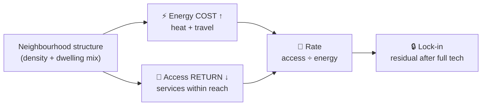

# The NEPI Scaffold

## 1. The Trophic Hypothesis

> Neighbourhood form shapes two things a household experiences: the **energy** it spends —
> to heat the home and to travel — and the **access** it gets to everyday destinations. The trophic view Take the position that the
> measure of a place is **not Purely how much energy it consumes, but how much access that energy
> buys** — function per unit energy (the trophic view: a dense neighbourhood passes energy
> through many layers; sprawl dissipates it in one pass Using Jane Jacobs' rainforest vs desert analogy in terms of extracting energy from the sun to support ecosystems The former is much more efficient in terms of how much use it gets per unit energy. ).

The framing has **two measured axes** and a **rate**:

- **Energy** (kWh/household/year) = **heat** (metered) + **car travel** (anchored to
  measured NTS mileage). What the household spends.
- **Access** = the **count of everyday services within a walkable catchment** (measured from
  the street network; can report **zero**). What the place gives back. Access to employment and access to amenities, but the principle is also more general.
- **The rate** = access ÷ energy. The headline: compact form delivers more access per kWh.

Each axis must survive the same test: _is the association with form real, or an artefact of who lives there?_ Compact form effects both axes but they are kept separate because they differ in **what technology can fix**: energy
is partly optimisable (insulate, electrify), access is structurally locked (§4) which has implications for lock-in.

---

## At a glance

**The claim in one line.** A compact neighbourhood spends **0.57× the energy** of a sprawling
one **and** buys **~10× the everyday access per kWh** — the measure of a place is not how much
energy it consumes, but how much access that energy buys.

| Axis           | Headline                                                                                        |
| -------------- | ----------------------------------------------------------------------------------------------- |
| ⚡ **Energy**  | Flat 13,674 → Detached **23,832** kWh/hh/yr (**1.74×**)                                         |
| 🌳 **Access**  | a flat reaches **~10×** the everyday services per kWh — and **14× the jobs** (5× buses → 20× rail) |
| 🔒 **Lock-in** | full insulation + EVs still leave a **1.47×** energy gap; the access deficit is **100%** locked |

**Evidence base — data → method → finding** (all sources open and measured):

| Component          | Data source                                                                  | Method                                                                       | Finding                                        |
| ------------------ | ---------------------------------------------------------------------------- | ---------------------------------------------------------------------------- | ---------------------------------------------- |
| **Heat**           | DESNZ metered gas + electricity → OA; Census 2021 TS044 dwelling type        | median per household by dominant type; same-size + full-sample decomposition | Detached ≈ **1.5×** a flat (intrinsic ≈ 1.15×) |
| **Travel**         | NTS9904 mileage × ONS 2021 RUC; Census TS045 cars, TS058 commute; DVLA fleet | constrained disaggregation (class marginal conserved) × fleet intensity      | Detached ≈ **2.8×** a flat; 24–37% of energy   |
| **Energy (total)** | the two rows above                                                           | median of the per-OA total                                                   | **1.74×** flat → detached                      |
| **Access**         | straight-line counts within 1,600 m — jobs (Census WP101EW), food + grocery (FSA), GP/pharmacy/hospital (NHS), school (GIAS), greenspace, bus, rail (NaPTAN) | KD-tree count per service ÷ household energy; flat vs detached | **~10×** more access per kWh; **14× the jobs** |
| **Lock-in**        | EPC best-fabric (POTENTIAL) intensity × floor area; EV fleet intensity       | recompute the energy axis at best fabric + full electrification              | residual **1.47×**; access unchanged           |

**How the argument builds.** One structural cause drives a _cost_ and a _return_; technology
reaches only the cost.

_Technology can cut the **cost** (insulate the homes, electrify the cars); it cannot move the
**return** (the GP stays far) — so even fully decarbonised, sprawl delivers less access per Joule._

**The two axes, measured** (reproduce both: `uv run python stats/argument_figures.py`):

---

## 2. The Energy axis (heat + travel)

Energy is the one thing we can largely **measure**: metered heating, plus car travel
anchored to measured national mileage. Both halves below.

### 2a. Form — heating energy and dwelling form

**Question.** Does low-density form (detached) **intrinsically** use more heating energy than
compact form (flats) — or is the difference just bigger homes and more people?

**Data.** Outcome = **official metered energy** (DESNZ sub-national gas + electricity → OA;
real bills, not modelled). Dwelling type from Census 2021 TS044 ("flat" = purpose-built
blocks only).

**Observation [solid].** Detached neighbourhoods use **~1.5× the energy per household of
flats** (≈ 10,200 → 15,500 kWh/yr); 1.35× per person.

**Why no single "per X" settles it [solid].** Every denominator forces a slope of 1 and
distorts something else. **Per-m² is actively misleading** — energy ∝ floor area^**0.68**, so
kWh/m² mechanically _falls_ with size, flattering large dwellings. The question is only
answered by **comparing like-for-like**.

**Same-size test [solid].** Flat areas ≈ 44–83 m², detached ≈ 71–163 m² — overlapping only
near 77 m². Where they overlap (~600 comparable neighbourhoods, holding size _and_ household
size): **detached = 1.20×** a flat (N=637, p<10⁻⁵); corroborated by quintile stratification
(1.12–1.17×) and a full-sample decomposition (1.14×).

**Decomposition of the 1.5× [solid].** ~63% is the **entangled** bigger-dwellings-+-more-
people bundle (size and occupancy collinear — can't be split); ~7% age/income; **~30% is the
intrinsic form/fabric penalty ≈ 1.15× (1.12–1.20×)**.

**Causal reading [provisional].** Dwelling size is a _consequence_ of low-density form
(mediator); household size is _self-selection_ (confound). The stock can't disentangle them —
which is itself the finding: low density, big dwellings, and big households are built together.

**Confounds checked [solid].** Build age robust (1.47–1.50× across specs; detached and flats
same ~1971 vintage). Boundary-straddle OAs de-duplicated.

**Under-recording check [solid].** Flats _are_ under-recorded (26% flagged, communal/bulk
gas; coverage 0.81 vs 0.96–0.99); detached are under-recorded the other way (14% off-gas).
Net is modest: well-measured OAs give **1.42×** vs 1.52×. The premium is robust at ~1.4–1.5×.

**Claim.** Total ≈ **1.5×** (well-measured ≈1.4×) — the bill. Intrinsic ≈ **1.15×** — the
fabric penalty holding size/occupancy/age/income constant. The ⅔ between is the inseparable
size+people bundle low-density form co-produces. Per-m² dropped; per-household headline.

### 2b. Travel — car-travel energy by constrained disaggregation

**Question.** How much energy does a household spend on car travel — _all_ trips, per place —
not just the commute?

**The undercount [solid].** The old Mobility figure was **commute-only** (journey to work) — a
**~6× undercount** of total car travel. It made travel look like ~8% of household energy when
it is really ~25–40%.

**The data gap.** No open dataset measures _total local vehicle mileage_: the all-trip
origin-destination matrix is commercial (mobile-network, ~£10k+); residence-linked MOT
mileage is access-restricted; open data gives only car _ownership_ + _commute_ + national
averages.

**The method — constrained disaggregation (open, measured-anchored) [solid].**

- **Anchor (measured):** NTS9904 2024 — car-driver miles/person by **2021 rural-urban class**
  of residence (all-purpose, residence-based; **2,534 urban → 5,217 rural** mi/person).
- **Allocate (measured per-OA):** cars-per-person + commute distance redistribute mileage
  _within_ each class.
- **Conserve:** each class's population-weighted mean reproduces the NTS figure **exactly**
  (verified to the integer) — measured total preserved, each OA varies locally, **no
  double-count**.
- **Energy:** × fleet intensity (DVLA `bev_share`, EV vs ICE).

**Result [solid].** Car travel **Flat 3,240 → Detached 9,272 kWh/hh** (≈2.9×); travel is
**24–37%** of household energy.

**Measured vs assumed.** _Measured per place:_ car ownership, commute distance, household
size, fleet mix, + the NTS class mileage anchor. _National constants only:_ ECUK energy-per-km
and one within-class commute elasticity (0.3).

### Combined energy axis [solid]

| Type     |   heat | car travel |  **total** |
| -------- | -----: | ---------: | ---------: |
| Flat     | 10,194 |      3,240 | **13,674** |
| Detached | 15,020 |      9,272 | **23,832** |

**Flat→Detached total energy gradient = 1.74×.**

_(The **total** is the median of each OA's heat + travel; medians are not additive, so it does
not equal the heat and travel column medians summed. The gradient uses this per-OA total —
consistent with the lock-in baseline in §5.)_

---

## 3. The Access axis — what your energy buys

**The headline [solid].** Kilowatt for kilowatt, a **compact neighbourhood delivers ~10× the
everyday access of a sprawling one** — **11× the GPs, 18× the shops, 20× the rail, 14× the jobs**,
~5× the buses (geometric mean **9.8×**). For the _same_ energy, you reach an order of
magnitude more of everyday life.

**Why it's so large.** Two penalties stack: a detached neighbourhood has **~5–10× fewer** services
within reach **and** burns **~1.7× the energy** — so per kWh it buys roughly a _tenth_ of the
access. _Pay more, get less._

**The intuition.** Two households on the same energy budget. The flat lives in a **five-minute
world** — GP, school, station, ~50 shops, all within a walk. The detached one spends _more_
energy to live in a **drive-for-everything world** — often no GP, no station, a handful of shops
within reach.

**The measure.** Access = the **count of each everyday service within a 1,600 m catchment**
(straight-line, from the OA centroid) — concrete, measured, and able to report **zero**, which
nearest distance cannot. Read three ways:

| within 1,600 m | Flat   | Detached | % detached with _zero_ | × access/kWh |
| -------------- | -----: | -------: | ---------------------: | -----------: |
| GP             |      9 |        1 |                **42%** |          11× |
| Pharmacy       |      8 |        1 |                    34% |          10× |
| Hospital       |     22 |        2 |                    36% |           8× |
| School         |     29 |        6 |                    14% |           7× |
| Food           |    156 |       15 |                     9% |          18× |
| Grocery        |     82 |        8 |                    16% |          14× |
| Greenspace     |     57 |       19 |                     3% |           6× |
| Bus            |    142 |       42 |                    10% |           5× |
| Rail           |      5 |        0 |                **72%** |          20× |
| **Jobs**       | 14,455 |    2,042 |                      — |          14× |
| **Overall**    |        |          |                        |     **9.8×** |

(Full table: `stats/access_profile.py`. Access is straight-line KD-tree, not network distance —
a conservative floor, since sprawl's poor street permeability would only widen the gap.)

**Claim.** Access is the **return** — what a household gets for living there — kept on its own
axis, never converted into energy. Compact form delivers far more of it per unit energy, service
by service; sprawl households, despite spending _more_ energy, often have **nothing** within a
walk.

---

## 4. The rate, and what explains it

**The rate [solid].** Energy and access, side by side: a flat neighbourhood spends **0.57×**
the energy of a detached one (13,674 vs 23,832) **and** reaches **~10× the everyday services
per kWh** (§3). **Compact form delivers far more access per unit energy.** This is a ratio of
two measured quantities — descriptive, _no model required_.

**What explains it [solid].** Neighbourhood structure — **residential density + dwelling mix** —
drives _both_ axes:

- **Access:** directly structural — compact form puts destinations within reach.
- **Energy:** dwelling mix drives heating (flat-heavy areas use less) and density drives travel
  (compact areas drive far less).

So energy and access are **not independent — they are causally linked**: the access deficit
(everything far) is what _forces_ the travel energy. **Travel energy is the energy cost of low
access**; heating is the separate, dwelling-driven component.

**Why keep two axes, then?** Not because they have different drivers (they don't) — but because
they differ in **what technology can fix**:

- **Energy is partly tech-optimisable** — insulate the homes, electrify the cars.
- **Access is structurally locked** — no technology moves the GP closer.

This is the **lock-in**, and the rate (access per energy) is what makes it legible: even fully
decarbonised, sprawl delivers less access per Joule, because the access deficit is structural
and permanent without rebuilding.

> Corrected causal claim: compact form drives **both** the access _and_ the energy — they are the
> **return** and the **cost** of the same structural cause. The rate matters because the cost can
> be optimised by technology while the return (access) cannot.

---

## 5. Lock-in — why the penalty survives decarbonisation

Structure drives both axes (§4), but technology can reach only one of them — the
carbon/infrastructure **lock-in** (Seto et al. 2016; Unruh 2000): built form fixes energy
demand for decades regardless of technology.

- **Electrification** cuts energy _per mile_ (EV ~0.20 vs ICE ~0.58 kWh/vkm) — **not the miles**.
- **Insulation** cuts loss _per m²_ — **not** the dwelling's **size or exposed surface**.

**Quantified [solid]** (`stats/lock_in.py`: best-practice fabric — EPC-potential intensity ×
floor area — + full electrification):

| Flat→Detached    |   Flat | Detached |       gap |
| ---------------- | -----: | -------: | --------: |
| Energy now       | 13,674 |   23,832 | **1.74×** |
| Energy optimised |  9,788 |   14,420 | **1.47×** |

Perfect optimisation closes ~54% of the energy **gap**, but a residual **~1.47×** survives, and it
splits across **both** halves — **heat/size ~2,575 kWh and travel/miles ~2,119 kWh**:

- **Heat lock-in is hard** — at best fabric, detached still uses **1.30×** a flat's heat, driven
  by **size** (detached dwellings are markedly larger). Insulation fixes per-m² efficiency, not floor area.
- **Travel lock-in is hard** — electrification preserves the **≈2.9× mileage ratio exactly**
  (detached drives ~2.9× the miles, electric or not).
- **Access lock-in is total** — the Access axis is tech-immune: no technology moves the GP closer.

The pattern is general: **technology optimises per-_unit_ efficiency (per-m², per-mile) but not
the structural _quantities_ (floor area, miles, distance).** So the residual penalty = bigger
homes (heat) + longer trips (travel) + the **entire** access deficit. This is what the trophic
framing makes legible: even fully decarbonised, sprawl delivers **less function per Joule** — you
can clean the energy, but you cannot make the desert a rainforest without rebuilding it.

---

## 6. Claims ladder (at a glance)

| #                        | Claim                                                                                                               | Status      |
| ------------------------ | ------------------------------------------------------------------------------------------------------------------- | ----------- |
| **Energy — Form (heat)** |                                                                                                                     |             |
| F1                       | Detached neighbourhoods use ~1.5× a flat's metered energy/household                                                 | **solid**   |
| F2                       | Per-m² is invalid (energy ∝ floor area^0.54)                                                                        | **solid**   |
| F3                       | Same-size intrinsic form penalty ≈ 1.15× (1.12–1.20×)                                                               | **solid**   |
| F4                       | ~63% of the gap is the entangled size+people bundle; ~30% intrinsic                                                 | **solid**   |
| F5                       | Size = form consequence; people = self-selection; inseparable                                                       | provisional |
| F6                       | Flat under-recording inflates the gap ~0.1×, doesn't overturn it (≈1.4× well-measured)                              | **solid**   |
| **Energy — Travel**      |                                                                                                                     |             |
| T1                       | Commute-only undercounts total car travel ~6×                                                                       | **solid**   |
| T2                       | No open dataset measures total local mileage (OD commercial, MOT restricted)                                        | **solid**   |
| T3                       | Disaggregation conserves the NTS class marginal exactly                                                             | **solid**   |
| T4                       | Car travel ≈ 2.9× flat→detached; 24–37% of household energy                                                         | **solid**   |
| E1                       | Combined energy (heat+travel) ≈ 1.74× flat→detached                                                                 | **solid**   |
| **Access**               |                                                                                                                     |             |
| A1                       | Compact form delivers ~10× the everyday access per kWh (5× buses → 20× rail; 14× jobs)                              | **solid**   |
| A2                       | Counts within 1,600 m: 42% of detached have no GP within reach, 72% no rail                                         | **solid**   |
| **Rate + structure**     |                                                                                                                     |             |
| R1                       | Compact form delivers more access per unit energy (descriptive)                                                     | **solid**   |
| R2                       | Structure (density + dwelling mix) drives both total energy _and_ the access gradient — both axes structural        | **solid**   |
| R3                       | Energy & access are cost & return of one structural cause; differ in tech-optimisability (the lock-in)              | provisional |
| **Lock-in**              |                                                                                                                     |             |
| L1                       | Perfect optimisation leaves ~46% of the energy gap (residual ~1.47×), split heat/size (1.30×) + travel/miles (2.9×) | **solid**   |
| L2                       | Tech optimises per-unit efficiency, not structural quantities (size, miles); access is 100% tech-immune             | **solid**   |

---

## 7. Open items — next

**Done.**

- **Lock-in** (`stats/lock_in.py`, best-fabric × size + full EV): current gradient 1.74× →
  optimised **1.47×**, ~46% of the penalty survives, split heat/size (1.30×) + travel/miles
  (2.9×), access 100% locked. _(Minor caveat: optimised heat is EPC-modelled potential × area
  while current is metered — a basis mix that doesn't change the conclusion.)_
- **Access axis** (`stats/oa_access.py` + `access_profile.py`): **straight-line KD-tree counts
  within a 1,600 m catchment** (no cityseer), now including **jobs** (Census WP101EW) and
  **grocery** (FSA retail); per-kWh rate **9.8×** (and 14× the jobs) as the headline.

**Open.**

- **Rate circularity.** Travel energy is partly the _cost of low access_, so the rate
  (access ÷ energy) contains the inverse of its own numerator. Consider rating against heat +
  an idealised/electrified travel cost, so the rate measures the _structural_ return cleanly.

**Pending — next phase (see scope banner at top).**

- **The paper (`PAPER.md`)** — deferred.
- **The Atlas** — pending: reevaluate the place-scoring and the XGBoost planning models for the
  two-axis frame (their code lives in git history, removed from the tree in the migration). The
  summed cost-stack and its access-penalty regression are superseded — they double-counted
  travel (see Appendix) — but the scoring and models can be reapplied to the two-axis output.

---

## Appendix — superseded framing (for the record)

Earlier drafts summed three kWh "surfaces" (Form + Mobility + Access penalty) and banded the
total A–G. That cost-stack was abandoned because (a) it inverted the trophic philosophy
(measuring total consumption, not function-per-energy), and (b) the Access penalty was a
regression slice of the same transport variable as Mobility, double-counting it. The two-axis
frame above replaces it: Access is the _return_, measured as counts within a catchment, never
summed into the energy cost. The old summed-total A–G banding and the empirical access-penalty
model are superseded; any future Atlas would score the two-axis output instead.
