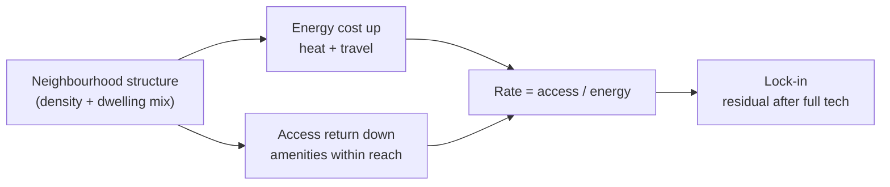

# The NEPI Scaffold

## 1. Hypothesis

The measure of a neighbourhood is not how much energy it consumes, but how much access that energy
buys — function per unit energy. A dense neighbourhood, in Jacobs' analogy, is a rainforest:
energy passes through many layers of exchange before it dissipates. A sprawling one is a desert:
the same energy dissipates in a single pass. NEPI makes this measurable as two axes and a rate.

- **Energy — the cost.** kWh per household per year: metered heat plus car travel. What a
  household spends.
- **Access — the return.** Everyday destinations reachable over the street network. What the place
  gives back. Measured directly, and able to report zero. (Here, amenities; the principle extends
  to employment and other functions.)
- **The rate.** Access per unit energy.

Both axes have one structural cause — residential density and dwelling mix — but they are kept
separate because they differ in **what technology can change**. Energy is partly optimisable
(insulate, electrify); access is fixed by street layout. That asymmetry is the lock-in (§5), and
the rate is what makes it legible.

Each axis is tested the same way: is the association with form real, or an artefact of who lives
there? The design is ecological by necessity — morphology is genuinely an area-level property — so
the Output Area is the correct unit of analysis, not a limitation.

---

## At a glance

A detached neighbourhood spends **1.74×** a flat's household energy, and gets less for it: at the
same distance a flat reaches **4.5–9.5×** more everyday amenities (density); a detached home
matches that count only by driving **2.4× as far**, for **~2.9×** the energy — so **~2.9×** the
access per kWh — while on foot **60% of detached neighbourhoods cannot reach a single GP**.

One structural cause drives a cost and a return; technology reaches only the cost.

**Evidence base** — data, method, finding (all sources open and measured):

| Component  | Data                                                                | Method                                                                  | Finding                                          |
| ---------- | ------------------------------------------------------------------- | ----------------------------------------------------------------------- | ------------------------------------------------ |
| Heat       | DESNZ metered gas + electricity → OA; Census 2021 TS044 type        | median per household by type; same-size overlap + full-sample decomp.   | detached ≈ **1.5×** a flat (intrinsic ≈ 1.15×)   |
| Travel     | NTS9904 mileage × ONS 2021 RUC; Census cars + commute; DVLA fleet   | constrained disaggregation (class marginal conserved) × fleet intensity | detached ≈ **2.9×** a flat; 24–37% of energy     |
| Energy     | the two rows above                                                  | median of the per-OA total                                              | **1.74×** flat → detached                        |
| Access     | network distance over OS Open Roads (cityseer); per-OA curve to 25.6 km | walkable (1.6 km), like-for-like (matched distance), rate (÷ energy) | rate **~2.9×**/kWh; like-for-like **4.5–9.5×**   |
| Lock-in    | EPC best-fabric intensity × floor area; EV fleet intensity          | recompute the energy axis at best fabric + full electrification         | residual **1.47×**; access unchanged             |

(Reproduce the figures: `uv run python stats/argument_figures.py`.)

---

## 2. Energy — the cost

Energy is the half we can largely measure: metered heating, and car travel anchored to measured
national mileage.

### 2a. Heat

**Question.** Does low-density form intrinsically use more heat, or is the difference just bigger
homes with more people?

**Headline [solid].** Detached neighbourhoods use **~1.5× the metered energy per household** of
flats (10,194 → 15,020 kWh/yr; 1.35× per person). The outcome is official DESNZ metered gas +
electricity — real bills, not modelled; dwelling type is Census 2021 TS044 ("flat" = purpose-built
blocks).

**The unit.** Report **per household** — it matches the bill. **Per-m² is rejected**: heat scales
sub-linearly with floor area (energy ∝ area^0.68), so kWh/m² falls automatically as homes get
bigger and flatters detached. The form question is answered only by comparing **like-for-like**.

**Intrinsic vs entangled [solid].** Where flat and detached neighbourhoods overlap in dwelling size
and household size (~600 comparable OAs near 77 m²), detached uses **1.20×** a flat (N=637,
p<10⁻⁵); quintile stratification gives 1.12–1.17×, a full-sample decomposition 1.14×. Decomposing
the 1.5×: **~63%** is the entangled bigger-homes-plus-more-people bundle (size and occupancy are
collinear and cannot be split), ~7% age/income, and **~30% is the intrinsic form/fabric penalty
≈ 1.15× (1.12–1.20×)**. Causally, dwelling size is a *consequence* of low density (a mediator) and
household size is *self-selection* (a confound); the stock cannot separate them — which is itself
the finding: low density, big dwellings, and big households are built together.

**Robustness [solid].** The premium holds across build-age specifications (1.47–1.50×; detached and
flats share a ~1971 vintage) and boundary-straddle de-duplication. Under-recording cuts both ways —
flats omit communal/bulk gas (26% flagged; coverage 0.81 vs 0.96–0.99), detached omit off-gas
(14%) — and well-measured OAs still give **1.42×** vs 1.52×.

**Claim.** Per household ≈ **1.5×** (well-measured ≈ 1.4×) is the bill; ≈ **1.15×** is the intrinsic
fabric penalty holding size, occupancy, age and income constant; the two-thirds between is the
inseparable size-plus-people bundle that low-density form co-produces.

### 2b. Travel

**Question.** How much energy does a household spend on car travel — *all* trips, per place, not
just the commute?

**The problem.** The commute is roughly one-sixth of car travel; using it alone undercounts ~6×,
making travel look like ~8% of household energy when it is really 25–40%. But no open dataset
measures total local mileage: the all-trip origin–destination matrix is commercial, residence-linked
MOT mileage is access-restricted, and open data gives only car ownership, commute, and national
averages.

**Method [solid] — constrained disaggregation.** Anchor to a measured coarse total and project it
onto OAs. NTS9904 (2024) gives car-driver miles per person by **2021 rural-urban class** of
residence (**2,534 urban → 5,217 rural**). Within each class, cars-per-person and commute distance
redistribute the mileage across OAs, normalised so each class's population-weighted mean reproduces
the NTS figure **exactly** — measured total preserved, each OA varying locally, no double-count.
Mileage × fleet intensity (DVLA `bev_share`, EV vs ICE) gives energy. Only ECUK energy-per-km and
one within-class commute elasticity (0.3) are national constants; ownership, commute, household
size and fleet mix are measured per place.

**Result [solid].** Car travel **Flat 3,240 → Detached 9,272 kWh/hh** (≈ 2.9×); 24–37% of household
energy.

### Combined

| per household / year | heat   | car travel | total      |
| -------------------- | -----: | ---------: | ---------: |
| Flat                 | 10,194 |      3,240 | **13,674** |
| Detached             | 15,020 |      9,272 | **23,832** |

**Total energy gradient = 1.74×** (the median of each OA's heat + travel). Medians are not additive,
so the total is not the column sums; this per-OA total is the lock-in baseline (§5).

---

## 3. Access — the return

**The measure.** For each OA, count the everyday amenities (GP, pharmacy, hospital, school, food,
grocery, greenspace) reachable **over the real road network** — cityseer over OS Open Roads, built
once (`stats/oa_network_access.py`). The full amenity-vs-distance curve is computed for every OA,
from a 1,600 m walk out to a 25.6 km drive, then read **three ways** on the same network ruler (so
the walkable set is a true subset of the drivable). The three numbers separate *what is close*,
*the structural density advantage*, and *what reach costs in energy*.

**[1] The walkable doorstep [solid] — what you reach on foot, free.** Within a 1,600 m network walk
a flat's world is rich; a detached one is barren.

| within 1,600 m (network) | Flat | Detached | % detached zero |
| ------------------------ | ---: | -------: | --------------: |
| GP                       |    5 |        0 |         **60%** |
| Hospital                 |   10 |        0 |             52% |
| School                   |   14 |        2 |             27% |
| Food                     |   93 |        6 |             17% |
| Grocery                  |   48 |        3 |             25% |
| Greenspace               |   25 |        7 |             11% |

A flat reaches **6.8 of 7** everyday destinations on foot; a detached home **4.6**. On the real
streets, **60% of detached neighbourhoods have no GP within a walk**.

**[2] Like-for-like reach [solid] — the density advantage at matched distance.** Hold the distance
*equal* for both types and the flat always reaches far more, because compact form sits in denser
places.

| within the same network distance | Flat : Detached |
| -------------------------------- | --------------: |
| 1,600 m (a walk)                 |        **9.5×** |
| 6,400 m                          |            6.3× |
| 12,800 m                         |            4.8× |
| 25,600 m (the maximum drive)     |        **4.5×** |

At *any* fixed distance the flat reaches **4.5–9.5×** the amenities — even maxed out at 25.6 km,
still 4.5×. This is the pure structural advantage: density, not behaviour.

**[3] The drivable rate [solid] — access per unit energy.** A detached home can only *match* the
flat's amenity count by **driving 2.4× as far** — and that driving is the whole of the
equalisation.

| each OA at its own catchment |  Flat | Detached | Flat : Det |
| ---------------------------- | ----: | -------: | ---------: |
| car-trip catchment (km)      |   7.5 |     18.3 |     (0.4×) |
| amenities reached            | 2,531 |    2,776 |   **0.9×** |
| car-travel energy (kWh)      | 3,240 |    9,272 |     (0.3×) |
| **access per kWh**           |   0.8 |      0.3 |   **2.9×** |

Driving 18.3 km, a detached home reaches what a flat reaches in 7.5 km — *about the same count
(0.9×)* — but for **~2.9× the energy**. So **~2.9× the access per kWh**. (Full output:
`stats/access_profile.py`.)

**Claim.** Three readings of one network curve. On foot, a flat's doorstep is far richer (basket
6.8 vs 4.6; 60% of detached have no GP within a walk). At any matched distance the flat reaches
4.5–9.5× more — the density advantage. A detached home erases the count gap only by driving 2.4× as
far, paying ~2.9× the energy — so ~2.9× the access per kWh. The walkable doorstep is the free
return; the drivable rate is what the rest costs. Access is the return, kept on its own axis, never
summed into the energy cost.

---

## 4. The rate

A flat neighbourhood spends **0.57×** the energy of a detached one (13,674 vs 23,832) and, scoped to
each household's own road-network travel, reaches **~2.9× the access per kWh** — and at any matched
distance **4.5–9.5×** more amenities (§3). This is a ratio of two measured quantities; no model.

**Why the rate lands on the energy ratio.** Structure drives both axes: density both puts
destinations within reach (access) and sets how far you must drive for the rest (travel energy);
dwelling mix drives heating. Energy and access are therefore *causally linked*, not independent —
the access deficit is what forces the travel energy. That the network rate (~2.9×) equals the
travel-energy ratio is the same fact seen twice: fairly scoped, the two forms reach about the same
amenities, so access-per-kWh is essentially the energy cost of reaching them. The rate is therefore
circular by construction — but nothing load-bearing rests on it: the access claim is carried by the
like-for-like number (§3), which compares amenities at a *matched* distance with no energy in it.

**Why keep two axes.** Only because technology can change one and not the other: insulation and
electrification cut the energy cost; nothing moves the GP closer. That asymmetry is the lock-in.

---

## 5. Lock-in — why the penalty survives decarbonisation

Structure drives both axes (§4), but technology reaches only one — the carbon/infrastructure
lock-in (Seto et al. 2016; Unruh 2000): built form fixes energy demand for decades regardless of
technology.

- **Electrification** cuts energy *per mile* (EV ~0.20 vs ICE ~0.58 kWh/vkm) — not the miles.
- **Insulation** cuts loss *per m²* — not the dwelling's size or exposed surface.

**Quantified [solid]** (`stats/lock_in.py`: best-practice fabric — EPC-potential intensity × floor
area — plus full electrification):

| Flat → Detached  |   Flat | Detached |       gap |
| ---------------- | -----: | -------: | --------: |
| Energy now       | 13,674 |   23,832 | **1.74×** |
| Energy optimised |  9,788 |   14,420 | **1.47×** |

Perfect optimisation closes ~54% of the energy gap, but a residual **~1.47×** survives, split across
both halves — heat/size ~2,575 kWh and travel/miles ~2,119 kWh:

- **Heat** — at best fabric, detached still uses **1.30×** a flat's heat, driven by size; insulation
  fixes per-m² efficiency, not floor area.
- **Travel** — electrification preserves the **≈2.9× mileage ratio exactly** (detached drives ~2.9×
  the miles, electric or not).
- **Access** — tech-immune: no technology moves the GP closer.

The pattern is general: **technology optimises per-unit efficiency (per-m², per-mile), not the
structural quantities (floor area, miles, distance).** So the residual is bigger homes (heat) +
longer trips (travel) + the entire access deficit. Even fully decarbonised, sprawl delivers less
function per Joule — you can clean the energy, but you cannot make the desert a rainforest without
rebuilding it.

---

## 6. Open items

**Done.**

- **Energy axis** — metered heat (form decomposition, §2a) + NTS-anchored car travel (§2b);
  combined gradient 1.74×.
- **Access axis** (`stats/oa_network_access.py` + `access_profile.py`) — network distance over OS
  Open Roads, full per-OA curve (1,600 m → 25.6 km), built once (~15 min). Three numbers: walkable
  doorstep, like-for-like 4.5–9.5×, drivable rate ~2.9×/kWh.
- **Lock-in** (`stats/lock_in.py`) — 1.74× → 1.47× after best fabric + full EV; ~46% of the gap
  survives, access 100% locked. (Minor caveat: optimised heat is EPC-modelled potential × area
  while current is metered — a basis mix that does not change the conclusion.)

**Open.**

- **Rate circularity.** Travel energy is partly the cost of low access, so the rate (access ÷
  energy) contains the inverse of its own numerator. Consider rating against heat plus an
  idealised/electrified travel cost, so the rate measures the structural return cleanly.
- **Catchment scale.** The catchment converts annual NTS mileage to a per-trip distance via a
  national trips-per-person constant; it sets the absolute kWh scale but not the flat-vs-detached
  pattern (the mileage ratio). To finalise.

**Pending — next phase.**

- **The paper (`PAPER.md`)** — deferred.
- **The Atlas** — pending: reevaluate the place-scoring and the XGBoost planning models for the
  two-axis frame (code in git history). The old summed cost-stack and its access-penalty regression
  are superseded (Appendix); the scoring and models can be reapplied to the two-axis output.

---

## Appendix — superseded framing (for the record)

Earlier drafts summed three kWh "surfaces" (Form + Mobility + Access penalty) and banded the total
A–G. That cost-stack was abandoned because (a) it inverted the trophic philosophy — measuring total
consumption, not function-per-energy — and (b) the Access penalty was a regression slice of the same
transport variable as Mobility, double-counting it. The two-axis frame replaces it: access is the
return, measured as amenities reachable over the network, never summed into the energy cost.
