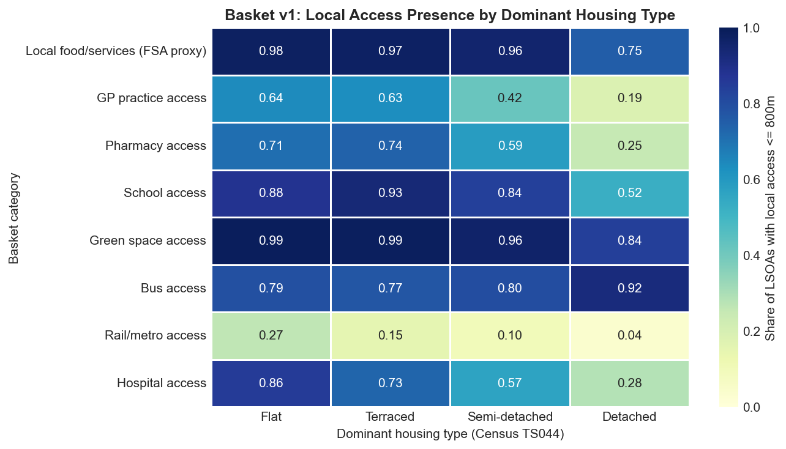
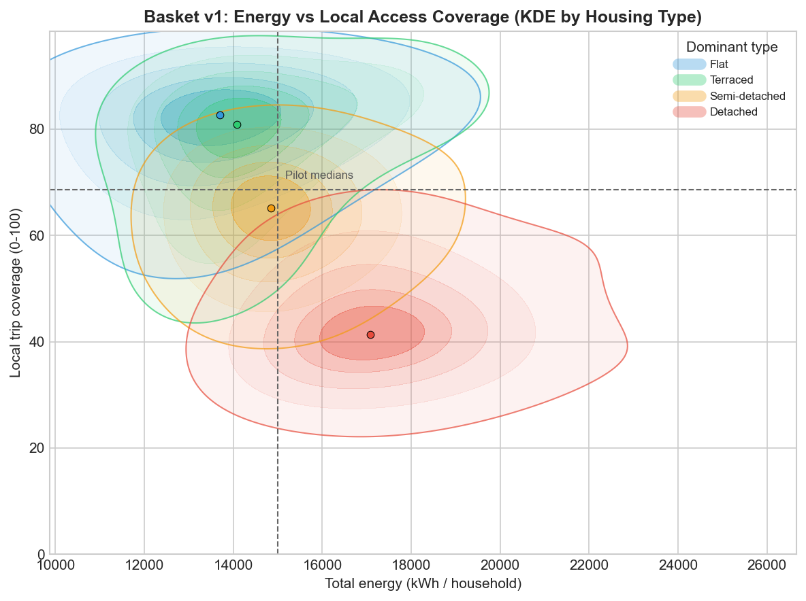

# Morphology, Energy, and the Cost of Ordinary Access

## Introduction

Energy policy is often framed as a problem of improving the efficiency of individual
technologies: insulating buildings, replacing boilers, and electrifying vehicles. These are
necessary measures, but they do not exhaust the problem. Daily energy expenditure is
also shaped by the wider package of housing form, neighbourhood morphology, transport
dependence, and local service access. These conditions generate secondary effects and can
lock in characteristic patterns of energy use.

This note examines the relationship between urban form and energy expenditure
through two linked quantities:

- the **energy cost** of living (building + transport), and
- the **local access return** that energy secures (access to everyday amenities and services).

At city scale, this also bears on service provision efficiency. Dispersed urban form
increases not only household energy demand, but also the energy required for a city to
deliver ordinary access to services across the settlement pattern.

## Scope and Framing

The analysis covers an 18-city English sample and an LSOA-level index formulation.

- Geography: 18 English cities
- Unit: LSOA (3,678 LSOAs)
- Core typology stratification: dominant Census 2021 accommodation type (TS044)
- Current access model: trip-type-specific distance-decay local-access model (nearest network distance), with wider-access bound at 4,800m
- Current energy model: metered building energy + modelled commute energy (private/public decomposition from Census mode and distance)

LSOA is used because DESNZ metered domestic energy is published at that scale and sets the
binding resolution.

## The Analytical Structure

The analysis proceeds in four steps:

1. **Building typology / morphology proxy** is associated with different building energy demand.
2. **Neighbourhood morphology** is associated with different transport energy demand.
3. **Neighbourhood morphology** is associated with different local amenity access.
4. These combine into a larger difference in **energy cost of access** than in energy alone.

Dominant housing type is used as a practical LSOA-level proxy for broader morphology,
supported by density and network-access evidence.

## Step 1: Building Typology and Building Energy

_Figure note (data and method)._ Building energy uses DESNZ sub-national domestic energy
statistics (2023), combining metered gas (weather-corrected) and electricity at LSOA level.
Each LSOA is grouped by dominant Census 2021 accommodation type (`TS044`, plurality share).
Bars show median LSOA values by dominant type; panel B stratifies by deprivation tercile
using Census `TS011`.

Interpretation.

- Building energy is higher in detached-dominant LSOAs than in flat-dominant LSOAs.
- The building-energy gradient is clear, but does not by itself explain the full structural
  gap between neighbourhood forms.
- Per-person and per-household readings differ because household size varies by typology.

Median LSOA values:

| Dwelling type | Building energy (kWh/household) | Building energy (kWh/person) |
| ------------- | ------------------------------- | ---------------------------- |
| Flat          | 13,034                          | 6,208                        |
| Terraced      | 13,342                          | 5,275                        |
| Semi-detached | 14,203                          | 5,807                        |
| Detached      | 16,632                          | 6,817                        |

> Note: Due to partial EPC coverage on the one hand and the difficulty in separating domestic from non-domestic built stock in open data, it proved difficult to get reliable numbers for envelope or party wall physics.

## Step 2: Morphology and Transport Energy (The Mobility Penalty)

_Figure note (data and method)._ Figure 2 now shows two panels using the same type-level
aggregation: (A) **commute-energy estimate** from Census 2021 commute distance bands (`TS058`)
and commute mode counts (`TS061`), annualised (return trips x workdays), with mode-specific
road/rail passenger-energy intensities; (B) a secondary **overall-travel scenario** that
scales panel A by the NTS 2024 total-to-commute distance ratio (`6082/1007 = 6.04x`).
Values are reported per household and summarised by median within dominant housing type.

Interpretation.

- Transport energy materially widens the cost gradient associated with neighbourhood form.
- The combined cost of ordinary living (building + transport) is substantially higher in
  more sprawling typologies.
- This is a morphology-linked energy dependency pattern, not just a building-envelope effect.

Median LSOA values:

| Dwelling type | Transport (commute est.) kWh/hh | Transport (overall est.) kWh/hh | Total (commute base) kWh/hh | Total (overall est.) kWh/hh |
| ------------- | ------------------------------- | ------------------------------- | --------------------------- | --------------------------- |
| Flat          | 739                             | 4,464                           | 13,774                      | 17,499                      |
| Terraced      | 959                             | 5,792                           | 14,301                      | 19,134                      |
| Semi-detached | 1,099                           | 6,635                           | 15,302                      | 20,838                      |
| Detached      | 1,243                           | 7,510                           | 17,875                      | 24,141                      |

Under the commute-only estimate, total energy rises from **13,774 kWh/hh** (flat-dominant) to
**17,875 kWh/hh** (detached-dominant), a **30%** gap. Under the overall-travel scenario, the
same comparison is **17,499 → 24,141 kWh/hh**, a **38%** gap.

_Figure note (data and method)._ Private/public mode decomposition uses Census `TS061` mode
counts and Census `TS058` distance bands. Private modes are defined as driving, passenger in
car/van, taxi, and motorcycle; public modes as bus, train, and metro/tram. Commute distance
is estimated from `TS058` travelling bands (excluding work-from-home and offshore/no-fixed-
place categories), annualised as return trips over 220 workdays, and converted using national
passenger-energy intensities from ECUK 2025: road passenger = 34.3 ktoe/billion passenger-km
and rail passenger = 15.3 ktoe/billion passenger-km (0.399 and 0.178 kWh/pkm respectively).

Interpretation.

- The private/public decomposition preserves the morphology gradient on transport demand.
- Private commute energy is substantially higher than public commute energy across all housing
  types, with the largest private burden in semi- and detached-dominant LSOAs.
- This decomposition is an estimated commute-energy split and complements the main
  building+transport totals.

_Figure note (data and method)._ Population density is derived from Census 2021 population
and OA area aggregated to LSOA. Transport energy is the same **commute-energy estimate**
described above. Filled KDE contours show the distribution of LSOAs by dominant housing type
in the density-transport space; contours are normalised within type for visual comparison.

Interpretation.

- The transport penalty is associated with neighbourhood structure, not only household choice.
- Lower-density / more sprawling LSOAs cluster at higher transport energy.
- This supports the morphology mechanism behind the combined energy gradient.

## Step 3: Morphology and Access to Amenities (The Return Side)

_Figure note (data and method)._ This figure uses cityseer network metrics at an 800m
pedestrian catchment (roughly a 10-minute walk). The plotted accessibility component is
street-network frontage/density (`cc_density_800`) aggregated to LSOA via UPRN-linked node
assignments. KDE contours show the distribution by dominant housing type.

Interpretation.

- More compact neighbourhood forms are associated with greater local network opportunity.
- This is a structural precondition for local amenity access and lower travel dependence.

_Figure note (data and method)._ Panels show median LSOA-level cityseer accessibility metrics
by dominant housing type, using gravity-weighted (`_wt`) counts within 800m network walk
catchments. Destination layers include FSA categories, bus, rail, green space, schools, and
GP practices. Error bars show IQRs.

Interpretation.

- The access gradient is not confined to one category; it appears across multiple everyday
  destination types.
- More sprawling typologies tend to have lower local access while also having higher
  transport energy, which is the core compounding mechanism.

## Step 5: Basket as a Trip-Demand Schedule

The basket is retained, but used only to define annual trip demand by destination type
rather than as an attainment score.

Trip-demand anchors used in Basket v1:

| Basket category             | Annual demand anchor (trips per person) | Included in summed destination-trip budget | Source basis                                                              |
| --------------------------- | --------------------------------------- | ------------------------------------------ | ------------------------------------------------------------------------- |
| Local food/services (proxy) | 167.0                                   | Yes                                        | DfT NTS 2024 shopping trips                                               |
| GP                          | 6.6                                     | Yes                                        | NHS England GP appointments (Apr 2024-Mar 2025), per-person               |
| Pharmacy                    | 7.2                                     | Yes                                        | NHSBSA prescription items (2024/25), assuming 3 items per collection trip |
| School                      | 59.2                                    | Yes                                        | DfE pupil headcount (2024/25) x 2 school trips/day x 190 days, per-person |
| Green space                 | 85.0                                    | Yes                                        | DfT NTS 2024 "just walk" trips                                            |
| Hospital                    | 2.0                                     | Yes                                        | NHS Digital outpatient attended appointments (2024/25), per-person        |
| Bus                         | 41.0                                    | No                                         | DfT NTS 2024 local bus trips/person (mode access variable)                |
| Rail/metro                  | 21.0                                    | No                                         | DfT NTS 2024 surface rail trips/person (mode access variable)             |

## Step 6: Distance Allocation and Land-Use Penalty

For each basket category in each LSOA, nearest network distance to destination is used to
allocate annual trips:

- `local-access share`: distance-decay share `exp(-ln(2) * (d / d_half)^2)`, where `d` is nearest distance and `d_half` is trip-type-specific
- `local-access trips`: `base trips × local-access share`
- `wider-access trips`: `base trips` when nearest distance `<= 4800m`, else `0`
- `additional travel-required trips`: `wider-access trips − local-access trips`

Trip-type local-distance half-parameters (`d_half`) used in this run:

- Food/services: 400m
- GP: 700m
- Pharmacy: 650m
- School: 900m
- Green space: 1,000m
- Hospital: 700m

Land-use access energy penalty is then:

- `additional travel-required trips × LSOA trip-energy intensity (kWh/trip)`

Trip-energy intensity uses the same transport model as Step 2 (Census `TS058` + `TS061`,
with the overall-travel scaling sensitivity).

_Figure note (data and method)._ Heatmap reports the share of LSOAs in each dominant housing
type with at least one destination within 800m network distance by category (`cc_*_nearest_max_4800`).
FSA nearest distance is the minimum of restaurant/pub/takeaway/other FSA nearest layers.

## Step 7: Access Delivery and Penalty by Morphology

_Figure note (data and method)._ Panel A shows mean local trip coverage
(`local-access trips / total basket trips`) by dominant housing type. Panel B shows mean
annual land-use access penalty (`additional travel-required trips × trip-energy intensity`)
under the overall-travel transport scenario. Local-access trips use the trip-type
distance-decay specification in Step 6 rather than a binary 800m rule.

Mean LSOA values:

| Type          | Trip budget (trips/hh/yr) | Local-access trips (trips/hh/yr) | Additional travel-required trips (trips/hh/yr) | Local trip coverage | Land-use access penalty (kWh/hh/yr) |
| ------------- | ------------------------- | -------------------------------- | ---------------------------------------------- | ------------------- | ----------------------------------- |
| Flat          | 691                       | 515                              | 176                                            | 75.2%               | 460                                 |
| Terraced      | 845                       | 625                              | 220                                            | 73.3%               | 611                                 |
| Semi-detached | 822                       | 505                              | 317                                            | 61.1%               | 953                                 |
| Detached      | 811                       | 367                              | 445                                            | 45.1%               | 1,611                               |

Interpretation.

- Required trip budgets are similar in magnitude across housing types.
- The difference is how much of that budget is delivered locally under trip-type walking-distance decay.
- Detached-dominant LSOAs require **2.53x** more additional travel-required trips than
  flat-dominant LSOAs.
- The associated land-use access penalty is **3.50x** higher in detached-dominant LSOAs.

## Step 8: Relationship Across All LSOAs

_Figure note (data and method)._ KDE contours show all pilot LSOAs in the space defined by
`total_kwh_per_hh` (x-axis) and `local trip coverage` (y-axis), coloured by dominant housing
type. Dashed lines mark pilot medians.

Interpretation.

- The morphology pattern is distribution-wide, not confined to type medians.
- Compact typologies cluster toward higher local trip coverage and lower total energy.
- More sprawling typologies shift toward lower local trip coverage and higher total energy.

## Step 9: Aggregate Cost of Sprawl (18-City PoC)

This proof-of-concept aggregates the premium paid by sprawling morphologies across the full
18-city sample.

Method.

- Compact benchmark group: Flat + Terraced dominant LSOAs
- Sprawl group: Semi + Detached dominant LSOAs
- Weighting: total households (`total_hh`) in each LSOA
- Component metrics (commute accounting): `building_kwh_per_hh`,
  `transport_kwh_per_hh_est`, `land_use_access_penalty_kwh_hh_commute_est`,
  and combined
  `building_kwh_per_hh + transport_kwh_per_hh_est + land_use_access_penalty_kwh_hh_commute_est`
- Sprawl premium per household: `sprawl mean - compact mean`
- Aggregate sprawl premium: `premium per household x sprawl households`

Household-weighted results (18 cities):

| Category                                | Compact (kWh/hh/yr) | Sprawl (kWh/hh/yr) | Premium (kWh/hh/yr) | Sprawl / Compact | Aggregate premium over sprawl households (TWh/yr) |
| --------------------------------------- | ------------------- | ------------------ | ------------------- | ---------------- | ------------------------------------------------- |
| Housing (building)                      | 13,833              | 15,062             | 1,228               | 1.09x            | 1.36                                              |
| Transport (commute estimate)            | 909                 | 1,136              | 226                 | 1.25x            | 0.25                                              |
| Land-use access penalty (commute basis) | 735                 | 1,411              | 675                 | 1.92x            | 0.75                                              |
| Combined commute-accounting burden      | 15,478              | 17,608             | 2,130               | 1.14x            | 2.36                                              |

## Conclusion

The results indicate a consistent morphology-energy-access relationship:

- more sprawling neighbourhood typologies have higher total household energy,
- lower delivery of routine trips within local walkable catchments, and
- higher additional travel-required energy to deliver the same everyday access functions.

The key result is compounding: morphology increases both baseline household energy demand
and the travel energy needed to secure ordinary access.

This framing also provides a route to national accounting. If an England-wide version of the
index is estimated, the results can be aggregated as an **excess energy cost of sprawl**:
the additional energy used above a compact-reference benchmark to deliver comparable basket
access, summed across LSOAs. This would make the cost of sprawl visible as a system-wide
energy burden, not only a household burden.

## Limitations

- Basket v1 uses a **distance-decay walkability proxy** with trip-type half-distance assumptions, not a full 20-minute multimodal travel-time model.
- The FSA food/services component is a proxy, not a clean essential-retail layer.
- Trip-demand conversion uses best-available annual counts with explicit assumptions
  (notably pharmacy collection conversion and pupil-trip conversion).
- Transport energy remains modelled from Census commute-energy (`TS058` + `TS061`) with an
  overall-travel scenario sensitivity, not direct observed full-purpose LSOA travel energy.
