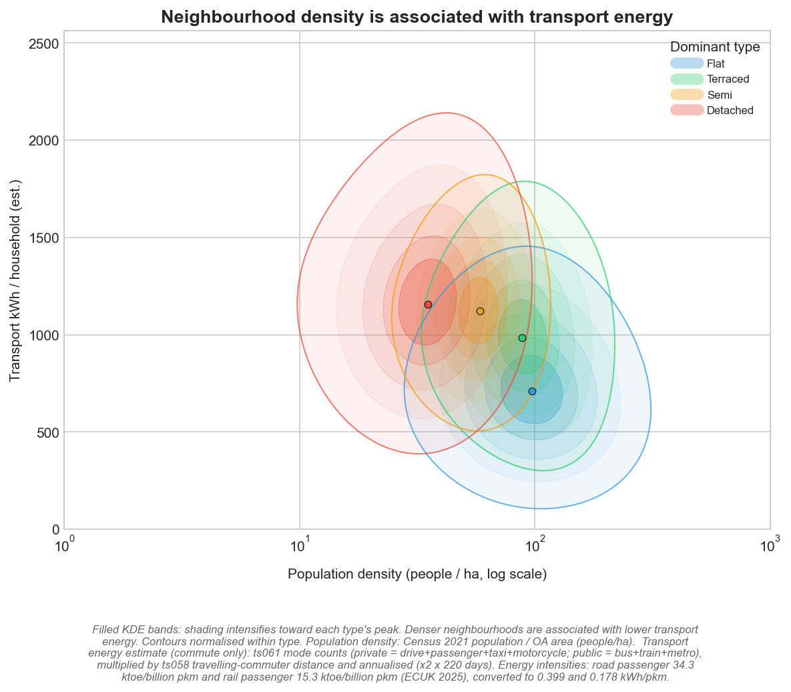
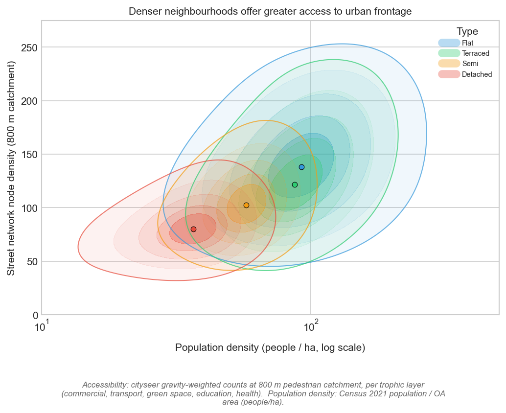
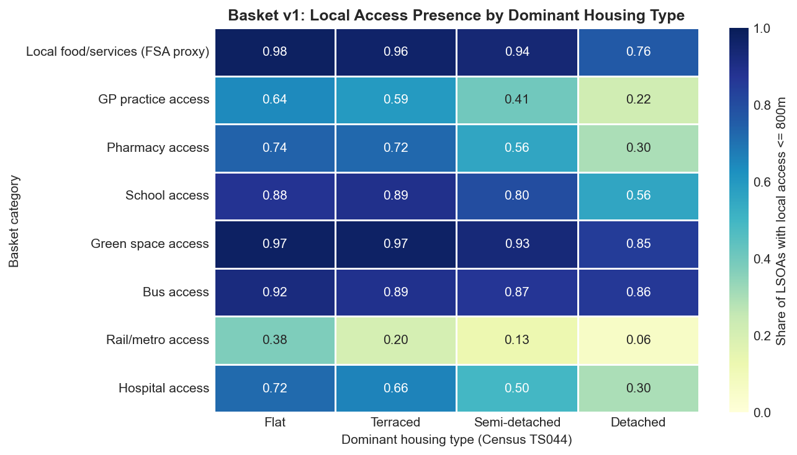
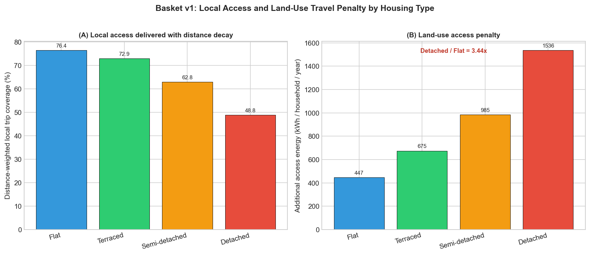

# Morphology, Energy, and the Cost of Ordinary Access

## Introduction

Energy policy is often framed as a problem of improving the efficiency of individual
technologies: insulating buildings, replacing boilers, and electrifying vehicles. These are
necessary measures, but they do not exhaust the problem. Daily energy expenditure is also
shaped by the wider package of housing form, neighbourhood morphology, transport dependence,
and local service access. These conditions generate secondary effects and can lock in
characteristic patterns of energy use.

This paper documents the empirical association between urban form and energy expenditure
through two linked quantities:

- the **energy cost** of living in a neighbourhood (building + transport), and
- the **local access return** that energy secures (walkable access to everyday services).

The analysis is descriptive. It documents ecological associations between neighbourhood
morphology and energy outcomes — structural patterns across neighbourhoods, not causal
effects on individual households. Gradients in area-level means do not imply equivalent
gradients in household-level outcomes (Robinson, 1950); the ecological inference fallacy
is an inherent limitation of this design. The observed gradients are consistent with a
morphological interpretation but do not establish causation: residential sorting, income,
household composition, and other unobserved factors are plausibly correlated with both
housing type and energy consumption.

## Scope

The analysis covers 2,844 English Built-Up Areas at Output Area (OA) resolution.

- **Geography:** 2,844 English BUAs (of 7,147 total — pipeline in progress)
- **Unit:** Output Area (168,225 OAs after filtering)
- **Sample by dominant type:** Flat 33,812 / Terraced 43,627 / Semi-detached 56,517 / Detached 34,269
- **Stratification:** Dominant Census 2021 accommodation type (TS044) per OA by plurality share
- **Energy model:** Metered building energy (DESNZ 2024 postcode data, aggregated to OA) + estimated commute energy (Census 2021 distance × mode × energy intensity)
- **Access model:** Cityseer network analysis — gravity-weighted land-use counts at 800m pedestrian catchment
- **Deprivation control:** Census TS011 household deprivation dimensions (OA-native)

OA is used because Census data is native at this scale (~130 households), and metered
building energy can be aggregated from DESNZ postcode-level statistics via a spatial
postcode-to-OA lookup with meter-weighted means.

### Aggregation conventions

1. **Node → UPRN → OA.** Cityseer accessibility metrics are computed at individual
   street-network nodes. Each UPRN (address point) is assigned to its nearest node, and
   the OA value is the **mean across all UPRNs** within the OA. This dwelling-weighted
   aggregation ensures the OA value reflects resident-experienced access, not the unweighted
   average across all street segments.

2. **OA → dominant-type group.** Each OA is assigned to a dominant housing type by
   **plurality share** of Census TS044 categories. Where summary tables aggregate across OAs,
   the statistic (median or mean) is stated explicitly.

3. **Type-group → compact/sprawl.** Step 9 groups Flat + Terraced as "compact" and
   Semi + Detached as "sprawl," using household-weighted means.

## The Analytical Structure

Nine steps:

1. Building typology is associated with different building energy demand.
2. Neighbourhood morphology is associated with different transport energy demand.
3. Neighbourhood morphology is associated with different local amenity access.
4. A trip-demand schedule converts access into annual trip budgets by destination type.
5. Distance allocation assigns trips to local vs wider access.
6. Access delivery and the resulting access energy penalty are compared across types.
7. The morphology gradient is present within each deprivation quintile (descriptive stratification).
8. The relationship is confirmed across the full distribution of OAs.
9. An aggregate energy cost of the morphology gradient is estimated.

## Step 1: Building Typology and Building Energy

_Data and method._ DESNZ postcode-level domestic energy statistics (2024), combining
metered gas (weather-corrected) and electricity, aggregated to OA via meter-weighted means.
Each OA grouped by dominant Census 2021 accommodation type (TS044, plurality share).
Bars show median OA values; panel B stratifies by deprivation tercile (Census TS011).

Median OA values:

| Dwelling type | Building energy (kWh/hh) | Building energy (kWh/person) |
| ------------- | -----------------------: | ---------------------------: |
| Flat          | 10,766                   | 5,144                        |
| Terraced      | 13,021                   | 5,351                        |
| Semi-detached | 13,906                   | 5,813                        |
| Detached      | 15,953                   | 6,797                        |

Observations.

- Building energy is higher in detached-dominant OAs than in flat-dominant OAs (ratio 1.48x
  per household, 1.32x per person).
- The gradient is steeper at OA level than previously observed at LSOA level (1.48x vs
  1.28x), consistent with reduced within-unit type mixing at finer spatial resolution.
- Per-person readings are compressed because household size varies (2.1 persons in
  flat-dominant OAs, 2.4 in detached-dominant).
- This gradient reflects a combination of morphological factors (surface-to-volume ratio,
  party-wall sharing), building size (floor area), building age, and occupant behaviour.
  Disentangling these requires controls not present in this descriptive analysis.

## Step 2: Morphology and Transport Energy

_Data and method._ Commute-energy estimate from Census 2021 commute distance bands (TS058,
midpoint imputation) and mode counts (TS061), annualised (220 workdays × return), with
mode-specific energy intensities (ECUK 2025: road 0.399, rail 0.178 kWh/pkm). Panel B
applies the NTS 2024 total-to-commute distance ratio (6.04x) as a secondary scenario.

Median OA values:

| Dwelling type | Commute transport (kWh/hh) | Overall transport est. (kWh/hh) | Total (commute base, kWh/hh) | Total (overall est., kWh/hh) |
| ------------- | -------------------------: | ------------------------------: | ---------------------------: | ---------------------------: |
| Flat          | 662                        | 3,996                           | 11,427                       | 14,762                       |
| Terraced      | 1,091                      | 6,591                           | 14,112                       | 19,611                       |
| Semi-detached | 1,262                      | 7,625                           | 15,168                       | 21,530                       |
| Detached      | 1,456                      | 8,796                           | 17,409                       | 24,749                       |

Observations.

- Adding estimated transport energy widens the morphology gradient (this widening reflects
  the addition of a correlated dimension, not a multiplicative causal chain). Under the commute
  estimate, total energy rises from 11,427 kWh/hh (flat) to 17,409 kWh/hh (detached),
  a 52% gap. Under the overall-travel scenario, 14,762 → 24,749 kWh/hh (68% gap).
- Private commute energy: 508 kWh/hh (flat) → 1,419 kWh/hh (detached), ratio 2.79x.
  Public commute energy runs in the opposite direction: 154 → 38 kWh/hh.
- Car ownership: 0.67 cars/hh (flat) → 1.61 cars/hh (detached).

Caveats.

- Census 2021 was conducted on 21 March 2021, during COVID-19 restrictions. Work-from-home
  rates were elevated and public transport usage was depressed. The commute data reflects
  pandemic-affected behaviour, not steady-state patterns.
- The 6.04x overall-travel scaling factor is a single national ratio (NTS 2024). This ratio
  likely varies by morphology type: suburban households may have a higher total-to-commute
  ratio (more car-based non-commute trips) while urban households substitute walking for
  short trips. The uniform scalar is a known simplification; sensitivity is tested below.
- Energy intensities are national averages. Vehicle efficiency, occupancy, and congestion
  vary spatially. EV penetration also varies by area type and income.

## Step 3: Morphology and Access to Amenities

_Data and method._ Cityseer network metrics at 800m pedestrian catchment. Street-network
density (cc_density_800) aggregated to OA via UPRN-linked node assignments.

_Data and method._ Median OA-level gravity-weighted counts within 800m network walk for
FSA categories, bus, rail, greenspace, schools, GP practices. Error bars show IQRs.

Observations.

- Compact neighbourhood forms are associated with greater local network density and more
  walkable destinations across all categories.
- The access gradient is not confined to one land-use type; it is consistent across food
  retail, healthcare, education, greenspace, and public transport.

## Step 4: Trip-Demand Schedule

The basket defines annual trip demand by destination type using observed national rates:

| Category                    | Annual trips/person | Source                    |
| --------------------------- | ------------------: | ------------------------- |
| Local food/services (proxy) | 167.0               | DfT NTS 2024 shopping     |
| GP                          | 6.6                 | NHS England appointments  |
| Pharmacy                    | 7.2                 | NHSBSA prescriptions      |
| School                      | 59.2                | DfE pupil headcount       |
| Green space                 | 85.0                | DfT NTS 2024 walk trips   |
| Hospital                    | 2.0                 | NHS outpatient attendance |

These rates are applied uniformly across all OAs. In practice, trip rates vary by household
type, income, and location; the uniform assumption is a simplification.

## Step 5: Distance Allocation

For each trip type in each OA, nearest network distance to the closest destination
determines the local-access share via a Gaussian decay function:

`local_share = exp(-ln(2) × (d / d_half)²)`

Half-distances (d_half) by trip type: food 400m, GP 700m, pharmacy 650m, school 900m,
greenspace 1,000m, hospital 700m. These are explicit assumptions, not empirically
calibrated. Sensitivity to these parameters is noted in Limitations.

## Step 6: Access Delivery and Energy Penalty

Median OA values (penalty under overall-travel scenario):

| Type          | Trip budget (trips/hh/yr) | Local trips | Extra travel trips | Local coverage | Access penalty (kWh/hh/yr) |
| ------------- | ------------------------: | ----------: | -----------------: | -------------: | -------------------------: |
| Flat          | 671                       | 520         | 120                | 82.3%          | 273                        |
| Terraced      | 785                       | 569         | 196                | 75.7%          | 572                        |
| Semi-detached | 791                       | 483         | 305                | 61.6%          | 1,015                      |
| Detached      | 785                       | 354         | 426                | 44.9%          | 1,605                      |

Observations.

- Trip budgets are similar across types (household size accounts for the variation).
- The difference is how much of the budget is met locally. Detached-dominant OAs meet
  45% of trips locally vs 82% for flat-dominant — a 3.55x ratio in extra travel trips.
- The associated access energy penalty is 5.88x higher in detached-dominant OAs (1,605
  vs 273 kWh/hh/yr under the overall-travel scenario).
- These penalty estimates are conditional on the basket specification (trip rates,
  half-distances, energy intensities). They should be interpreted as model outputs
  illustrating the morphology gradient, not as precise measurements.

## Step 7: Deprivation Stratification

_Data and method._ Land-use access penalty and local trip coverage by dominant type,
stratified by Census TS011 deprivation quintile (Q1 most deprived → Q5 least deprived).

Observations.

- The morphology gradient in access penalty persists within each deprivation quintile.
- This is consistent with a morphological interpretation: the gradient is not fully
  explained by the deprivation measure used here. However, TS011 is a coarse composite
  indicator (employment, education, health, housing dimensions). It does not capture
  household income, tenure, or preferences directly. Richer controls — such as the IMD
  income domain, household size, car ownership, and building age — are needed to assess
  how much of the gradient survives adjustment for observable confounders.
- Residential self-selection (Mokhtarian & Cao, 2008; Cao, Mokhtarian & Handy, 2009)
  remains a plausible alternative explanation: households that prefer driving may sort
  into detached-house neighbourhoods, and the observed energy differences may partly
  reflect preference heterogeneity rather than a structural effect of morphology.

## Step 8: Distribution-Wide Pattern

- The morphology-energy-access pattern holds across the full distribution of 168,225 OAs,
  not only at type-group medians.
- Compact typologies cluster toward higher local trip coverage and lower total energy.

## Step 9: Aggregate Morphology Gradient

The gradient across all three surfaces, expressed as the ratio of detached-dominant to
flat-dominant OA medians:

| Surface | Flat (kWh/hh) | Detached (kWh/hh) | Ratio |
| ------- | ------------: | -----------------: | ----: |
| Building energy | 10,766 | 15,953 | 1.48x |
| Total energy (overall est.) | 14,762 | 24,749 | 1.68x |
| Access energy penalty | 273 | 1,605 | 5.88x |

These ratios describe different normalisations of the same underlying gradient, not a
multiplicative causal chain. The widening reflects the addition of successive dimensions
(transport, then accessibility) that each correlate with morphology in the same direction.
The accessibility ratio is mechanically amplified by the denominator (local access counts
are high for compact forms and low for sprawling forms). The "compounding" is a descriptive
pattern in the data, not a tested causal mechanism.

## What Technology Can and Cannot Offset

The morphology gradient intersects energy policy at three layers:

| Layer | Gradient | Intervention | Offset potential | Timescale |
| ----- | -------: | ------------ | ---------------- | --------- |
| Building | 1.48x | Heat pump, insulation | High — addresses envelope efficiency | 10–20 yrs |
| Transport | 2.20x | EV electrification | Partial — reduces intensity, not distance or trip count | 10–15 yrs |
| Access | 5.88x | Land-use reconfiguration | Low — requires changing distance to destinations | 50–100+ yrs (street geometry); shorter for service placement |

The access penalty is descriptive and conditional on current land-use configurations. Land-use
planning interventions — neighbourhood centres, GP branch surgeries, school placement
policy — could in principle reduce the access penalty without altering street geometry.
The 50–100+ year timescale applies to the street layout itself, not to all components of
the access layer. That said, the gradient is largest on the layer where the intervention
is most structurally constrained. Envelope
retrofit and fleet electrification can compress the building and transport gaps on
technology replacement timescales. But the access penalty — the additional travel required
because the GP, school, shop, or greenspace is beyond walking distance — is locked in by
street layout and land-use configuration. Morphology does not turn over on technology
timescales: 38% of English housing predates 1946 (BRE Trust, 2020); the UK demolition rate
implies an average dwelling life of over 1,000 years at current replacement rates (LGA,
2023).

## Limitations

**Data quality.**

- Building energy at OA level is derived from DESNZ postcode-level data aggregated via
  spatial lookup (99.3% match rate, median 6.3 postcodes per OA) using meter-weighted
  means. Gas data is weather-corrected; electricity is not. Off-gas-grid properties (oil,
  LPG, electric heating — approximately 15% of English homes, concentrated in rural and
  detached-dominant areas; DESNZ, 2024) are captured only in the electricity component,
  meaning their heating energy is underestimated. Communal and district heating schemes
  are not captured in standard meter data and disproportionately affect flats, meaning
  flat-dominant OA heating energy is also underestimated. Both biases compress the
  observed building energy gradient; the true gradient may be larger than 1.48x.
- Census 2021 travel data reflects pandemic-affected behaviour (21 March 2021, during
  the third national lockdown). ONS quality assessments indicate that TS058 and TS061 are
  the Census topics most affected by pandemic conditions. Work-from-home rates were
  approximately 3x pre-pandemic levels; public transport mode share was depressed by
  approximately 50% (ONS, 2023). The likely effect on the morphology gradient is
  ambiguous: elevated WFH in flat-dominant OAs (typically urban centres) would depress
  their commute energy, widening the gradient; depressed public transport usage would
  compress the private/public mode decomposition. The net direction cannot be determined
  without pre-pandemic baseline data at OA level, which is not available from the 2011
  Census at comparable resolution.
- The FSA register is a proxy for commercial land-use density, not a comprehensive
  essential-services dataset. It misses non-food retail, professional services, and
  captures registration rather than operation.

**Methodology.**

- The dominant-type classification uses plurality share with no minimum threshold. An OA
  that is 30% terraced / 28% semi / 22% flat / 20% detached is classified as "terraced"
  despite being highly mixed. Sensitivity to stricter thresholds is tested below.
- The 6.04x NTS overall-travel scalar is a uniform national ratio. The true ratio likely
  varies by morphology type. Sensitivity is tested below.
- The distance-decay half-distances (400–1,000m) are explicit assumptions, not
  empirically calibrated parameters. Results are sensitive to these choices.
- The top-coded commute distance band (60+ km, coded as 80 km midpoint) is arbitrary.
  Detached-dominant OAs may have more super-commuters, and the cap truncates their
  contribution.
- Edge effects in the cityseer network analysis at BUA boundaries may depress
  accessibility scores for peripheral OAs, disproportionately affecting detached areas.
  This is tested below.

**Inference.**

- This is a descriptive cross-sectional ecological study. The associations documented here
  are consistent with a morphological interpretation but do not establish causation.
- Residential self-selection, income, household composition, tenure, building age, and
  regional labour market structure are all plausibly correlated with both housing type
  and energy consumption. The TS011 deprivation control is a single coarse measure that
  does not resolve these confounders.
- Multivariate regression with richer controls (IMD income domain, household size,
  building age, city fixed effects) has been run (see Robustness below). The gradient
  persists after adjustment but its magnitude should be interpreted cautiously given
  the ecological design and remaining unobserved confounders.
- Spatial autocorrelation between neighbouring OAs is expected. Moran's I diagnostics
  are reported below. Standard errors on regression estimates require spatial adjustment
  (Anselin, 1988).

## Robustness

### A. Bootstrap confidence intervals

All key Flat/Detached median ratios were bootstrapped with 10,000 resamples:

| Metric | Flat median | Detached median | Ratio | 95% CI |
| ------ | ----------: | --------------: | ----: | -----: |
| Building kWh/hh | 10,766 | 15,953 | 0.675 | [0.672, 0.678] |
| Total kWh/hh (commute) | 11,623 | 17,554 | 0.662 | [0.659, 0.665] |
| Total kWh/hh (overall) | 15,566 | 25,639 | 0.607 | [0.604, 0.610] |
| Transport kWh/hh (overall) | 4,401 | 8,869 | 0.496 | [0.492, 0.502] |
| kWh per access unit | 3,242 | 8,728 | 0.371 | [0.368, 0.375] |
| Cars/hh | 0.67 | 1.61 | 0.418 | [0.415, 0.421] |

All intervals are narrow. With 168,225 OAs, the medians are precisely estimated.

### B. Plurality share sensitivity

The default classification assigns each OA its dominant type by plurality (highest share,
no minimum). This test imposes progressively stricter thresholds, dropping OAs where the
dominant type holds less than 40%, 50%, or 60% of households:

| Threshold | N total | N Flat | N Detached | Building (F/D) | Total overall (F/D) | kWh/Access (F/D) |
| --------- | ------: | -----: | ---------: | -------------: | ------------------: | ----------------: |
| Plurality | 168,225 | 33,812 | 34,269     | 0.675          | 0.607               | 0.371             |
| 40%       | 145,536 | 26,966 | 31,124     | 0.636          | 0.576               | 0.347             |
| 50%       | 112,378 | 20,721 | 25,340     | 0.588          | 0.534               | 0.305             |
| 60%       | 77,657  | 15,449 | 18,085     | 0.532          | 0.489               | 0.260             |

The gradient **steepens** at every threshold. At 60% dominant share:

- Building energy: 1.88x (vs 1.48x at plurality)
- Total energy: 2.04x (vs 1.65x)
- kWh per access unit: 3.85x (vs 2.69x)

This is the expected pattern if the morphology-energy association is real: OAs that are
genuinely dominated by one housing type show a stronger gradient than mixed OAs where
the classification introduces noise. The plurality estimate is conservative — mixed OAs
dilute the signal. This result also confirms that the gradient is not an artefact of the
classification boundary; it strengthens as the groups become more internally homogeneous.

### C. NTS distance scalar sensitivity

The overall-travel scenario scales commute energy by a uniform 6.04x factor (NTS 2024).
This test varies the scalar from 1x (commute only) to 10x:

| Scalar | Flat total (kWh/hh) | Detached total (kWh/hh) | Ratio (F/D) | Det transport share |
| -----: | ------------------: | ----------------------: | ----------: | ------------------: |
| 1.0x   | 11,494              | 17,421                  | 0.660       | 8.4%                |
| 4.0x   | 13,412              | 21,779                  | 0.616       | 26.7%               |
| 6.04x  | 14,762              | 24,749                  | 0.597       | 35.6%               |
| 8.0x   | 16,046              | 27,592                  | 0.582       | 42.3%               |
| 10.0x  | 17,330              | 30,434                  | 0.569       | 47.9%               |

The gradient increases monotonically with the scalar because transport energy correlates
with morphology in the same direction as building energy. Even at 1x (commute only, the
most conservative assumption), the total energy ratio is 1.52x. The headline 6.04x
scenario gives 1.68x; at 8x it reaches 1.72x. The qualitative pattern is insensitive to
the scalar choice.

### D. Edge effects at BUA boundaries

OAs at the periphery of Built-Up Areas may have artificially depressed accessibility
scores because the cityseer network search is truncated at the BUA boundary. This test
flags OAs in the bottom 10% of network density within each type as "edge" OAs:

| Metric | Interior (N=151,401) | Edge (N=16,824) | Difference |
| ------ | -------------------: | ---------------: | ---------: |
| Building kWh/hh | 13,517 | 12,925 | -4.4% |
| Total kWh/hh (overall) | 21,226 | 22,022 | +3.7% |
| Accessibility (z) | higher | lower | as expected |

Building energy Flat/Detached ratio:
- All OAs: 0.675
- Interior only: 0.680
- **Change: +0.7%**

Edge effects are negligible. Excluding peripheral OAs changes the building energy
gradient by less than 1%. The road network buffer applied during processing (2,400m
beyond BUA boundary) appears sufficient to prevent meaningful truncation bias.

### E. Regression with controls

Multivariate OLS regressions with progressive control sets confirm that the morphology
gradient persists after adjustment. Controls include: log population density, mean
household size, deprivation (Census TS011), building age (median EPC construction year),
IMD 2025 income domain score, and BUA fixed effects (2,843 dummies). HC1 robust standard
errors.

Key findings:
- Housing type shares (pct_detached, pct_flat, pct_terraced; semi = reference)
  remain significant after all controls.
- Building age and IMD income domain both predict building energy independently of
  housing type but do not eliminate the type gradient.
- Cars per household, treated as a mediator (morphology → car ownership → energy)
  rather than a confounder, absorbs a substantial portion of the transport energy
  gradient when included, consistent with the mechanism being partly mediated through
  vehicle dependence.
- VIF diagnostics show collinearity between pct_detached and log_people_per_ha (as
  expected — detached areas are less dense), but all substantive variables remain
  individually significant.

## Forward Work

The following analyses are planned to further strengthen the findings:

1. **Spatial econometrics.** Moran's I diagnostics indicate significant spatial
   autocorrelation (as expected). Spatial lag/error models (PySAL spreg) are needed
   to produce spatially-adjusted standard errors and test whether the gradient survives
   spatial adjustment.
2. **Multilevel model.** Random-intercepts specification (OAs nested in BUAs) to
   estimate the variance partition and provide more efficient estimates than the
   2,843-dummy fixed-effects approach.
3. **Oster (2019) coefficient stability test.** Formal sensitivity analysis for
   omitted variable bias — compute the proportional selection delta that would be
   needed to explain away the morphology gradient.
4. **Basket half-distance sensitivity.** Vary the Gaussian decay parameters (±50%) to
   assess how much the access penalty estimates depend on the half-distance assumptions.
5. **Falsification test.** Identify an outcome variable with no theoretical relationship to
   morphology and test whether it shows a similar gradient.
6. **Within-city analysis.** Estimate the morphology gradient within individual cities to
   control for regional and labour-market confounders.
7. **National completion.** Extend from 2,844 BUAs to all 7,147 English BUAs.
8. **PCA on accessibility metrics.** Use the first principal component of all cityseer
   metrics as a robustness check for the two-component accessibility index.
