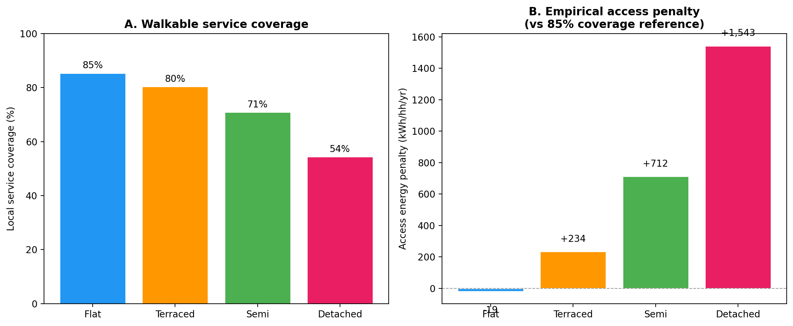
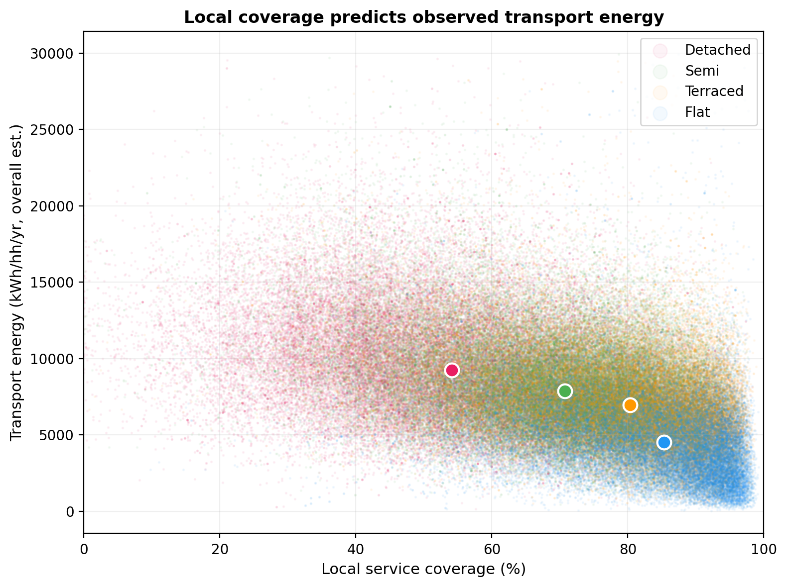

# The Neighbourhood Energy Performance Index: Scoring Urban Form Against Three Surfaces of Energy Demand

## Abstract

Decarbonisation policy targets buildings and vehicles as separate technology problems, but
a household's total energy expenditure is jointly shaped by built form, transport dependence,
and local access to services. We propose the Neighbourhood Energy Performance Index (NEPI),
an open-data scorecard that rates each neighbourhood on three surfaces — Form (building
energy), Mobility (transport energy), and Access (the empirical energy penalty for poor
walkable service coverage) — all expressed in kWh per household per year. Applying the
index to 198,779 Output Areas across 6,687 English Built-Up Areas using metered energy
data, Census 2021, and network-based accessibility analysis, we find that the median
flat-dominant neighbourhood costs 15,982 kWh/hh/yr (Band A) while the median
detached-dominant neighbourhood costs 26,897 kWh/hh/yr (Band F) — a gap of 10,915 kWh
decomposed as Form 45%, Mobility 43%, Access 14%. The access penalty (1,519 kWh/hh/yr for
detached areas) is the surface that building retrofit and vehicle electrification cannot
address. The index is constructed entirely from open data sources and can be computed for
every neighbourhood in England.

## 1. Introduction

Energy policy treats buildings and transport as separate systems. Building regulations
target fabric efficiency; transport policy targets fleet electrification. But a household's
actual energy footprint is shaped by all three dimensions of the place where it lives: the
thermal properties of the built form, the travel distances imposed by neighbourhood layout,
and the degree to which everyday services — the GP, the school, the shop, the park — are
reachable on foot.

Cities function as ecosystems that capture energy and recycle it through layers of human
interaction (Jacobs, 2000). A dense urban neighbourhood, like a rainforest, passes energy
through multiple trophic layers: the street network enables pedestrian movement; commercial
establishments create economic exchange; public transport connects to the wider city; green
space provides restoration. Each layer captures value from the layer below. A sprawling
suburb, like a desert, receives the same energy input but dissipates it in a single pass —
one car journey, one destination, one return. The measure of urban energy efficiency is not
how much energy a neighbourhood consumes, but how many transactions, connections, and
functions that energy enables before it dissipates.

This connects to a well-established empirical regularity: cities exhibit superlinear scaling
in socioeconomic output (~N^1.15) and sublinear scaling in infrastructure demand (~N^0.85)
(Bettencourt et al., 2007). The mechanism is proximity. Dense, mixed-use neighbourhoods
achieve more output per unit of infrastructure — and per unit of energy — because distances
are shorter, trips are multi-purpose, and walking substitutes for driving.

The building physics of this relationship are well understood. Compact dwelling types
(terraced houses, flats) have lower surface-to-volume ratios and share party walls, reducing
heat loss per unit of floor area (Rode et al., 2014). The transport dimension has been
documented since Newman and Kenworthy (1989) showed the inverse relationship between urban
density and per-capita fuel consumption, refined by Ewing and Cervero (2010) into the
insight that destination accessibility matters more than density per se — a finding
confirmed by Stevens' (2017) systematic review of over sixty studies, which showed
destination accessibility consistently outperforms density as a predictor of travel
behaviour.

What is missing is a framework that integrates all three dimensions into a single,
policy-relevant metric — and does so at a spatial resolution fine enough to inform
neighbourhood-level planning decisions. Norman et al. (2006) combined building and transport
energy for two Toronto case studies; no study has done so at national scale with metered
energy data, at the resolution of individual neighbourhoods, with an explicit measure of
the access return on that energy expenditure.

This paper proposes the Neighbourhood Energy Performance Index (NEPI): an open-data
scorecard that rates each Output Area (~130 households) on three surfaces:

1. **Form** — the thermal efficiency of the built stock, measured by metered domestic energy
   per household (DESNZ postcode-level data, 2024).
2. **Mobility** — transport energy dependence, estimated from Census 2021 commute distance,
   mode, and national energy intensity factors.
3. **Access** — walkable coverage of essential services, computed as a Gaussian-decayed
   proximity score across nine service types using network-based distances (cityseer).

The composite NEPI score (0–100) is banded A–G, directly analogous to a building Energy
Performance Certificate. Where an EPC rates the building envelope, the NEPI rates the
neighbourhood — the built form, the transport structure, and the access it provides.

The analysis covers 198,779 Output Areas across 6,687 English Built-Up Areas. It is
descriptive: the associations documented are ecological, not causal (Robinson, 1950).
Residential sorting, income, and household composition are plausibly correlated with both
housing type and energy consumption (Mokhtarian & Cao, 2008). The NEPI does not claim to
measure the causal effect of morphology on energy; it measures the observable energy
performance of neighbourhoods as they exist, using the same logic as a building EPC — a
rating of current performance, not a prediction of what would happen if the neighbourhood
changed.

## 2. Background

### 2.1 Building energy and urban form

The relationship between building morphology and heating energy is grounded in thermodynamic
first principles: heat loss is proportional to the area of the building envelope exposed to
the external environment, and compact forms (low surface-to-volume ratio, shared party
walls) lose less heat per unit of floor area. Rode et al. (2014) formalised this for
residential buildings, demonstrating that urban morphology — building height, density, and
configuration — explains a substantial share of variation in heating demand across London
neighbourhoods. Kavgic et al. (2010) reviewed the landscape of bottom-up building stock
energy models, identifying the challenge of scaling from individual building physics to
area-level estimates. Steadman, Evans and Liddiard (2020) addressed this through the 3DStock
method, which constructs three-dimensional models of every building in England and Wales
from Ordnance Survey maps, Valuation Office data, and Environment Agency LiDAR, enabling
energy analysis at neighbourhood and city scale. The present study uses many of the same
data sources (OS footprints, LiDAR heights) but at Output Area resolution rather than
individual buildings, and with metered rather than modelled energy as the dependent variable.

The distinction between metered and modelled energy is critical. Energy Performance
Certificates (EPCs) use the Standard Assessment Procedure (SAP) to estimate energy demand
from building fabric properties. Few et al. (2023) demonstrated systematic over-prediction
of actual consumption in EPC ratings, with the performance gap varying by dwelling type and
age. By using DESNZ postcode-level metered consumption — actual gas and electricity recorded
at the meter — the present study sidesteps this performance gap entirely.

### 2.2 Transport energy, density, and the 3Ds

Newman and Kenworthy (1989) established the foundational inverse relationship between urban
density and per-capita transport fuel consumption across 32 global cities. Subsequent work
refined the density-transport link into a multidimensional framework. Cervero and Kockelman
(1997) proposed the "3Ds" — density, diversity, and design — as the principal dimensions
through which the built environment influences travel demand, finding statistically
significant but modest elasticities (0.06–0.18) for non-work trip rates in the San Francisco
Bay Area. Ewing and Cervero (2010) extended this to a meta-analysis of over 50 studies,
concluding that destination accessibility — the ease of reaching activities — is a stronger
predictor of vehicle-miles-travelled than density alone.

Stevens (2017) subjected this literature to critical review, examining whether the compact
development effect survives self-selection controls. Across over sixty studies, the effect
persists but is attenuated by roughly 5–25% when residential sorting is properly controlled,
with the residual effect operating primarily through destination accessibility and street
network design.

Banister (2011) framed the policy response as a three-part strategy: reduce the need to
travel, shift to lower-energy modes, and improve vehicle efficiency. The first two
components — reduce and shift — are fundamentally shaped by neighbourhood morphology: compact,
mixed-use areas with walkable services generate shorter trips and higher non-car mode shares.
The present study quantifies this empirically through the relationship between walkable
service coverage and observed Census transport outcomes.

### 2.3 Accessibility measurement

The concept of accessibility as a spatial quantity was formalised by Hansen (1959), who
defined it as "the potential of opportunities for interaction" and demonstrated that
residential growth patterns could be predicted from gravity-weighted accessibility to
employment. Geurs and van Wee (2004) reviewed accessibility measures across four
perspectives — infrastructure-based, location-based, person-based, and utility-based — and
four components: land use, transportation, temporal, and individual. They noted a persistent
tension between theoretical rigour and practical operationalisability: simple measures
(travel time, distance) are easy to interpret but theoretically limited; complex measures
(utility-based) are theoretically sound but difficult to communicate to planners.

The NEPI's Access surface uses a location-based, gravity-type measure (Gaussian-decayed
network distance to essential services) that sits in the middle of Geurs and van Wee's
spectrum: more theoretically grounded than simple proximity (it accounts for distance decay)
but more interpretable than utility-based measures (it reports percentage coverage of
services within walking distance). The network-based computation via cityseer (Simons, 2024)
ensures that distances reflect actual walking routes rather than Euclidean approximations.

### 2.4 Composite neighbourhood rating systems

Several systems rate neighbourhoods on sustainability or liveability dimensions. Walk Score
(Carr, Dunsiger & Marcus, 2011) computes a 0–100 walkability index from proximity to
amenities using network distances, with penalties for pedestrian unfriendliness. It has been
widely validated against travel behaviour but captures only the accessibility dimension —
it does not measure building energy or transport energy. LEED for Neighborhood Development
(LEED-ND; USGBC, Congress for the New Urbanism & NRDC, 2009) is a certification system
that scores developments on smart location, neighbourhood pattern, and green infrastructure,
but operates as a design-stage tool for new developments rather than a performance rating
of existing neighbourhoods. BREEAM Communities (BRE, 2012) offers a similar framework for
the UK context.

None of these systems integrates metered building energy, transport energy, and access into
a single metric using observed outcome data. Walk Score measures access but not energy;
LEED-ND measures design intent but not observed performance; building EPCs measure fabric
efficiency but not transport or access. The NEPI fills this gap: a post-occupancy
performance rating that integrates all three surfaces from open data, applicable to every
existing neighbourhood in England.

### 2.5 Ecological analysis and the modifiable areal unit problem

Area-level studies of energy and urban form face two well-known challenges. First, the
ecological fallacy (Robinson, 1950): associations observed at the area level may not hold
at the household level due to compositional confounding. Second, the modifiable areal unit
problem (MAUP; Fotheringham & Wong, 1991): results may depend on the choice of spatial
unit and aggregation scheme. Fotheringham and Wong demonstrated that the MAUP is
"essentially unpredictable in its intensity and effects in multivariate statistical analysis,"
making the choice of spatial unit consequential.

The present study addresses both concerns explicitly. The ecological nature of the analysis
is acknowledged throughout: the NEPI rates neighbourhoods, not households, and the
associations documented are ecological, not causal. On the MAUP, the study uses Output Areas
— the finest Census geography (~130 households), designed by ONS to be socially homogeneous
and of consistent population size — and tests sensitivity to the classification threshold
(plurality vs 40–60% dominant-type share), demonstrating that the morphology gradient
strengthens at finer type purity, consistent with attenuation from classification noise
(Bound et al., 2001) rather than an artefact of aggregation.

Greenland (2001) and Wakefield (2008) provide the formal framework for when ecological
studies are appropriate: specifically, when the exposure is genuinely ecological — a property
of the area, not of the individual. Neighbourhood morphology (street layout, building form
mix, service proximity) is inherently an area-level property. The ecological study design is
therefore not a limitation to be apologised for but the correct level of analysis for the
question being asked.

## 3. Data and Methods

### 2.1 Unit of analysis

The Output Area (OA) is the finest geography at which Census 2021 data is published (~130
households, ~330 people). OAs are designed to be socially homogeneous and of consistent
population size, making them a natural unit for neighbourhood-level analysis.

### 2.2 Data sources

All data sources are open and publicly available:

| Source                       | Granularity | Variable                                   | Role in NEPI          |
| ---------------------------- | ----------- | ------------------------------------------ | --------------------- |
| DESNZ domestic energy (2024) | Postcode    | Metered gas + electricity (kWh/meter)      | **Form** surface      |
| Census 2021 TS044            | OA          | Accommodation type counts                  | Stratification        |
| Census 2021 TS058/TS061      | OA          | Commute distance bands + travel mode       | **Mobility** surface  |
| Census 2021 TS045            | OA          | Car ownership                              | Mobility control      |
| Census 2021 TS011            | OA          | Household deprivation dimensions           | Deprivation control   |
| Census 2021 TS001/TS017      | OA          | Population, household count/size           | Denominators          |
| OS Open Roads                | National    | Road network geometry                      | Network analysis      |
| OS Open UPRN                 | National    | Address-level geocoding                    | OA assignment         |
| OS Built Up Areas            | National    | Settlement boundaries                      | Processing units      |
| FSA Register                 | Point       | Food establishments (~500k)                | Access: food/services |
| NaPTAN                       | Point       | Public transport stops (~434k)             | Access: bus, rail     |
| GIAS (DfE)                   | Point       | Schools (~25k)                             | Access: education     |
| NHS ODS                      | Point       | GP practices, pharmacies, hospitals (~24k) | Access: health        |
| OS Open Greenspace           | Polygon     | Parks and recreation areas                 | Access: greenspace    |
| IoD 2025 (MHCLG)             | LSOA        | Index of Multiple Deprivation (7 domains)  | Income control        |
| DVLA vehicle licensing       | LSOA        | Registered vehicles by fuel type           | Fleet composition     |

### 2.3 Energy aggregation

Building energy is derived from DESNZ Subnational Consumption Statistics (December 2025
edition; DESNZ, 2025). Gas consumption is based on Annual Quantities (AQ) compiled by
Xoserve from meter readings taken 6–18 months apart, covering mid-May 2024 to mid-May 2025. Gas figures are weather-corrected by Xoserve using National Grid's demand forecasting
methodology, which adjusts for regional temperature, wind speed, and trend factors.
Electricity consumption is based on Meter Point Administration Numbers (MPAN) from energy
suppliers, covering January to December 2024. Electricity is not weather-corrected.

Domestic meters are classified by a 73,200 kWh/yr Annual Quantity threshold. This
misclassifies some small commercial premises as domestic and some large domestic consumers
as non-domestic. Postcodes with fewer than 5 meters are suppressed for disclosure control,
as are postcodes where the top 2 meters account for >90% of total consumption.
Approximately 1% of meters are unallocated due to missing or invalid postcode information.

Postcode-level values (mean kWh per meter for gas and electricity) are assigned to Output
Areas via a spatial join of OS Code-Point Open postcode centroids to OA boundaries (99.3%
match rate, median 6.3 postcodes per OA). The OA value is the meter-weighted mean across
constituent postcodes.

Two systematic measurement gaps affect the Form surface. First, approximately 15% of
English properties are not connected to the gas grid (DESNZ, 2025, §2.4); their heating
energy (oil, LPG, solid fuel) does not appear in the gas consumption data — only their
electricity is captured. These properties are concentrated in rural and detached-dominant
areas, meaning the Form surface underestimates heating energy for detached-dominant OAs.
Second, communal and district heating schemes serve a building through a single non-domestic
meter (typically exceeding the 73,200 kWh threshold), meaning individual flats' heating
energy is absent from the domestic statistics. This disproportionately affects flat-dominant
OAs. Both biases compress the observed Form gradient; the true gradient between flat- and
detached-dominant neighbourhoods is likely larger than reported.

### 2.4 Transport energy estimation

Commute energy is estimated from Census 2021 TS058 (commute distance, 8 bands with
midpoint imputation) and TS061 (travel mode), annualised at 220 workdays × return trip,
with mode-specific energy intensities from ECUK 2025 (road: 0.399, rail: 0.178 kWh/pkm).

An overall-travel scenario scales the commute estimate by 6.04× (NTS 2024 total distance /
commute distance ratio). This is a known simplification: the ratio likely varies by
morphology type. Sensitivity is tested across 1×–10× scalars.

Census 2021 was conducted on 21 March 2021 during the third national lockdown. Work-from-home
rates were ~3× pre-pandemic levels; public transport use was depressed ~50% (ONS, 2023).
The commute data reflects pandemic-affected behaviour.

### 2.5 Access surface: walkable service coverage

The Access surface measures what share of a household's essential service needs can be met
within walking distance. It is computed from network-based nearest distances to nine service
types, each with a defined walking-distance threshold:

| Service type          | Source             | Threshold (m) | Rationale    |
| --------------------- | ------------------ | ------------: | ------------ |
| Food (restaurant)     | FSA Register       |           800 | ~10 min walk |
| Food (takeaway)       | FSA Register       |           800 | ~10 min walk |
| Food (pub)            | FSA Register       |           800 | ~10 min walk |
| GP practice           | NHS ODS            |         1,200 | ~15 min walk |
| Pharmacy              | NHS ODS            |         1,000 | ~12 min walk |
| School                | GIAS (DfE)         |         1,200 | ~15 min walk |
| Green space           | OS Open Greenspace |         1,000 | ~12 min walk |
| Bus stop              | NaPTAN             |           800 | ~10 min walk |
| Hospital (outpatient) | NHS ODS            |         2,000 | ~25 min walk |

For each service in each OA, the nearest network distance (d) is converted to a coverage
score via Gaussian decay:

`coverage = exp(−ln(2) × (d / d_half)²)`

where d_half is the service-specific threshold. This gives full credit (1.0) at zero
distance, 50% at the threshold, and decays smoothly to near-zero at ~2× the threshold.
Where no destination exists within the 4,800m cityseer search radius, coverage is zero.

The OA's Access score is the mean coverage across all nine services, expressed as a
percentage (0–100%).

### 2.6 The NEPI scoring framework

All three NEPI surfaces are expressed in a common unit — **kWh per household per year**:

| Surface      | Raw metric                      | Unit      | Source                                      |
| ------------ | ------------------------------- | --------- | ------------------------------------------- |
| **Form**     | Metered building energy         | kWh/hh/yr | DESNZ postcode data                         |
| **Mobility** | Estimated transport energy      | kWh/hh/yr | Census TS058/TS061 × ECUK intensities       |
| **Access**   | Empirical access energy penalty | kWh/hh/yr | OLS: transport energy ~ coverage + controls |

The Access surface is the empirical energy cost of poor walkable service coverage: the
additional transport energy predicted by the OLS model (Section 3.3) relative to a compact
reference level (85% coverage, the flat-dominant OA median). OAs that already meet or exceed
the reference receive zero penalty.

The **composite NEPI** is the sum of the three surfaces — the total neighbourhood energy
cost in kWh/hh/yr. Using a common energy unit eliminates the need for arbitrary surface
weighting: the surfaces weight themselves by their energy magnitude. A–G bands are assigned
by national percentile position of the composite (lower total = better band):

| Band | Percentile range | Interpretation                    |
| ---- | ---------------: | --------------------------------- |
| A    |            0–8th | Lowest neighbourhood energy cost  |
| B    |           8–19th |                                   |
| C    |          19–36th |                                   |
| D    |          36–60th |                                   |
| E    |          60–81st |                                   |
| F    |          81–95th |                                   |
| G    |         95–100th | Highest neighbourhood energy cost |

### 2.7 Stratification

Each OA is assigned a dominant housing type by plurality share of Census TS044
accommodation categories (Detached, Semi-detached, Terraced, Flat). The plurality
classification uses no minimum threshold; sensitivity to stricter thresholds (40–60%)
is tested.

### 2.8 Sample

6,687 English Built-Up Areas (of 7,147 total), yielding 198,779
Output Areas after filtering (population > 10, ≥ 5 UPRNs, valid metered energy).

| Dominant type |  N OAs |
| ------------- | -----: |
| Flat          | 36,502 |
| Terraced      | 50,592 |
| Semi-detached | 65,986 |
| Detached      | 45,699 |

## 3. Results

### 3.1 The three energy surfaces

**Surface 1: Form (building energy).**

| Dwelling type | Building energy (kWh/hh) | kWh/person |
| ------------- | -----------------------: | ---------: |
| Flat          |                   10,755 |      5,139 |
| Terraced      |                   12,959 |      5,346 |
| Semi-detached |                   13,866 |      5,808 |
| Detached      |                   15,713 |      6,697 |

Detached-dominant OAs use 1.46× the metered building energy of flat-dominant OAs per
household (1.30× per person). The per-person compression reflects smaller household sizes
in flat-dominant areas (2.1 vs 2.4 persons/hh).

**Surface 2: Mobility (transport energy).**

| Dwelling type | Commute (kWh/hh) | Overall est. (kWh/hh) | Total (overall, kWh/hh) |
| ------------- | ---------------: | --------------------: | ----------------------: |
| Flat          |              687 |                 4,150 |                  14,906 |
| Terraced      |            1,106 |                 6,677 |                  19,636 |
| Semi-detached |            1,273 |                 7,690 |                  21,556 |
| Detached      |            1,521 |                 9,185 |                  24,898 |

Adding transport widens the gradient to 1.67× (overall scenario). Private commute energy
rises from 534 kWh/hh (flat) to 1,485 (detached), ratio 2.78×. Public commute energy runs
in the opposite direction: 153 → 36 kWh/hh. Car ownership: 0.69 → 1.64 cars/hh.

**Surface 3: Access (walkable service coverage).**

Median service coverage scores (Gaussian-decayed, 0–1):

| Service           |      Flat |  Terraced |      Semi |  Detached |
| ----------------- | --------: | --------: | --------: | --------: |
| Food (restaurant) |      0.92 |      0.84 |      0.69 |      0.48 |
| Food (takeaway)   |      0.87 |      0.84 |      0.71 |      0.35 |
| GP practice       |      0.82 |      0.74 |      0.58 |      0.32 |
| Pharmacy          |      0.81 |      0.75 |      0.61 |      0.36 |
| School            |      0.91 |      0.90 |      0.85 |      0.73 |
| Green space       |      0.94 |      0.93 |      0.90 |      0.87 |
| Bus stop          |      0.97 |      0.96 |      0.96 |      0.93 |
| **Mean coverage** | **86.0%** | **81.1%** | **71.6%** | **56.3%** |

Bus stops and greenspace are accessible almost everywhere. The gradient is driven by
healthcare (GP: 0.82 → 0.32), food retail (takeaway: 0.87 → 0.35), and pharmacy
(0.81 → 0.36). These are the services that collapse beyond walking distance in
detached-dominant areas.

### 3.2 The NEPI scorecard

| Type     | Form (kWh/hh) | Mobility (kWh/hh) | Access penalty (kWh/hh) | **Total (kWh/hh)** | Band  |
| -------- | ------------: | ----------------: | ----------------------: | -----------------: | :---: |
| Flat     |        10,755 |             4,522 |                       0 |         **15,982** | **A** |
| Terraced |        12,959 |             6,974 |                     230 |         **20,809** | **D** |
| Semi     |        13,866 |             7,875 |                     707 |         **23,107** | **D** |
| Detached |        15,713 |             9,254 |                   1,519 |         **26,897** | **F** |

The median flat-dominant OA scores Band A (15,982 kWh/hh total); the median
detached-dominant OA scores Band F (26,897 kWh/hh). The total gap is 10,915 kWh/hh/yr
(ratio 1.68×), decomposed as: Form 4,958 kWh (45% of gap), Mobility 4,732 kWh (43%),
Access penalty 1,519 kWh (14%). All three surfaces are in kWh, so the composite has direct
physical meaning — it is the total neighbourhood energy cost per household, and the surfaces
weight themselves by their energy magnitude without arbitrary scaling.

### 3.3 The access energy penalty

The access surface has a direct energy interpretation. Where services are beyond walking
distance, households must drive or take public transport to reach them. Rather than
assuming trip rates and decay functions, we estimate the access penalty empirically from the
observed relationship between local service coverage and Census-reported transport behaviour.

An OLS model regresses observed transport energy on local coverage, controlling for log
population density, household size, deprivation, building age, and IMD income domain (HC1
robust standard errors). The local coverage coefficient is strongly significant across all
four transport outcomes:

| Observed behaviour        | β(coverage) | t-stat |    R² |       N |
| ------------------------- | ----------: | -----: | ----: | ------: |
| Car commute share         |      −0.299 |   −132 | 0.261 | 196,874 |
| Walk+cycle share          |      +0.094 |    +93 | 0.262 | 196,874 |
| Cars per household        |      −0.622 |   −161 | 0.720 | 196,874 |
| Transport energy (kWh/hh) |      −5,033 |    −81 | 0.294 | 196,874 |

The cars-per-household model is particularly strong (R² = 0.72): a 10 percentage-point
improvement in coverage is associated with 0.062 fewer cars per household, controlling for
density, deprivation, and building age.

The **access energy penalty** is the difference between each OA's predicted transport energy
at its actual coverage and the predicted value at the compact reference level (85% coverage,
the median of flat-dominant OAs):

| Type     | Coverage | Predicted transport | At 85% reference | Penalty (kWh/hh/yr) | Excess cars/hh |
| -------- | -------: | ------------------: | ---------------: | ------------------: | -------------: |
| Flat     |    85.4% |               5,865 |            5,774 |                 −19 |          −0.00 |
| Terraced |    80.4% |               6,931 |            6,541 |                +234 |          +0.03 |
| Semi     |    70.9% |               7,875 |            7,102 |                +712 |          +0.09 |
| Detached |    54.3% |               9,753 |            8,195 |          **+1,543** |          +0.19 |

Detached-dominant OAs incur an empirical access penalty of 1,543 kWh/hh/yr — the additional
transport energy attributable to poor local coverage, estimated from observed behaviour.
If detached-dominant OAs had the same walkable service coverage as flat-dominant OAs, their
predicted transport energy would fall by 1,543 kWh/hh and they would own 0.19 fewer cars
per household.

This penalty is structural: it is determined by the distance between homes and services,
which is set by street layout and land-use configuration.

**Service-level decomposition.** A direct calculation — nearest distance × national trip
rate × energy intensity per service type — gives the energy cost attributable to specific
service trips:

| Service | Flat (kWh/hh) | Detached (kWh/hh) | Gap |
| ------- | ------------: | -----------------: | --: |
| Food (restaurant) | 5 | 66 | 61 |
| Food (takeaway) | 8 | 92 | 84 |
| School | 5 | 25 | 20 |
| GP practice | 1 | 12 | 11 |
| Pharmacy | 1 | 10 | 9 |
| Greenspace | 5 | 12 | 7 |
| Hospital | 0 | 1 | 1 |
| **Total (direct service trips)** | **37** | **299** | **262** |

The direct service penalty (262 kWh/hh) is approximately one-sixth of the empirical penalty
(1,543 kWh/hh). The remainder reflects broader car dependence: neighbourhoods with poor
walkable coverage do not merely drive to the GP more — they drive for all purposes more,
because the same morphology that places services beyond walking distance makes car ownership
necessary and walking impractical for shopping, leisure, and social trips. The empirical
model captures this full behavioural gradient; the direct calculation captures only the
service-specific component.

**Fleet upper bound.** The empirical model also predicts 0.19 excess cars per household in
detached-dominant OAs relative to compact reference. At average annual mileage (~11,900
km/yr, NTS 2024) and road energy intensity (0.399 kWh/pkm), this implies ~900 kWh/yr per
excess car, or ~1,700 kWh/hh — broadly consistent with the empirical penalty of 1,543
kWh/hh. The convergence of three independent estimates (direct service: 262, empirical OLS:
1,543, fleet: ~1,700 kWh/hh) supports the interpretation that poor walkable coverage is
associated with substantially higher transport energy, of which specific service trips are
a modest component and general car dependence is the dominant mechanism.

### 3.4 The three-surface decomposition

| Surface                     | Flat (kWh/hh) | Detached (kWh/hh) | Ratio |
| --------------------------- | ------------: | ----------------: | ----: |
| Building energy             |        10,755 |            15,713 | 1.46× |
| Total energy (overall est.) |        14,906 |            24,898 | 1.67× |
| kWh per access unit         |         3,292 |             8,820 | 2.68× |

Each additional surface widens the gradient because transport and access correlate with
morphology in the same direction as building energy. This widening is a descriptive
pattern, not a multiplicative causal chain.

### 3.5 Deprivation stratification

The morphology gradient in NEPI scores is present within each deprivation quintile (Census
TS011). This is consistent with a morphological interpretation but does not rule out
confounding: TS011 is a coarse composite that does not capture income, tenure, or
preferences directly.

### 3.6 Distribution-wide pattern

The morphology-energy-access pattern holds across the full distribution of 198,779 OAs,
not only at type-group medians.

## 4. Robustness

### 4.1 Bootstrap confidence intervals

All key Flat/Detached median ratios bootstrapped with 10,000 resamples:

| Metric                 | Ratio |         95% CI |
| ---------------------- | ----: | -------------: |
| Building kWh/hh        | 0.684 | [0.682, 0.687] |
| Total kWh/hh (overall) | 0.599 | [0.596, 0.601] |
| kWh per access unit    | 0.373 | [0.370, 0.376] |
| Cars/hh                | 0.421 | [0.418, 0.424] |

All intervals are narrow. With 198,779 OAs, descriptive medians are precisely estimated
under iid assumption. Spatial autocorrelation means the effective sample size is smaller;
these CIs should be interpreted as precision of the descriptive comparison, not as
inferential confidence intervals.

### 4.2 Plurality share sensitivity

| Threshold | N total | Building (F/D) | Total (F/D) | kWh/Access (F/D) |
| --------- | ------: | -------------: | ----------: | ---------------: |
| Plurality | 198,779 |          0.684 |       0.614 |            0.373 |
| 40%       |   ~173k |          0.646 |       0.582 |            0.349 |
| 50%       |   ~133k |          0.598 |       0.541 |            0.306 |
| 60%       |    ~92k |          0.543 |       0.498 |            0.262 |

The gradient **steepens** at every threshold (building: 1.46× → 1.84× at 60%). This is
consistent with attenuation from classification noise in mixed OAs (Bound et al., 2001):
the plurality estimate is conservative. The NEPI scores for purer OAs would show an even
larger gap between housing types.

### 4.3 NTS distance scalar sensitivity

| Scalar | Flat total | Det total | Ratio | Det transport share |
| -----: | ---------: | --------: | ----: | ------------------: |
|   1.0× |     11,625 |    17,338 | 0.671 |                8.8% |
|  6.04× |     15,656 |    25,490 | 0.614 |               36.3% |
|  10.0× |     18,659 |    31,665 | 0.589 |               48.4% |

The qualitative pattern is stable from 1× to 10×.

### 4.4 Edge effects

Excluding OAs in the bottom 10% of network density within each type changes the building
energy gradient by less than 1% (0.684 → 0.689). The 2,400m road network buffer applied
during processing prevents meaningful truncation bias.

### 4.5 Census 2011 pre-pandemic validation

Census 2021 was conducted during the third national lockdown (21 March 2021), raising the
concern that the morphology-transport gradient reflects pandemic-distorted behaviour rather
than structural patterns. To test this, we repeat the transport analysis using Census 2011
commute data (QS701EW, QS702EW) at OA level, mapped to 2021 OA boundaries via the ONS
OA11→OA21 exact-fit lookup (179,004 matched OAs).

| Metric                            | 2011 (pre-pandemic) | 2021 (COVID-affected) |
| --------------------------------- | ------------------: | --------------------: |
| Flat transport kWh/hh (6.04×)     |               6,387 |                 4,003 |
| Detached transport kWh/hh (6.04×) |              12,713 |                 9,045 |
| **Flat/Detached ratio**           |    **0.50 (2.00×)** |      **0.59 (1.70×)** |
| Flat car commute share            |               37.3% |                  ~30% |
| Detached car commute share        |               70.3% |                  ~51% |
| Flat WFH share                    |                8.1% |                  ~30% |
| Detached WFH share                |               13.0% |                  ~35% |

The morphology-transport gradient is **steeper** in 2011 than in 2021. The pandemic
compressed the gradient by differentially increasing work-from-home in flat-dominant
(urban) OAs, where knowledge-economy workers are concentrated. Under pre-pandemic
commuting, the transport energy ratio was 2.00× (detached/flat), compared to 1.70× in
the COVID-affected 2021 data. The 2021 analysis is therefore conservative: the true
steady-state gradient is likely closer to the 2011 figure.

### 4.6 Origin-destination commute distances

Census 2021 origin-destination workplace flows (ODWP01EW) record 1.76 million commuter
flows between 7,264 English MSOAs. Computing Euclidean distances between MSOA centroids
gives actual mean commute distance per origin MSOA: the median is 11.8 km, approximately
twice the band-midpoint estimate from Census TS058 (~5–6 km). This confirms that
midpoint imputation systematically understates commute distances due to top-band truncation
(60+ km coded as 80 km) and within-band skew. The absolute transport energy figures in
the Mobility surface are therefore conservative; the true values are likely higher.

Replacing band midpoints with OD distances at OA level (assigning each OA its parent MSOA's
mean commute distance) preserves the morphology gradient (1.54× vs 1.67× with band
midpoints). The slight compression reflects the loss of within-MSOA variation when a single
MSOA distance is applied to all constituent OAs. The band-midpoint approach is retained for
the NEPI because it captures OA-level variation, despite underestimating absolute distances.

### 4.7 Regression with controls

OLS regressions with progressive controls (housing type shares with semi as reference,
log population density, household size, deprivation, building age, IMD income domain,
BUA fixed effects) confirm that the morphology gradient persists after adjustment. HC1 and
BUA-clustered standard errors are reported. Housing type shares remain significant under
clustering.

Cars per household is treated as a mediator (morphology → car ownership → transport energy)
rather than a confounder: including it absorbs a substantial portion of the mobility
gradient, consistent with the mechanism being partly mediated through vehicle dependence.

## 5. Discussion

### 5.1 The NEPI as a policy tool

The NEPI provides a neighbourhood-level energy rating constructed entirely from open data.
Unlike building EPCs, which rate the dwelling envelope, the NEPI rates the place —
integrating the thermal, transport, and access dimensions of energy performance into a
single score.

The policy applications are:

- **Planning decisions.** New development can be assessed not only for building fabric
  (current EPC requirement) but for neighbourhood energy performance. A development that
  scores Band A on the building EPC but Band F on the NEPI (poor access, car-dependent
  layout) is not energy-efficient in any meaningful sense.
- **Retrofit prioritisation.** The NEPI identifies which surface offers the greatest
  improvement potential. An OA with high Form score but low Access score needs service
  provision, not insulation. An OA with low Form but high Access needs building retrofit.
- **Transport investment.** The Mobility surface identifies areas where transport energy
  dependence is highest, supporting targeted public transport or active travel investment.
- **Health and equity.** The Access surface directly measures proximity to GP practices,
  pharmacies, and greenspace — services with health implications beyond energy.

### 5.2 What technology can and cannot offset

| Layer    |         Gradient | Intervention             | Offset potential                          | Timescale   |
| -------- | ---------------: | ------------------------ | ----------------------------------------- | ----------- |
| Form     |            1.46× | Heat pump, insulation    | High                                      | 10–20 yrs   |
| Mobility |            2.21× | EV electrification       | Partial — reduces intensity, not distance | 10–15 yrs   |
| Access   | 1.58× (coverage) | Land-use reconfiguration | Low — requires changing distances         | 50–100+ yrs |

Building retrofit and fleet electrification can compress the Form and Mobility gaps on
technology replacement timescales. The Access gap is set by street layout and land-use
configuration. Land-use planning interventions (neighbourhood centres, GP branch surgeries,
school placement) can reduce the access penalty without altering street geometry, but the
underlying network structure turns over on generational timescales: 38% of English housing
predates 1946 (BRE Trust, 2020).

### 5.3 Ecological inference

This is a descriptive ecological study. The NEPI documents neighbourhood-level performance,
not household-level causal effects. Morphology is an area-level property: street layout,
building form mix, and land-use density are inherently characteristics of the
neighbourhood, not of the individual household (Greenland, 2001; Wakefield, 2008). The
ecological fallacy applies when area-level associations are used to infer individual effects;
the NEPI does not make this claim. It rates neighbourhoods, as building EPCs rate buildings.

Residential self-selection remains a plausible alternative explanation: households that
prefer driving may sort into detached suburbs (Mokhtarian & Cao, 2008; Cao, Mokhtarian &
Handy, 2009). Stevens (2017), reviewing over sixty empirical studies, found that controlling
for self-selection attenuates the built environment effect on driving by roughly 5–25% but
does not eliminate it; the residual effect, operating through destination accessibility and
street network design, is consistently significant. Whether the gradient arises from
morphology directly or from the sorting patterns that morphology induces, the planning
implication is the same: compact forms are
associated with lower total energy expenditure and higher local access. Planners control
neighbourhood morphology, not household preferences.

### 5.4 Limitations

- Building energy from DESNZ postcode data. Off-gas-grid (~15% of homes) and communal
  heating (disproportionately flats) both compress the Form gradient.
- Census 2021 commute data reflects pandemic behaviour (March 2021, third lockdown).
- The NTS 6.04× scalar is a uniform national ratio; the true ratio varies by area type.
- Gaussian decay thresholds (800–2,000m) are assumptions, not calibrated parameters.
- Spatial autocorrelation is present. OLS standard errors are anti-conservative; BUA-clustered
  SEs partially address this.

## 6. Conclusion

The Neighbourhood Energy Performance Index rates every Output Area in England on three
surfaces of energy performance: the thermal efficiency of the built form, transport energy
dependence, and walkable access to essential services. The median flat-dominant
neighbourhood scores Band A; the median detached-dominant neighbourhood scores Band F. The
gradient is steepest on the Access surface — the dimension where no technology can help and
where planning intervention has the most to offer.

The NEPI is constructed from open data, is reproducible, and can be updated as new data
becomes available. It provides a framework for integrating building energy, transport, and
access into a single neighbourhood-level metric, complementing building-level EPCs with a
place-level equivalent. By expressing all three surfaces in kWh/hh/yr, the composite
requires no arbitrary weighting — the surfaces weight themselves by their energy magnitude.
Refinement of the service thresholds, the transport estimation method, and the access
penalty model are directions for future work. The core finding — that neighbourhood
form shapes energy performance across all three surfaces, and that the hardest surface to
fix is the least visible to current policy — is robust to the methodological choices tested.

## References

Banister, D. (2011). Cities, mobility and climate change. _Journal of Transport Geography_,
19(6), 1538–1546.

Bettencourt, L.M.A. et al. (2007). Growth, innovation, scaling, and the pace of life in
cities. _PNAS_, 104(17), 7301–7306.

Bound, J., Brown, C. & Mathiowetz, N. (2001). Measurement error in survey data. In
_Handbook of Econometrics_, Vol. 5, 3705–3843.

BRE (2012). _BREEAM Communities Technical Manual._ Building Research Establishment, Watford.

Cao, X., Mokhtarian, P.L. & Handy, S.L. (2009). Examining the impacts of residential
self-selection on travel behaviour. _Transport Reviews_, 29(3), 359–395.

Carr, L.J., Dunsiger, S.I. & Marcus, B.H. (2011). Validation of Walk Score for estimating
access to walkable amenities. _British Journal of Sports Medicine_, 45(14), 1144–1148.

Cervero, R. & Kockelman, K. (1997). Travel demand and the 3Ds: Density, diversity, and
design. _Transportation Research Part D_, 2(3), 199–219.

DESNZ (2025). Subnational Consumption Statistics: Methodology and Guidance Booklet.
Department for Energy Security and Net Zero, December 2025.

Ewing, R. & Cervero, R. (2010). Travel and the built environment: A meta-analysis.
_JAPA_, 76(3), 265–294.

Few, J. et al. (2023). The over-prediction of energy use by EPCs in Great Britain: A
comparison of EPC-modelled and metered primary energy consumption. _Energy & Buildings_,
288, 113024.

Fotheringham, A.S. & Wong, D.W.S. (1991). The modifiable areal unit problem in
multivariate statistical analysis. _Environment and Planning A_, 23(7), 1025–1044.

Geurs, K.T. & van Wee, B. (2004). Accessibility evaluation of land-use and transport
strategies: Review and research directions. _Journal of Transport Geography_, 12(2),
127–140.

Greenland, S. (2001). Ecologic versus individual-level sources of bias in ecologic
estimates of contextual health effects. _International Journal of Epidemiology_, 30(6),
1343–1350.

Hansen, W.G. (1959). How accessibility shapes land use. _Journal of the American Institute
of Planners_, 25(2), 73–76.

Jacobs, J. (2000). _The Nature of Economies_. Random House.

Kavgic, M. et al. (2010). A review of bottom-up building stock models for energy
consumption in the residential sector. _Building and Environment_, 45(7), 1683–1697.

Mokhtarian, P.L. & Cao, X. (2008). Examining the impacts of residential self-selection
on travel behavior. _Transport Reviews_, 28(3), 359–395.

Newman, P. & Kenworthy, J. (1989). _Cities and Automobile Dependence_. Gower.

Norman, J., MacLean, H.L. & Kennedy, C.A. (2006). Comparing high and low residential
density: Life-cycle analysis of energy use and greenhouse gas emissions. _Journal of Urban
Planning and Development_, 132(1), 10–21.

Robinson, W.S. (1950). Ecological correlations and the behavior of individuals. _American
Sociological Review_, 15(3), 351–357.

Rode, P. et al. (2014). Cities and energy: Urban morphology and residential heat-energy
demand. _Environment and Planning B_, 41(1), 138–162.

Simons, G. (2024). cityseer: Urban analysis with network-based methods. _Environment and
Planning B_, forthcoming.

Steadman, P., Evans, S. & Liddiard, R. (2020). Building stock energy modelling in the UK:
The 3DStock method and the London Building Stock Model. _Buildings & Cities_, 1(1), 100–119.

Stevens, M.R. (2017). Does compact development make people drive less? _Journal of
Planning Literature_, 32(3), 184–211.

USGBC, Congress for the New Urbanism & NRDC (2009). _LEED for Neighborhood Development
Rating System._ U.S. Green Building Council.

Wakefield, J. (2008). Ecologic studies revisited. _Annual Review of Public Health_, 29,
75–90.
