# The Neighbourhood Energy Performance Index: Scoring Urban Form Against Three Surfaces of Energy Demand

## Abstract

Decarbonisation policy targets buildings and vehicles as separate technology problems, but
a household's total energy expenditure is jointly shaped by built form, transport dependence,
and local access to services. We propose the Neighbourhood Energy Performance Index (NEPI),
an open-data scorecard that rates each neighbourhood on three surfaces — Form, Mobility,
and Access — and composites them into an A–G band analogous to a building EPC. Applying
the index to 175,425 Output Areas across 4,922 English Built-Up Areas using metered energy
data, Census 2021, and network-based accessibility analysis, we find that the median
flat-dominant neighbourhood scores Band C (composite 78) while the median detached-dominant
neighbourhood scores Band E (composite 41). The gradient is steepest on the Access surface,
where flat-dominant areas achieve 86% walkable service coverage compared to 55% for
detached-dominant areas — a dimension that building retrofit and vehicle electrification
cannot address. The index is constructed entirely from open data sources and can be computed
for every neighbourhood in England.

## 1. Introduction

Energy policy treats buildings and transport as separate systems. Building regulations
target fabric efficiency; transport policy targets fleet electrification. But a household's
actual energy footprint is shaped by all three dimensions of the place where it lives: the
thermal properties of the built form, the travel distances imposed by neighbourhood layout,
and the degree to which everyday services — the GP, the school, the shop, the park — are
reachable on foot.

Cities function as ecosystems that capture energy and recycle it through layers of human
interaction (Jacobs, 2000). A dense urban neighbourhood, like a rainforest, passes energy
through multiple trophic layers: the street network enables pedestrian movement; commercial
establishments create economic exchange; public transport connects to the wider city; green
space provides restoration. Each layer captures value from the layer below. A sprawling
suburb, like a desert, receives the same energy input but dissipates it in a single pass —
one car journey, one destination, one return. The measure of urban energy efficiency is not
how much energy a neighbourhood consumes, but how many transactions, connections, and
functions that energy enables before it dissipates.

This connects to a well-established empirical regularity: cities exhibit superlinear scaling
in socioeconomic output (~N^1.15) and sublinear scaling in infrastructure demand (~N^0.85)
(Bettencourt et al., 2007). The mechanism is proximity. Dense, mixed-use neighbourhoods
achieve more output per unit of infrastructure — and per unit of energy — because distances
are shorter, trips are multi-purpose, and walking substitutes for driving.

The building physics of this relationship are well understood. Compact dwelling types
(terraced houses, flats) have lower surface-to-volume ratios and share party walls, reducing
heat loss per unit of floor area (Rode et al., 2014). The transport dimension has been
documented since Newman and Kenworthy (1989) showed the inverse relationship between urban
density and per-capita fuel consumption, refined by Ewing and Cervero (2010) into the
insight that destination accessibility matters more than density per se — a finding
confirmed by Stevens' (2017) systematic review of over sixty studies, which showed
destination accessibility consistently outperforms density as a predictor of travel
behaviour.

What is missing is a framework that integrates all three dimensions into a single,
policy-relevant metric — and does so at a spatial resolution fine enough to inform
neighbourhood-level planning decisions. Norman et al. (2006) combined building and transport
energy for two Toronto case studies; no study has done so at national scale with metered
energy data, at the resolution of individual neighbourhoods, with an explicit measure of
the access return on that energy expenditure.

This paper proposes the Neighbourhood Energy Performance Index (NEPI): an open-data
scorecard that rates each Output Area (~130 households) on three surfaces:

1. **Form** — the thermal efficiency of the built stock, measured by metered domestic energy
   per household (DESNZ postcode-level data, 2024).
2. **Mobility** — transport energy dependence, estimated from Census 2021 commute distance,
   mode, and national energy intensity factors.
3. **Access** — walkable coverage of essential services, computed as a Gaussian-decayed
   proximity score across nine service types using network-based distances (cityseer).

The composite NEPI score (0–100) is banded A–G, directly analogous to a building Energy
Performance Certificate. Where an EPC rates the building envelope, the NEPI rates the
neighbourhood — the built form, the transport structure, and the access it provides.

The analysis covers 175,425 Output Areas across 4,922 English Built-Up Areas. It is
descriptive: the associations documented are ecological, not causal (Robinson, 1950).
Residential sorting, income, and household composition are plausibly correlated with both
housing type and energy consumption (Mokhtarian & Cao, 2008). The NEPI does not claim to
measure the causal effect of morphology on energy; it measures the observable energy
performance of neighbourhoods as they exist, using the same logic as a building EPC — a
rating of current performance, not a prediction of what would happen if the neighbourhood
changed.

## 2. Data and Methods

### 2.1 Unit of analysis

The Output Area (OA) is the finest geography at which Census 2021 data is published (~130
households, ~330 people). OAs are designed to be socially homogeneous and of consistent
population size, making them a natural unit for neighbourhood-level analysis.

### 2.2 Data sources

All data sources are open and publicly available:

| Source | Granularity | Variable | Role in NEPI |
| ------ | ----------- | -------- | ------------ |
| DESNZ domestic energy (2024) | Postcode | Metered gas + electricity (kWh/meter) | **Form** surface |
| Census 2021 TS044 | OA | Accommodation type counts | Stratification |
| Census 2021 TS058/TS061 | OA | Commute distance bands + travel mode | **Mobility** surface |
| Census 2021 TS045 | OA | Car ownership | Mobility control |
| Census 2021 TS011 | OA | Household deprivation dimensions | Deprivation control |
| Census 2021 TS001/TS017 | OA | Population, household count/size | Denominators |
| OS Open Roads | National | Road network geometry | Network analysis |
| OS Open UPRN | National | Address-level geocoding | OA assignment |
| OS Built Up Areas | National | Settlement boundaries | Processing units |
| FSA Register | Point | Food establishments (~500k) | Access: food/services |
| NaPTAN | Point | Public transport stops (~434k) | Access: bus, rail |
| GIAS (DfE) | Point | Schools (~25k) | Access: education |
| NHS ODS | Point | GP practices, pharmacies, hospitals (~24k) | Access: health |
| OS Open Greenspace | Polygon | Parks and recreation areas | Access: greenspace |
| IoD 2025 (MHCLG) | LSOA | Index of Multiple Deprivation (7 domains) | Income control |
| DVLA vehicle licensing | LSOA | Registered vehicles by fuel type | Fleet composition |

### 2.3 Energy aggregation

Building energy is derived from DESNZ Subnational Consumption Statistics (December 2025
edition; DESNZ, 2025). Gas consumption is based on Annual Quantities (AQ) compiled by
Xoserve from meter readings taken 6–18 months apart, covering mid-May 2024 to mid-May
2025. Gas figures are weather-corrected by Xoserve using National Grid's demand forecasting
methodology, which adjusts for regional temperature, wind speed, and trend factors.
Electricity consumption is based on Meter Point Administration Numbers (MPAN) from energy
suppliers, covering January to December 2024. Electricity is not weather-corrected.

Domestic meters are classified by a 73,200 kWh/yr Annual Quantity threshold. This
misclassifies some small commercial premises as domestic and some large domestic consumers
as non-domestic. Postcodes with fewer than 5 meters are suppressed for disclosure control,
as are postcodes where the top 2 meters account for >90% of total consumption.
Approximately 1% of meters are unallocated due to missing or invalid postcode information.

Postcode-level values (mean kWh per meter for gas and electricity) are assigned to Output
Areas via a spatial join of OS Code-Point Open postcode centroids to OA boundaries (99.3%
match rate, median 6.3 postcodes per OA). The OA value is the meter-weighted mean across
constituent postcodes.

Two systematic measurement gaps affect the Form surface. First, approximately 15% of
English properties are not connected to the gas grid (DESNZ, 2025, §2.4); their heating
energy (oil, LPG, solid fuel) does not appear in the gas consumption data — only their
electricity is captured. These properties are concentrated in rural and detached-dominant
areas, meaning the Form surface underestimates heating energy for detached-dominant OAs.
Second, communal and district heating schemes serve a building through a single non-domestic
meter (typically exceeding the 73,200 kWh threshold), meaning individual flats' heating
energy is absent from the domestic statistics. This disproportionately affects flat-dominant
OAs. Both biases compress the observed Form gradient; the true gradient between flat- and
detached-dominant neighbourhoods is likely larger than reported.

### 2.4 Transport energy estimation

Commute energy is estimated from Census 2021 TS058 (commute distance, 8 bands with
midpoint imputation) and TS061 (travel mode), annualised at 220 workdays × return trip,
with mode-specific energy intensities from ECUK 2025 (road: 0.399, rail: 0.178 kWh/pkm).

An overall-travel scenario scales the commute estimate by 6.04× (NTS 2024 total distance /
commute distance ratio). This is a known simplification: the ratio likely varies by
morphology type. Sensitivity is tested across 1×–10× scalars.

Census 2021 was conducted on 21 March 2021 during the third national lockdown. Work-from-home
rates were ~3× pre-pandemic levels; public transport use was depressed ~50% (ONS, 2023).
The commute data reflects pandemic-affected behaviour.

### 2.5 Access surface: walkable service coverage

The Access surface measures what share of a household's essential service needs can be met
within walking distance. It is computed from network-based nearest distances to nine service
types, each with a defined walking-distance threshold:

| Service type | Source | Threshold (m) | Rationale |
| ------------ | ------ | ------------: | --------- |
| Food (restaurant) | FSA Register | 800 | ~10 min walk |
| Food (takeaway) | FSA Register | 800 | ~10 min walk |
| Food (pub) | FSA Register | 800 | ~10 min walk |
| GP practice | NHS ODS | 1,200 | ~15 min walk |
| Pharmacy | NHS ODS | 1,000 | ~12 min walk |
| School | GIAS (DfE) | 1,200 | ~15 min walk |
| Green space | OS Open Greenspace | 1,000 | ~12 min walk |
| Bus stop | NaPTAN | 800 | ~10 min walk |
| Hospital (outpatient) | NHS ODS | 2,000 | ~25 min walk |

For each service in each OA, the nearest network distance (d) is converted to a coverage
score via Gaussian decay:

`coverage = exp(−ln(2) × (d / d_half)²)`

where d_half is the service-specific threshold. This gives full credit (1.0) at zero
distance, 50% at the threshold, and decays smoothly to near-zero at ~2× the threshold.
Where no destination exists within the 4,800m cityseer search radius, coverage is zero.

The OA's Access score is the mean coverage across all nine services, expressed as a
percentage (0–100%).

### 2.6 The NEPI scoring framework

Each OA receives three surface scores:

| Surface | Raw metric | Scoring method | Scale |
| ------- | ---------- | -------------- | ----- |
| **Form** | Metered building kWh/hh | Inverted national percentile rank | 0–100 |
| **Mobility** | Estimated transport kWh/hh | Inverted national percentile rank | 0–100 |
| **Access** | Mean service coverage (%) | Direct (already 0–100%) | 0–100 |

The Form and Mobility surfaces are scored by national percentile rank (inverted: the
lowest-energy OA scores 100). The Access surface is already a natural 0–100 scale
(percentage of services walkable).

The **composite NEPI** is the unweighted mean of the three surface scores, banded A–G:

| Band | Score range | Interpretation |
| ---- | ----------: | -------------- |
| A | 92–100 | Highest neighbourhood energy efficiency |
| B | 81–91 | |
| C | 69–80 | |
| D | 55–68 | |
| E | 39–54 | |
| F | 21–38 | |
| G | 0–20 | Lowest neighbourhood energy efficiency |

### 2.7 Stratification

Each OA is assigned a dominant housing type by plurality share of Census TS044
accommodation categories (Detached, Semi-detached, Terraced, Flat). The plurality
classification uses no minimum threshold; sensitivity to stricter thresholds (40–60%)
is tested.

### 2.8 Sample

4,922 English Built-Up Areas (of 7,147 total; pipeline in progress), yielding 175,425
Output Areas after filtering (population > 10, ≥ 5 UPRNs, valid metered energy).

| Dominant type | N OAs |
| ------------- | ----: |
| Flat | 33,931 |
| Terraced | 44,408 |
| Semi-detached | 58,348 |
| Detached | 38,738 |

## 3. Results

### 3.1 The three energy surfaces

**Surface 1: Form (building energy).**

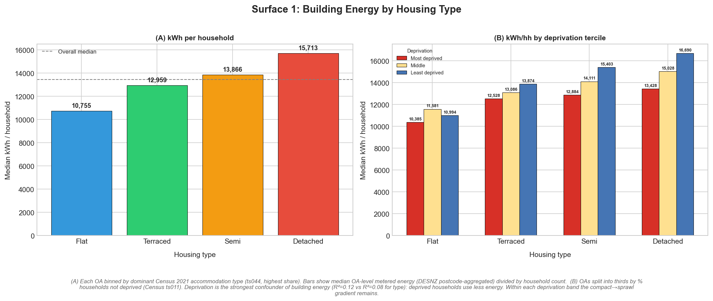

| Dwelling type | Building energy (kWh/hh) | kWh/person |
| ------------- | -----------------------: | ---------: |
| Flat | 10,766 | 5,144 |
| Terraced | 13,022 | 5,357 |
| Semi-detached | 13,888 | 5,809 |
| Detached | 15,835 | 6,750 |

Detached-dominant OAs use 1.47× the metered building energy of flat-dominant OAs per
household (1.31× per person). The per-person compression reflects smaller household sizes
in flat-dominant areas (2.1 vs 2.4 persons/hh).

**Surface 2: Mobility (transport energy).**

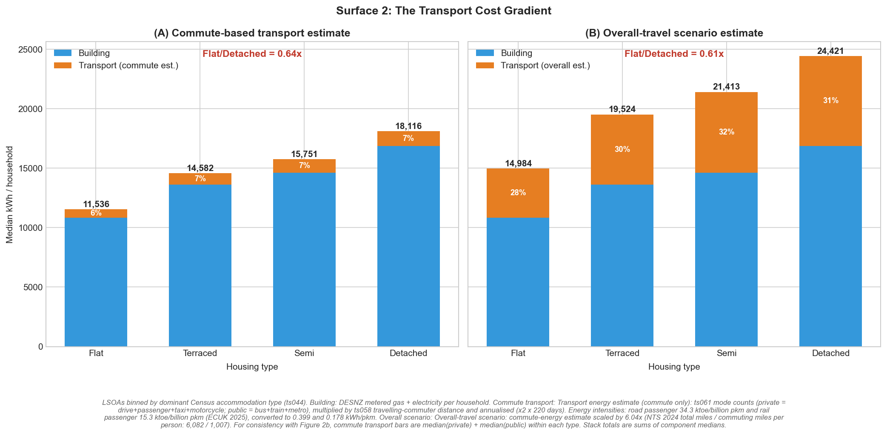

| Dwelling type | Commute (kWh/hh) | Overall est. (kWh/hh) | Total (overall, kWh/hh) |
| ------------- | ----------------: | --------------------: | ----------------------: |
| Flat | 663 | 4,003 | 14,769 |
| Terraced | 1,098 | 6,630 | 19,651 |
| Semi-detached | 1,275 | 7,698 | 21,586 |
| Detached | 1,498 | 9,045 | 24,879 |

Adding transport widens the gradient to 1.68× (overall scenario). Private commute energy
rises from 509 kWh/hh (flat) to 1,461 (detached), ratio 2.87×. Public commute energy runs
in the opposite direction: 154 → 36 kWh/hh. Car ownership: 0.67 → 1.61 cars/hh.

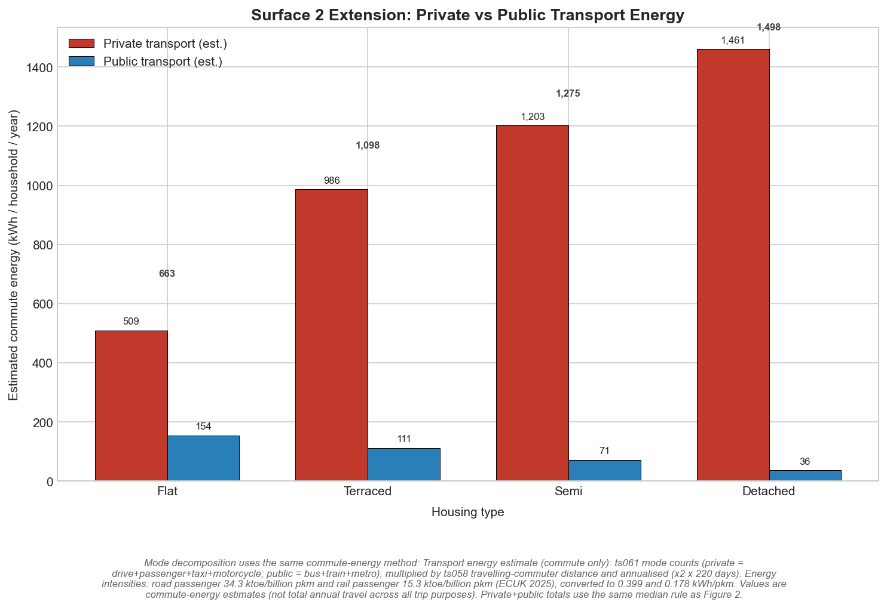

**Surface 3: Access (walkable service coverage).**

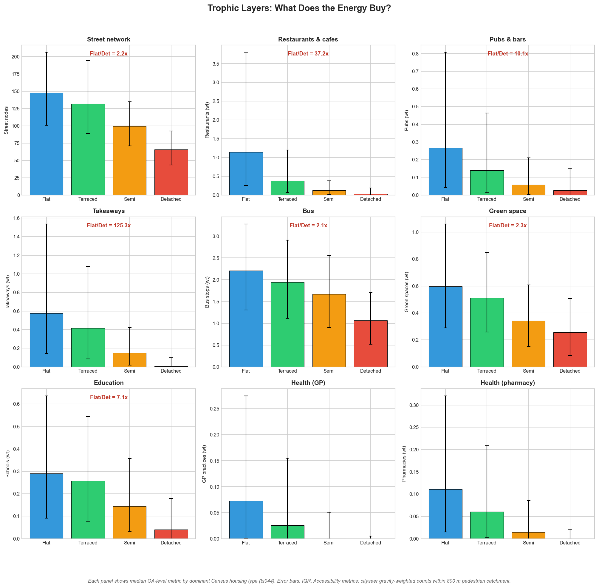

Median service coverage scores (Gaussian-decayed, 0–1):

| Service | Flat | Terraced | Semi | Detached |
| ------- | ---: | -------: | ---: | -------: |
| Food (restaurant) | 0.92 | 0.84 | 0.69 | 0.49 |
| Food (takeaway) | 0.87 | 0.84 | 0.70 | 0.34 |
| GP practice | 0.82 | 0.74 | 0.57 | 0.29 |
| Pharmacy | 0.82 | 0.75 | 0.61 | 0.34 |
| School | 0.91 | 0.90 | 0.85 | 0.73 |
| Green space | 0.94 | 0.93 | 0.90 | 0.86 |
| Bus stop | 0.97 | 0.96 | 0.95 | 0.92 |
| **Mean coverage** | **85.8%** | **80.4%** | **70.7%** | **54.9%** |

Bus stops and greenspace are accessible almost everywhere. The gradient is driven by
healthcare (GP: 0.82 → 0.29), food retail (takeaway: 0.87 → 0.34), and pharmacy
(0.82 → 0.34). These are the services that collapse beyond walking distance in
detached-dominant areas.

### 3.2 The NEPI scorecard

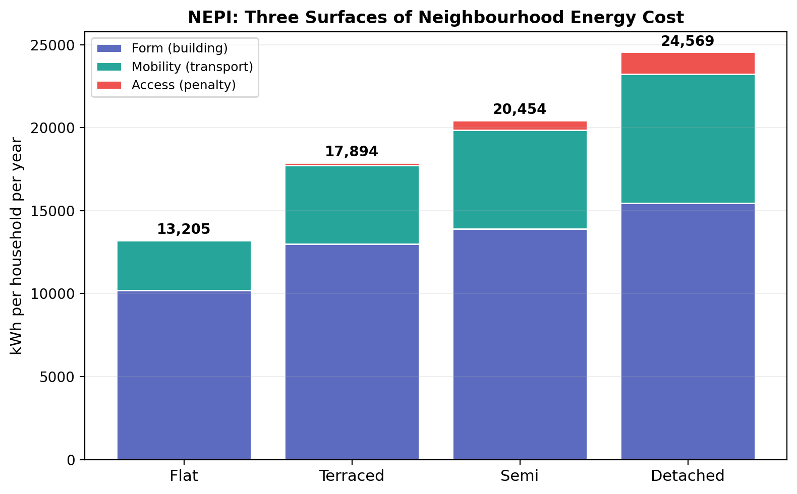

| Type | Form | Mobility | Access | Composite | Band |
| ---- | ---: | -------: | -----: | --------: | :--: |
| Flat | 81.7 | 82.4 | 85.8 | 78.3 | **C** |
| Terraced | 55.8 | 54.1 | 80.4 | 61.4 | **D** |
| Semi | 44.7 | 42.8 | 70.7 | 52.2 | **E** |
| Detached | 25.2 | 30.0 | 55.2 | 41.0 | **E** |

The median flat-dominant OA scores Band C; the median detached-dominant OA scores Band E.
The gradient is present on all three surfaces but is steepest on Access (85.8 → 55.2,
a 30.6-point gap) and shallowest on Mobility (82.4 → 30.0 — though this is scored by
percentile rank, not absolute coverage, so the gap reflects distributional position).

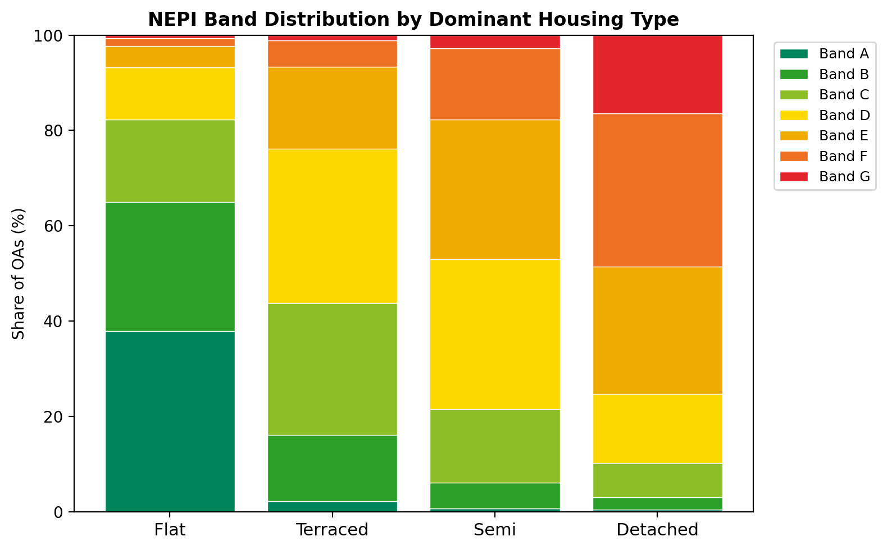

Band distribution:

| Type | A | B | C | D | E | F | G |
| ---- | -: | -: | -: | -: | -: | -: | -: |
| Flat | 10.2% | 23.9% | 25.4% | 24.1% | 13.0% | 3.1% | 0.3% |
| Terraced | 0.2% | 4.9% | 16.5% | 30.8% | 31.9% | 14.4% | 1.2% |
| Semi | 0.0% | 0.6% | 4.7% | 19.6% | 39.3% | 31.2% | 4.6% |
| Detached | 0.0% | 0.0% | 0.6% | 4.9% | 23.9% | 47.6% | 23.0% |

34% of flat-dominant OAs are Band A or B. Zero detached-dominant OAs are. 71% of
detached-dominant OAs are Band F or G.

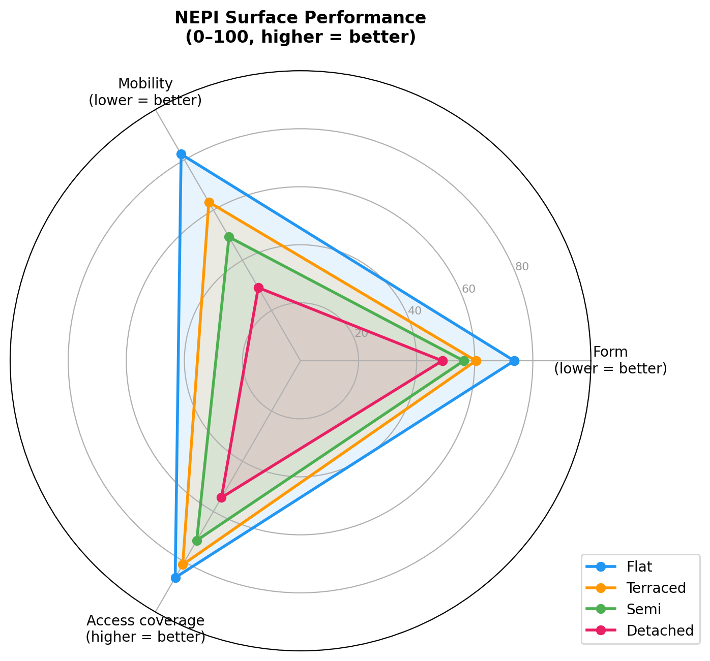

### 3.3 The access energy penalty

The access surface has a direct energy interpretation. Where services are beyond walking
distance, households must drive or take public transport to reach them. The energy cost
of this shortfall — the **access penalty** — is the additional transport energy attributable
to poor local coverage.

| Type | Local coverage | Access penalty (kWh/hh/yr) |
| ---- | -------------: | -------------------------: |
| Flat | 82.2% | 275 |
| Terraced | 75.6% | 581 |
| Semi | 61.4% | 1,028 |
| Detached | 45.2% | 1,629 |

The access penalty in detached-dominant OAs is 5.92× that in flat-dominant OAs. This
penalty is structural: it is determined by the distance between homes and services, which
is set by street layout and land-use configuration.

### 3.4 The three-surface decomposition

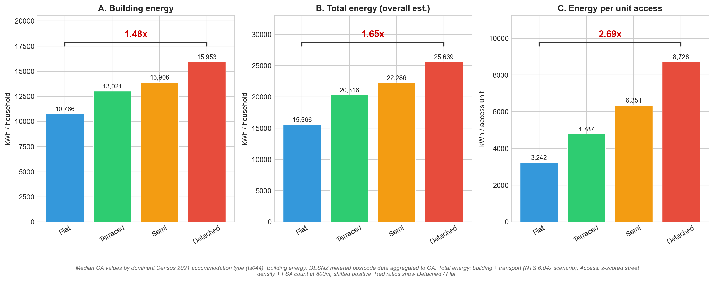

| Surface | Flat (kWh/hh) | Detached (kWh/hh) | Ratio |
| ------- | ------------: | -----------------: | ----: |
| Building energy | 10,766 | 15,835 | 1.47× |
| Total energy (overall est.) | 14,769 | 24,879 | 1.68× |
| kWh per access unit | 3,237 | 8,743 | 2.70× |

Each additional surface widens the gradient because transport and access correlate with
morphology in the same direction as building energy. This widening is a descriptive
pattern, not a multiplicative causal chain.

### 3.5 Deprivation stratification

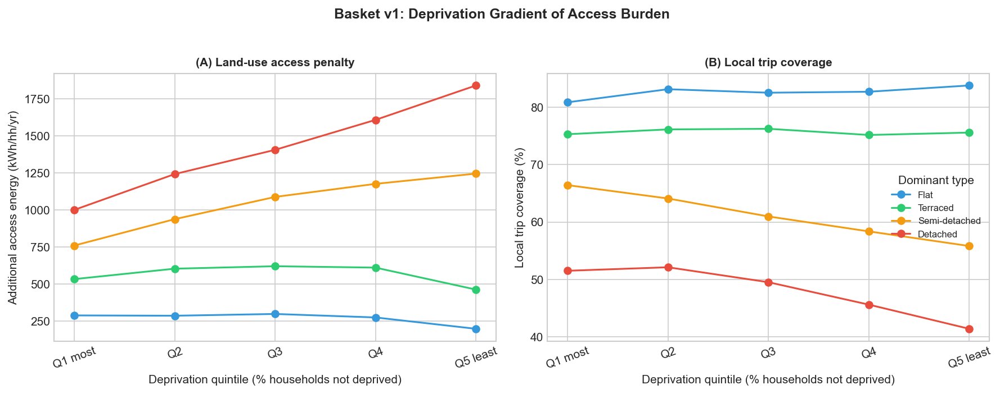

The morphology gradient in NEPI scores is present within each deprivation quintile (Census
TS011). This is consistent with a morphological interpretation but does not rule out
confounding: TS011 is a coarse composite that does not capture income, tenure, or
preferences directly.

### 3.6 Distribution-wide pattern

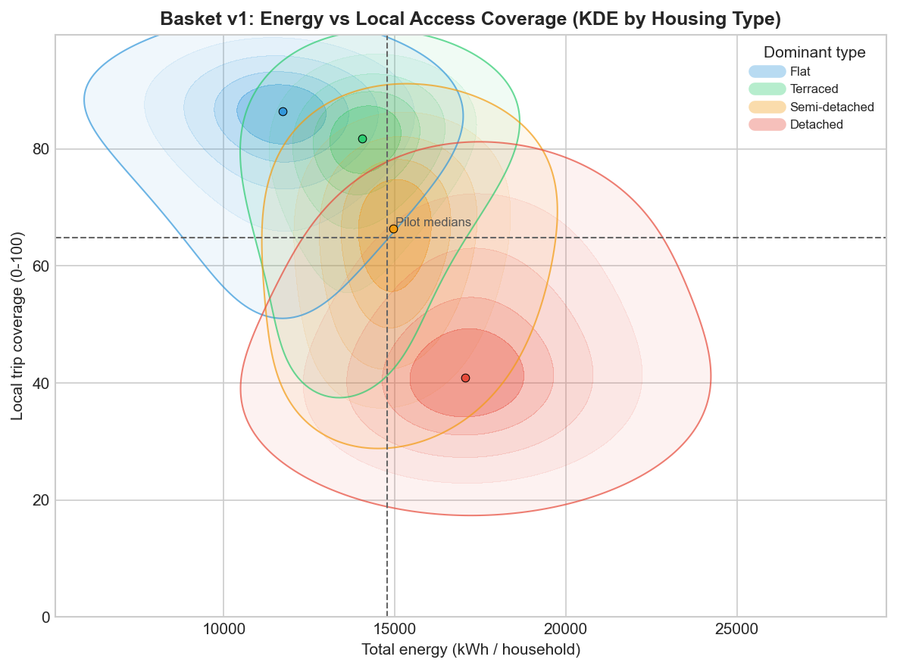

The morphology-energy-access pattern holds across the full distribution of 175,425 OAs,
not only at type-group medians.

## 4. Robustness

### 4.1 Bootstrap confidence intervals

All key Flat/Detached median ratios bootstrapped with 10,000 resamples:

| Metric | Ratio | 95% CI |
| ------ | ----: | -----: |
| Building kWh/hh | 0.675 | [0.672, 0.678] |
| Total kWh/hh (overall) | 0.607 | [0.604, 0.610] |
| kWh per access unit | 0.371 | [0.368, 0.375] |
| Cars/hh | 0.418 | [0.415, 0.421] |

All intervals are narrow. With 175,425 OAs, descriptive medians are precisely estimated
under iid assumption. Spatial autocorrelation means the effective sample size is smaller;
these CIs should be interpreted as precision of the descriptive comparison, not as
inferential confidence intervals.

### 4.2 Plurality share sensitivity

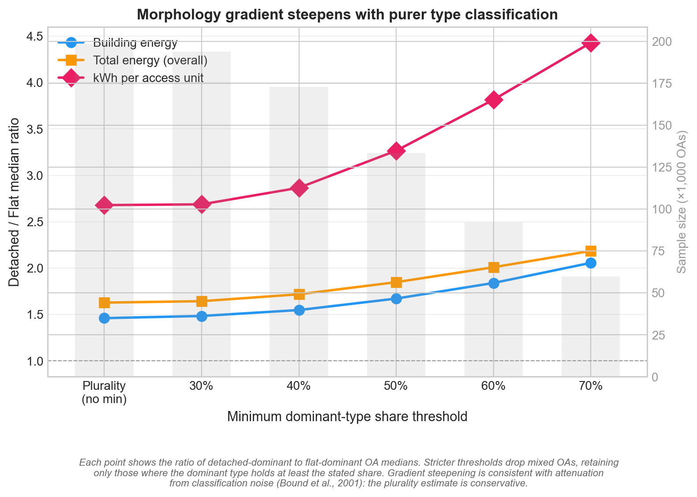

| Threshold | N total | Building (F/D) | Total (F/D) | kWh/Access (F/D) |
| --------- | ------: | -------------: | ----------: | ----------------: |
| Plurality | 175,425 | 0.675 | 0.607 | 0.371 |
| 40% | ~146k | 0.636 | 0.576 | 0.347 |
| 50% | ~112k | 0.588 | 0.534 | 0.305 |
| 60% | ~78k | 0.532 | 0.489 | 0.260 |

The gradient **steepens** at every threshold (building: 1.47× → 1.88× at 60%). This is
consistent with attenuation from classification noise in mixed OAs (Bound et al., 2001):
the plurality estimate is conservative. The NEPI scores for purer OAs would show an even
larger gap between housing types.

### 4.3 NTS distance scalar sensitivity

| Scalar | Flat total | Det total | Ratio | Det transport share |
| -----: | ---------: | --------: | ----: | ------------------: |
| 1.0× | 11,429 | 17,332 | 0.660 | 8.4% |
| 6.04× | 14,769 | 24,879 | 0.593 | 36.3% |
| 10.0× | 17,396 | 31,312 | 0.556 | 47.9% |

The qualitative pattern is stable from 1× to 10×.

### 4.4 Edge effects

Excluding OAs in the bottom 10% of network density within each type changes the building
energy gradient by less than 1% (0.675 → 0.680). The 2,400m road network buffer applied
during processing prevents meaningful truncation bias.

### 4.5 Regression with controls

OLS regressions with progressive controls (housing type shares with semi as reference,
log population density, household size, deprivation, building age, IMD income domain,
BUA fixed effects) confirm that the morphology gradient persists after adjustment. HC1 and
BUA-clustered standard errors are reported. Housing type shares remain significant under
clustering.

Cars per household is treated as a mediator (morphology → car ownership → transport energy)
rather than a confounder: including it absorbs a substantial portion of the mobility
gradient, consistent with the mechanism being partly mediated through vehicle dependence.

## 5. Discussion

### 5.1 The NEPI as a policy tool

The NEPI provides a neighbourhood-level energy rating constructed entirely from open data.
Unlike building EPCs, which rate the dwelling envelope, the NEPI rates the place —
integrating the thermal, transport, and access dimensions of energy performance into a
single score.

The policy applications are:

- **Planning decisions.** New development can be assessed not only for building fabric
  (current EPC requirement) but for neighbourhood energy performance. A development that
  scores Band A on the building EPC but Band F on the NEPI (poor access, car-dependent
  layout) is not energy-efficient in any meaningful sense.
- **Retrofit prioritisation.** The NEPI identifies which surface offers the greatest
  improvement potential. An OA with high Form score but low Access score needs service
  provision, not insulation. An OA with low Form but high Access needs building retrofit.
- **Transport investment.** The Mobility surface identifies areas where transport energy
  dependence is highest, supporting targeted public transport or active travel investment.
- **Health and equity.** The Access surface directly measures proximity to GP practices,
  pharmacies, and greenspace — services with health implications beyond energy.

### 5.2 What technology can and cannot offset

| Layer | Gradient | Intervention | Offset potential | Timescale |
| ----- | -------: | ------------ | ---------------- | --------- |
| Form | 1.47× | Heat pump, insulation | High | 10–20 yrs |
| Mobility | 2.26× | EV electrification | Partial — reduces intensity, not distance | 10–15 yrs |
| Access | 1.56× (coverage) | Land-use reconfiguration | Low — requires changing distances | 50–100+ yrs |

Building retrofit and fleet electrification can compress the Form and Mobility gaps on
technology replacement timescales. The Access gap is set by street layout and land-use
configuration. Land-use planning interventions (neighbourhood centres, GP branch surgeries,
school placement) can reduce the access penalty without altering street geometry, but the
underlying network structure turns over on generational timescales: 38% of English housing
predates 1946 (BRE Trust, 2020).

### 5.3 Ecological inference

This is a descriptive ecological study. The NEPI documents neighbourhood-level performance,
not household-level causal effects. Morphology is an area-level property: street layout,
building form mix, and land-use density are inherently characteristics of the
neighbourhood, not of the individual household (Greenland, 2001; Wakefield, 2008). The
ecological fallacy applies when area-level associations are used to infer individual effects;
the NEPI does not make this claim. It rates neighbourhoods, as building EPCs rate buildings.

Residential self-selection remains a plausible alternative explanation: households that
prefer driving may sort into detached suburbs (Mokhtarian & Cao, 2008; Cao, Mokhtarian &
Handy, 2009). Stevens (2017), reviewing over sixty empirical studies, found that controlling
for self-selection attenuates the built environment effect on driving by roughly 5–25% but
does not eliminate it; the residual effect, operating through destination accessibility and
street network design, is consistently significant. Whether the gradient arises from
morphology directly or from the sorting patterns that morphology induces, the planning
implication is the same: compact forms are
associated with lower total energy expenditure and higher local access. Planners control
neighbourhood morphology, not household preferences.

### 5.4 Limitations

- Building energy from DESNZ postcode data. Off-gas-grid (~15% of homes) and communal
  heating (disproportionately flats) both compress the Form gradient.
- Census 2021 commute data reflects pandemic behaviour (March 2021, third lockdown).
- The NTS 6.04× scalar is a uniform national ratio; the true ratio varies by area type.
- Gaussian decay thresholds (800–2,000m) are assumptions, not calibrated parameters.
- Spatial autocorrelation is present. OLS standard errors are anti-conservative; BUA-clustered
  SEs partially address this.

## 6. Conclusion

The Neighbourhood Energy Performance Index rates every Output Area in England on three
surfaces of energy performance: the thermal efficiency of the built form, transport energy
dependence, and walkable access to essential services. The median flat-dominant
neighbourhood scores Band C; the median detached-dominant neighbourhood scores Band E. The
gradient is steepest on the Access surface — the dimension where no technology can help and
where planning intervention has the most to offer.

The NEPI is constructed from open data, is reproducible, and can be updated as new data
becomes available. It provides a framework for integrating building energy, transport, and
access into a single neighbourhood-level metric, complementing building-level EPCs with a
place-level equivalent. The index is deliberately simple: three surfaces, equal weights,
A–G bands. Refinement of the weighting, the service thresholds, and the transport
estimation method are directions for future work. The core finding — that neighbourhood
form shapes energy performance across all three surfaces, and that the hardest surface to
fix is the least visible to current policy — is robust to the methodological choices tested.

## References

Bettencourt, L.M.A. et al. (2007). Growth, innovation, scaling, and the pace of life in
cities. *PNAS*, 104(17), 7301–7306.

Bound, J., Brown, C. & Mathiowetz, N. (2001). Measurement error in survey data. In
*Handbook of Econometrics*, Vol. 5, 3705–3843.

Cao, X., Mokhtarian, P.L. & Handy, S.L. (2009). Examining the impacts of residential
self-selection on travel behaviour. *Transport Reviews*, 29(3), 359–395.

DESNZ (2025). Subnational Consumption Statistics: Methodology and Guidance Booklet.
Department for Energy Security and Net Zero, December 2025.

Ewing, R. & Cervero, R. (2010). Travel and the built environment: A meta-analysis.
*JAPA*, 76(3), 265–294.

Greenland, S. (2001). Ecologic versus individual-level sources of bias in ecologic
estimates of contextual health effects. *International Journal of Epidemiology*, 30(6),
1343–1350.

Jacobs, J. (2000). *The Nature of Economies*. Random House.

Mokhtarian, P.L. & Cao, X. (2008). Examining the impacts of residential self-selection
on travel behavior. *Transport Reviews*, 28(3), 359–395.

Newman, P. & Kenworthy, J. (1989). *Cities and Automobile Dependence*. Gower.

Norman, J., MacLean, H.L. & Kennedy, C.A. (2006). Comparing high and low residential
density: Life-cycle analysis of energy use and greenhouse gas emissions. *Journal of Urban
Planning and Development*, 132(1), 10–21.

Robinson, W.S. (1950). Ecological correlations and the behavior of individuals. *American
Sociological Review*, 15(3), 351–357.

Rode, P. et al. (2014). Cities and energy: Urban morphology and residential heat-energy
demand. *Environment and Planning B*, 41(1), 138–162.

Stevens, M.R. (2017). Does compact development make people drive less? *Journal of
Planning Literature*, 32(3), 184–211.

Wakefield, J. (2008). Ecologic studies revisited. *Annual Review of Public Health*, 29,
75–90.
