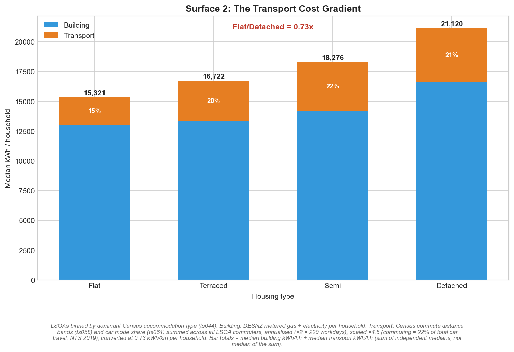
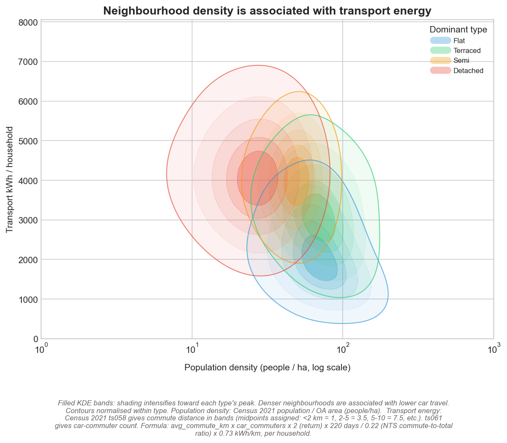
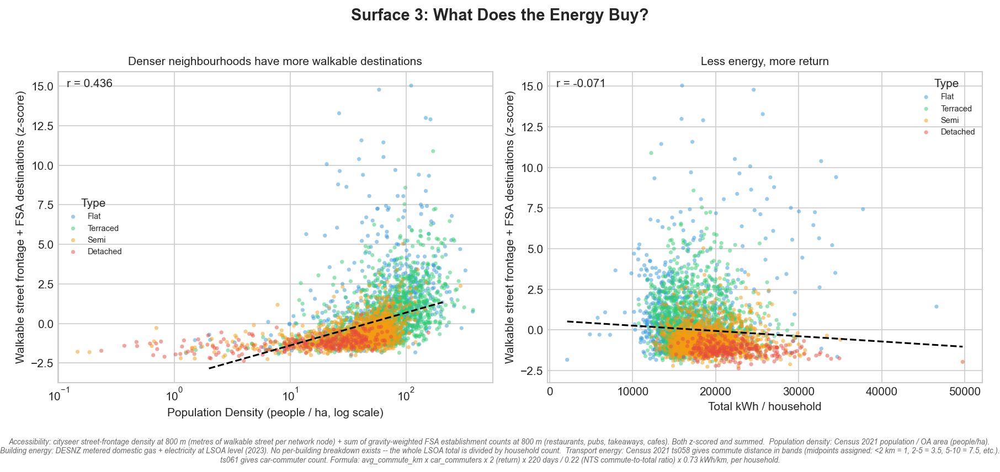
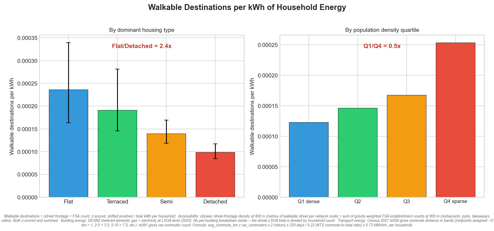
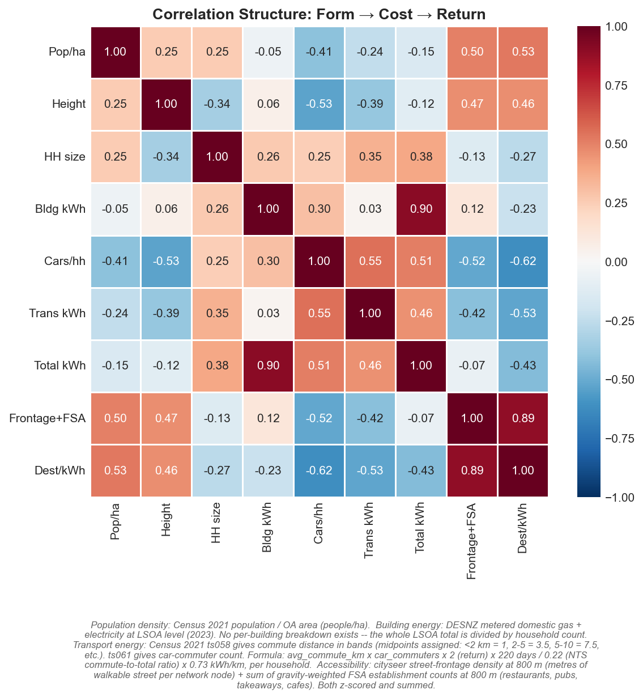
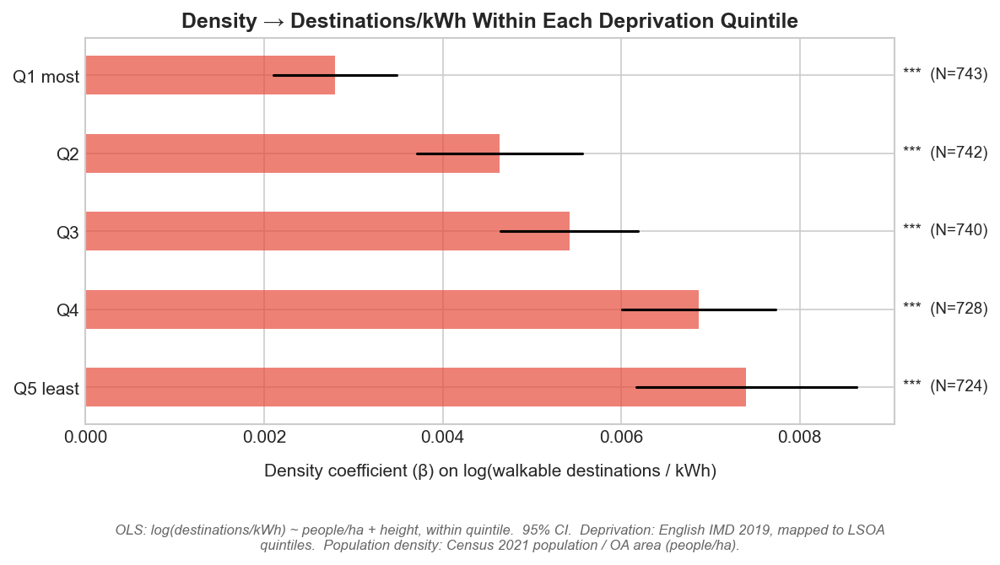
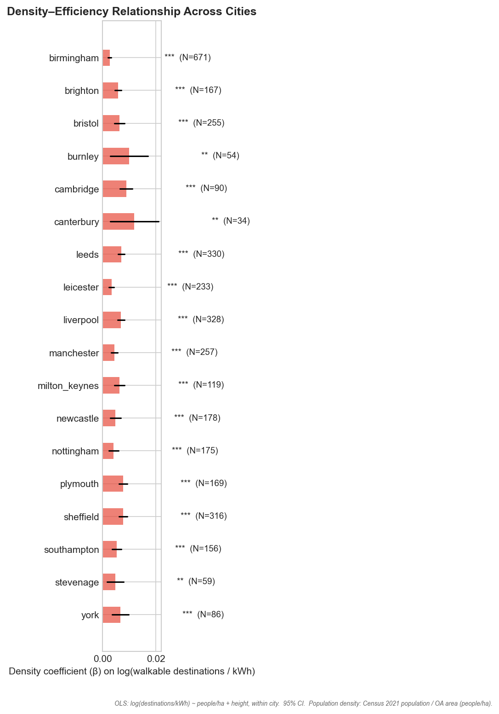

# Research Overview

## Hypothesis

Dwelling type is not simply a building form — it encodes a committed pattern of urban life.
A detached house does not solely incur a higher thermal penalty through its exposed
envelope; it also situates its occupants at greater distance from destinations, is
associated with higher levels of car dependence, and returns less accessible city per unit
of energy consumed. The energy cost of low-density development is therefore not a fixed
quantity but a compounding one: it widens as the unit of analysis shifts from building
physics alone to the full cost of residential energy use.

The central claim is as follows: when energy consumption is normalised sequentially — first
per household, then per capita, then per unit of accessible city delivered — the efficiency
differential between the most compact and most sprawling dwelling types widens at each
step. That progressive widening, rather than any single cross-sectional comparison, is the
primary observation.

---

## Observations

All values are medians across Lower Super Output Areas (LSOAs), stratified by dominant
accommodation type (Census 2021, TS044). The dataset comprises 18 English cities
(N = 3,678 LSOAs).

### Surface 1: Building Energy

| Dwelling type | Building energy (kWh/household) | Building energy (kWh/person) |
|---|---|---|
| Flat | 13,034 | 6,208 |
| Terraced | 13,342 | 5,275 |
| Semi-detached | 14,203 | 5,807 |
| Detached | 16,632 | 6,817 |

At the household level, detached dwellings are associated with 28% higher building energy
than flats. The per-capita comparison is less straightforward: flat and detached LSOAs
converge in kWh per person, because flat-dominated LSOAs have smaller average household
sizes (2.08 persons per household versus 2.43 for detached). The thermal advantage of
shared-wall construction is partially offset by lower occupancy — an observation that
motivates moving beyond the household as the functional unit.

### Surface 2: Transport Energy

| Dwelling type | Transport energy (kWh/household) | Car commute share | Cars per household |
|---|---|---|---|
| Flat | 2,286 | 29% | 0.68 |
| Terraced | 3,380 | 40% | 0.89 |
| Semi-detached | 4,072 | 48% | 1.13 |
| Detached | 4,489 | 45% | 1.47 |

Estimated transport energy is approximately twice as high in detached-dominated LSOAs as
in flat-dominated LSOAs (4,489 versus 2,286 kWh per household). When building and
transport energy are combined, total household energy rises from 15,764 kWh (flat) to
21,416 kWh (detached) — a differential of 36%. Car availability follows the same
gradient: detached-dominated LSOAs have 2.15 times as many cars per household as
flat-dominated LSOAs.

### Surface 3: Accessibility

The accessibility composite combines gravity-weighted street network density and
gravity-weighted FSA establishment counts within an 800-metre pedestrian catchment, both
standardised and summed. Higher scores indicate more connected, destination-rich
environments.

| Dwelling type | Accessibility score (standardised) |
|---|---|
| Flat | +0.35 |
| Terraced | −0.01 |
| Semi-detached | −0.75 |
| Detached | −1.19 |

Flat-dominated LSOAs score 1.54 standard deviations above detached-dominated LSOAs on
the accessibility composite, a substantively large differential.

### The Compounding Differential: Accessibility per Unit of Energy

Dividing the accessibility score by total energy consumption per household produces a
measure of the return on residential energy expenditure — what each unit of energy delivers
in terms of reachable urban environment:

| Dwelling type | Accessibility per kWh (×10⁻⁴) | Ratio relative to flat |
|---|---|---|
| Flat | 2.36 | 1.00 |
| Terraced | 1.92 | 0.81 |
| Semi-detached | 1.40 | 0.59 |
| Detached | 0.99 | 0.42 |

Detached-dominated LSOAs return less than half the accessible urban environment per unit
of energy compared with flat-dominated LSOAs. The differential that stands at 28% when
measured at the level of building physics has compounded to a factor of 2.4 when the
return on that energy is taken into account.

---

## Distinguishing this from Prior Density–Energy Research

The most immediate objection is that these observations replicate the established
relationship between urban density and transport energy (Newman and Kenworthy, 1989; Ewing
and Cervero, 2010). Three aspects of the analysis distinguish it from that literature.

**The functional unit is itself the argument.** Existing studies select a single metric —
vehicle-kilometres travelled, kWh per capita, or carbon per household — and report the
density gradient against it. The present analysis treats the choice of functional unit not
as a methodological detail but as the substance of the inquiry. The progressive widening of
the efficiency differential across three normalisations is what is being measured and
explained, not a by-product of a particular unit choice.

**Dwelling type as a committed spatial arrangement.** Population density is a summary
statistic of decisions already embedded in the built fabric; dwelling type encodes those
decisions at the level of the individual unit. A detached house commits its occupants to a
particular plot geometry, street pattern, and proximity to services for the lifetime of the
structure. Using Census accommodation type (TS044) as the stratification variable rather
than population density makes the lock-in mechanism explicit: it is not that compact areas
happen to be efficient, but that the physical disposition of dwellings determines which
layers of urban interaction are accessible on foot and which require motorised travel.

**Accessibility disaggregated into independent layers.** The analysis measures four
distinct accessibility dimensions — street network connectivity, commercial destinations,
public transport, and green space — each gravity-weighted at the 800-metre pedestrian
catchment. The regression results demonstrate that each dimension contributes independently
to the accessibility differential after controlling for population density and dwelling type
composition. This decomposition has not been applied in the density–energy literature.

---

## The Deprivation Robustness Check

The observed efficiency differential could reflect socio-economic sorting rather than
structural effects of dwelling type: affluent areas may exhibit both compact housing and
higher destination density, while deprived areas may exhibit sprawling housing and fewer
services. To address this, LSOAs are stratified into quintiles by the proportion of
households not deprived in any dimension (Census 2021, TS011), and the accessibility
regression is replicated within each quintile. The differential is sustained within every
quintile, including the most deprived fifth. The accessibility deficit associated with
sprawling dwelling types is therefore structural — it persists independently of the
socio-economic character of the area.

---

## Summary of Contribution

The analysis demonstrates that compact urban form is not simply a more efficient vessel for
equivalent residential activity. The same quantum of energy, expended in a compact
neighbourhood, passes through a greater number of layers of urban interaction before it
dissipates. That compounding differential is not amenable to closure through building
fabric improvement or vehicle electrification, because it is rooted in the spatial
arrangement of dwellings relative to destinations — an arrangement that is fixed for the
lifetime of the built stock.
