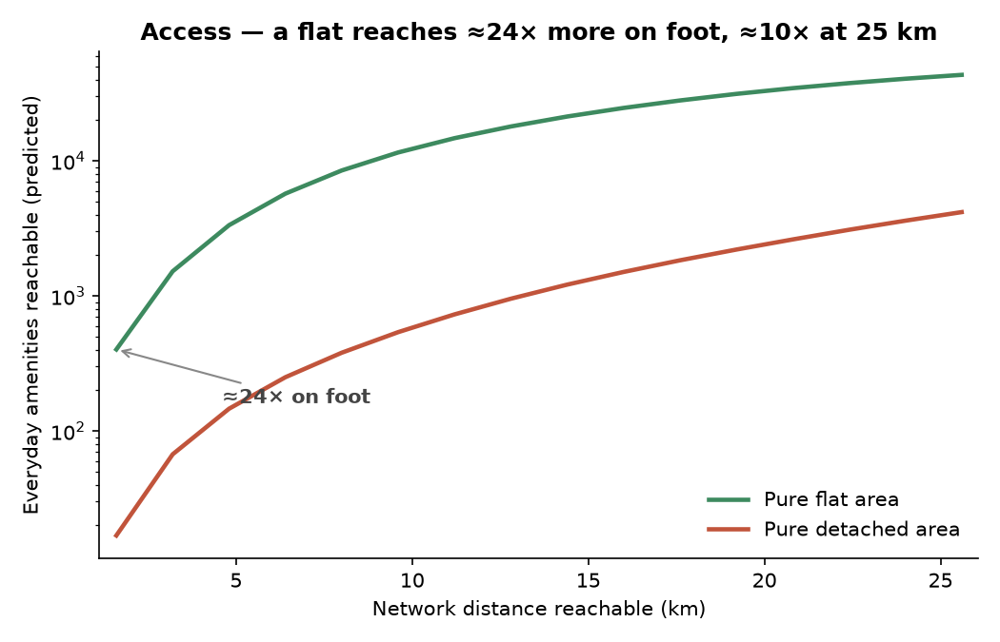

# NEPI — what we measured, how, and what we found

## The question

We are testing a reframing: that a neighbourhood should be judged not by how much energy it consumes, but by how much access that energy buys — the everyday life a household can reach for the energy it spends. The idea is Jane Jacobs's: a place is efficient *because* of its complexity, the way a rainforest folds a unit of energy through many exchanges and does far more with it, while a desert, for an equivalent amount of energy, does less because it cannot fold it and the energy simply streams through and is lost. We put this on two measured quantities — energy spent and access gained — and the rate between them, across roughly 178,000 English neighbourhoods (Census Output Areas), comparing flat-type against detached-type neighbourhoods.

## How the comparison is made

Every "×" in this document is a flat-versus-detached gap, computed the same way:

- *The unit is a neighbourhood.* We use the Census 2021 **Output Area**, the smallest area the census publishes — about 300 residents (~125 households). England has roughly 178,000 of them.
- *We use the whole dwelling mix, not a label.* The census gives each area its full mix — say 60% flats, 25% terraced, 10% semi-detached, 5% detached. Instead of labelling each area by its most common type, we feed every area's complete mix into one regression (a *compositional* model), which reads off the energy (or access) of a pure all-flat and a pure all-detached area; the gap between them is what we report. Using every proportion is sharper than a one-type label.
- *We hold the obvious differences equal.* The same model holds **income, tenure and building age** constant and weights by the number of households, so the gap it reports is the difference the *form* makes, not differences in wealth, renting or the age of the stock. (Access is the exception — see that section — because there the compactness *is* the mechanism.)
- *Both per household and per person.* Detached households are about a sixth larger, so a gap "per person" is always smaller than the same gap "per household". We report both throughout: per household is what is consumed and emitted, per person is per resident.
- *Reading the tables.* In every table the **Flat** and **Detached** columns are the plain observed medians — real metered energy, real reachable counts — shown to ground the numbers. The **ratio** columns are the model estimate described above, so they need not equal the bare quotient of the two observed columns.
- *Caveat.* The model reads the gap at the extremes — a *wholly* flat versus a *wholly* detached area, which few real areas are — so each ratio is the sharp end of the estimate: the gap is at least this much.

## Energy: the units, and why

We measure household energy in kilowatt-hours per household (and per person) per year, combining heat with car travel. The heat is *metered, not modelled*: DESNZ's actual gas and electricity, aggregated from postcode to neighbourhood, rather than the modelled SAP ratings behind a building's EPC, which over-predict what homes actually burn (the performance gap).

**How the energy figure is built**

- *It is "delivered" energy.* Every figure is the energy that actually arrives at the home to be used — gas and electricity for heat, plus fuel or electricity for the car. It is not primary energy and not carbon, so no conversion factors enter; the units are simply kilowatt-hours per year.
- *From postcode up to the neighbourhood.* DESNZ publishes metered gas and electricity at **postcode** level. We total each postcode's consumption (the mean per meter multiplied by the number of meters, gas and electricity together) and aggregate it to the Output Area, so areas with more meters carry proportionally more weight; dividing by the area's households gives kilowatt-hours per household.
- *Why "metered, not modelled" matters.* An EPC rating is a **design estimate** of how a building *should* perform; metered consumption is what households *actually* use. The two diverge — the "performance gap" — so the metered figure is the honest measure of energy spent.

## Heat

A detached neighbourhood uses about **1.41 times** a flat's heat per household, **1.08 times** per person. The gap is the form's, in three parts: detached homes are bigger, hold more people, and have a leakier shape (more exposed wall, no shared party walls). With floor area, occupancy, age, income and tenure all held equal, the shape alone accounts for about **12%** (1.12×); the rest is the larger homes and households that low density brings.

**How we separated "shape" from "size"**

- *The puzzle.* The detached-versus-flat heat gap blends three things low density brings together: bigger homes, more people in each home, and a leakier shape. We want the part that is the **shape alone**.
- *The method — a "ladder".* Starting from the compositional model above (the full dwelling mix, with age, income and tenure held equal), we add controls one at a time — first household size, then floor area — and watch the gap shrink. What it shrinks by was really **size and occupancy in disguise** — about **three-quarters** of the gap. What survives once both are held fixed (about 1.12×, i.e. roughly **12%** extra) is the **direct** penalty of the form itself: exposed walls and no shared surfaces.
- *Why we do not simply divide by floor area.* Comparing homes "per square metre" is tempting but misleading: energy does not rise in step with size — double the floor area and heat rises by *less* than double (its "elasticity" to floor area is below 1). Dividing by square metres therefore flatters large homes automatically and would hide the very effect we are trying to isolate.
- *Caveat.* Local climate (heating-degree-days, from HadUK-Grid) is the one confound still to be added; it would refine the direct term further.

## How we measured car travel

We want all the car energy a home's location forces, not just the commute — the commute is only about a sixth of car miles, so using it alone undercounts driving roughly sixfold. No open dataset measures all local driving per neighbourhood, so we build it by *constrained disaggregation*. We start from a measured total: the National Travel Survey (NTS9904) gives car-driver miles per person by 2021 rural-urban class — how far the average person drives in a dense city, a town, a village. We then distribute each class's total down to its neighbourhoods using two local signals from the Census, car ownership and commute distance, so lower-ownership and shorter-commute places receive fewer miles. Each class's population-weighted mean is held to the survey figure, so the totals stay as measured and only their distribution across neighbourhoods is estimated. Finally we convert miles to energy using the local fleet's energy per mile, allowing for the share of electric versus petrol cars (DVLA).

**The estimate, step by step**

- *Why it cannot simply be counted.* No open dataset records how far the residents of one neighbourhood drive in total. The commute is the only journey the census measures, and it is roughly a sixth of all car miles — so a commute-only figure would undercount driving about sixfold.
- *"Constrained disaggregation."* We take a quantity we **do** know reliably — the average miles driven per person across a whole class of places — and share it out among the neighbourhoods in that class using local clues, in a way that keeps the class average exactly intact. "Constrained" means the measured totals never move; only their **distribution** between neighbourhoods is estimated.
- *The measured anchor.* The National Travel Survey (NTS9904) gives car-driver miles per person by 2021 **Rural-Urban Class** of residence — about 2,500 miles per person in dense cities rising to roughly 5,200 in the countryside. Because it is measured by where people live, it carries the real urban-to-rural driving gradient without counting passing through-traffic.
- *The local clues.* Within each class we raise or lower a neighbourhood's share by its **car ownership** (cars per person, Census TS045) and, more gently, its **commute distance** (Census TS058), so lower-ownership, shorter-commute places receive fewer miles.
- *Keeping the books balanced.* The population-weighted average of the shared-out miles in each class is forced back to exactly the survey figure, so nothing is invented at the level we can actually check.
- *Miles into energy.* Miles × household size × the local fleet's energy per mile, where a petrol car uses about 0.93 kWh per mile and an electric one about 0.32, blended by the area's share of electric vehicles (DVLA).
- *The one judgement call.* How strongly commute distance pulls the estimate is set by a single number (an elasticity of 0.30); the analysis reports how little the result moves when it is varied.

| energy, per household / year | Flat (observed) | Detached (observed) | ratio, per household | ratio, per person |
| --- | --: | --: | --: | --: |
| heat (metered gas + electricity) | 10,194 | 15,020 | 1.41× | 1.08× |
| car travel | 3,240 | 9,272 | 3.23× | 2.47× |
| **total** | 13,674 | 23,832 | **2.02×** | **1.54×** |

The Flat and Detached columns are observed medians; the ratios are the compositional (method-D) estimate, so they are not the quotient of the two columns. Car travel makes up 24–37% of all household energy.

## Access: the units we compare

Access is the count of things reachable from a neighbourhood over the *real road network*, the distance along the streets people actually use, computed with cityseer over OS Open Roads rather than straight-line. Because it is a property of the *location*, it is the same however the household is counted: per home or per person makes no difference to what is within reach. We count three kinds of thing, each in its own unit: **amenities** (everyday destinations — GPs, pharmacies, hospitals, schools, food outlets, supermarkets, greenspace), **jobs** (the number of jobs reachable, a weighted sum because each workplace carries its own job count), and **people** (the resident population reachable). Each is read at two distances on one ruler — a short walk (1.6 km) and a long drive (25.6 km) — so the on-foot and the drivable figures are directly comparable, and what you reach on foot is a subset of what you reach by car.

**How access is measured**

- *Distance along streets, not as the crow flies.* Every count is measured over the **real road network** — the routes people actually walk and drive — using the cityseer routing engine over Ordnance Survey Open Roads. We build the entire England street network once (about 3.6 million junctions) and measure outward from each neighbourhood along it.
- *One ruler, read at fixed distances.* From each Output Area we count what is reachable at every step from a short walk (1,600 m) out to a long drive (25,600 m). The on-foot figure is therefore a genuine subset of the drivable one — the same ruler, read closer in.
- *Three kinds of thing, each in its own unit.* **Amenities** are a plain count of seven everyday destinations reachable (GPs, pharmacies and hospitals from the NHS; schools from GIAS; food outlets and supermarkets from the FSA; greenspace from Ordnance Survey). **Jobs** are a *weighted* sum — each workplace counts for the number of jobs it holds (Census WP101EW), not as a single point. **People** are likewise a weighted sum of the residents reachable.
- *The ratio is the compositional estimate too — but income only, not density.* The flat-versus-detached access gaps below come from the same full-mix model. For access we hold **income** equal but deliberately **not** density: density is the very mechanism by which compact form delivers access, so netting it out would erase the effect under study. Because access counts are non-negative and have real zeros (many detached areas reach no GP on foot), the model uses a count form (Poisson) that cannot predict negative counts.
- *Check — quantity, not mix.* The flats' advantage is in **how much** is reachable, not in a better blend of uses: the variety of land uses differs only about 1.1×, so the balance is similar and the gap is one of sheer count.

| within reach (median) | Flat, on foot | Flat, 25 km | Detached, on foot | Detached, 25 km | ratio, foot | ratio, 25 km |
| --- | --: | --: | --: | --: | --: | --: |
| amenities | 209 | 20,812 | 22 | 4,653 | **23.9×** | 10.4× |
| jobs | 6,927 | 807,658 | 598 | 173,447 | **52.4×** | 14.3× |
| people | 17,838 | 2,343,165 | 2,767 | 472,236 | **12.5×** | 11.1× |

The Flat and Detached columns are observed medians; the ratios are the compositional estimate. The compactness behind the gap: a flat neighbourhood holds about 79 people per hectare against a detached one's 14, a factor of 5.7.

## The ratios

For access the flat is ahead at every distance, and the gap narrows as distance grows. On foot a flat reaches roughly **24 times** the amenities, **52 times** the jobs and **12 times** the people of a detached neighbourhood; out at a 25 km drive, where a detached home can finally reach into denser places, the flat is still **10 to 14 times** ahead. For energy the direction reverses: a detached home spends about **1.4 times** the heat, **3.2 times** the car energy, and **2.0 times** the total per household. The **rate** brings the two together: a flat returns about **6.3 times the access per kilowatt-hour** it spends.

**How the rate works, and why it differs from the on-foot gap**

- *The rate.* For access per kilowatt-hour we take, for each neighbourhood, the amenities reachable at its own car catchment divided by its car-travel energy, and compare a pure all-flat against a pure all-detached area the same way as every other ratio — giving the **6.3×** figure. It says how much everyday reach each kilowatt-hour of driving buys.
- *Why the rate (~6.3×) is smaller than the on-foot gap (~24×).* The on-foot figure holds **distance** fixed — at the same reach the flat has far more around it. Let each home drive out to its *own* catchment and the detached home **spends energy to compensate**, pulling its count up until the two nearly converge (about 1.2× apart) — but it burned far more fuel to get there, so **per kilowatt-hour the flat is still 6.3× ahead.**

## Lock-in: what survives decarbonisation

Does decarbonisation close the gap? We recompute the energy with each home at best-practice insulation (its EPC-potential fabric) and a fully electric fleet.

**How the optimised scenario is computed**

- *Best-practice fabric.* We take each area's metered **gas** (space and water heating) and scale it by the EPC fabric-improvement ratio — potential intensity over current intensity, both EPC-modelled so the performance gap cancels (the median improvement is about half). Metered **electricity** (appliances, lighting) is left untouched, since insulation does not change it. Anchoring to the metered bill keeps the scenario on the same scale as the headline figures, and a best-insulated detached home is still a *larger* home that loses more heat.
- *Full electrification.* Car energy is recomputed at the electric fleet's energy per mile while holding the **miles unchanged** — technology cuts the energy per mile, never the distance the form forces.
- *Access is unchanged by construction.* No insulation and no motor brings a school or shop closer, so the access axis is identical before and after — which is precisely the point.

| total energy gap (compositional) | per household | per person |
| --- | --: | --: |
| now | 2.02× | 1.54× |
| after best insulation + a full electric fleet | 1.50× | 1.15× |

The energy gap closes only part way: per household from 2.02 to 1.50 times, per person from 1.54 to 1.15 times — about **half** the excess survives, and a real residual remains even per resident. What survives splits across both halves of the form: a best-insulated detached home is still **bigger**, so it still loses more heat; and electrification cuts the energy per mile but not the **miles**, so a detached home still drives far further. Technology optimises the efficiency of each unit but leaves the structural quantities — floor area and distance — untouched.

The access gap does not move at all, because no amount of insulation and no electric motor brings a school, a job or a shop any closer to a house built far from them. The inefficiency of dispersed form is therefore not something technology retires; it is fixed in the street layout, which changes only when places are physically rebuilt, over generations rather than product cycles. That permanence is the heart of the finding, and the reason access has to be measured and planned for directly.

## The NEPI scorecard, Atlas and models

We will provide the measure as three things: a **NEPI scorecard**, an EPC-style rating for neighbourhoods rather than buildings; an **Atlas** to explore the ratings; and **XGBoost models** that predict a neighbourhood's NEPI from its form, fabric and fleet, so different combinations can be simulated, including a proposed development before it is built.

*Status: these three are **planned outputs**, not yet built. The measured findings above stand on their own; the scorecard, Atlas and models are the intended means of delivering them.*

---

*Method note: every flat-versus-detached ratio is a compositional (no-intercept, household-weighted) regression on the full dwelling-type mix, holding income, tenure and building age equal (income only for access, where density is the mechanism); energy axes use a log model, access counts a Poisson model. The ratio reads the gap between a pure all-flat and a pure all-detached area, so it is the sharp, like-for-like end of the estimate and need not equal the quotient of the observed-median columns. Robustness: the metered heat gap holds on well-measured neighbourhoods (gas-meter coverage 0.81 for flats vs 0.94 for detached); land-use mix differs little (~1.1×), so the access advantage is quantity, not balance. The three figures are on this same compositional basis. Reproduce: `stats/form_size_decomposition.py` (energy axes + the heat ladder), `stats/access_profile.py` (access + rate), `stats/lock_in.py` (decarbonisation scenario), `stats/travel_energy.py` (car-travel energy).*
