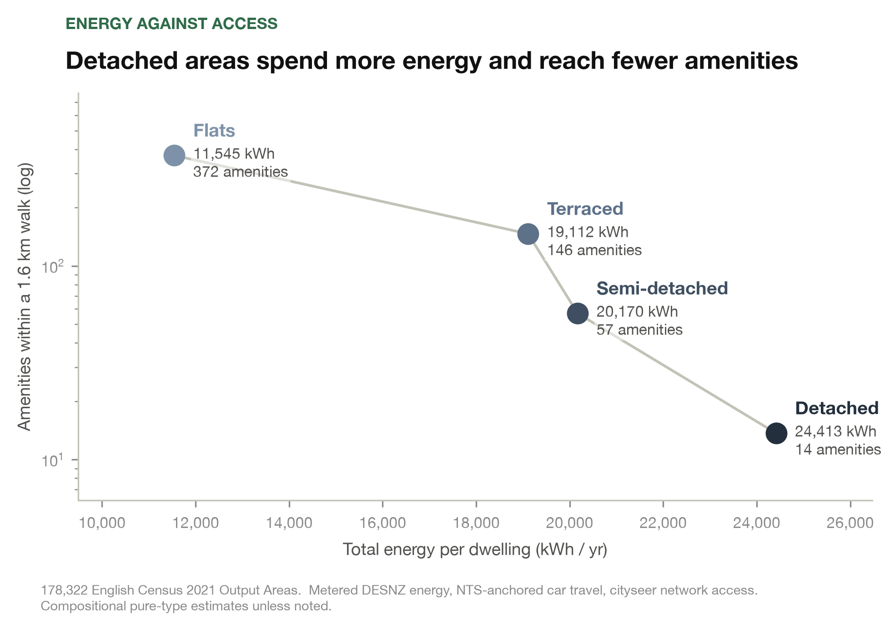
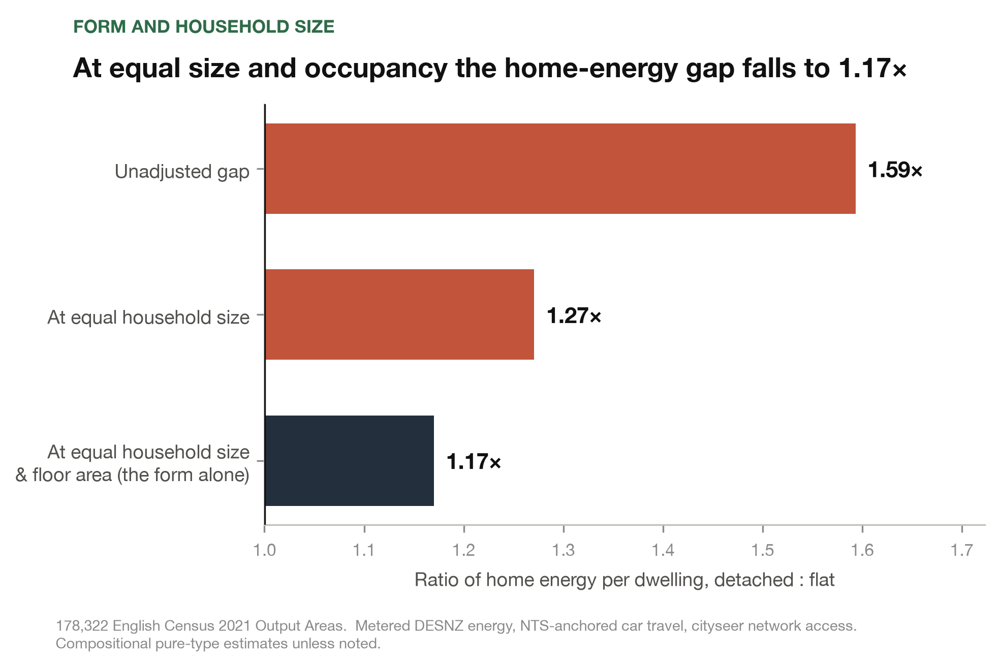
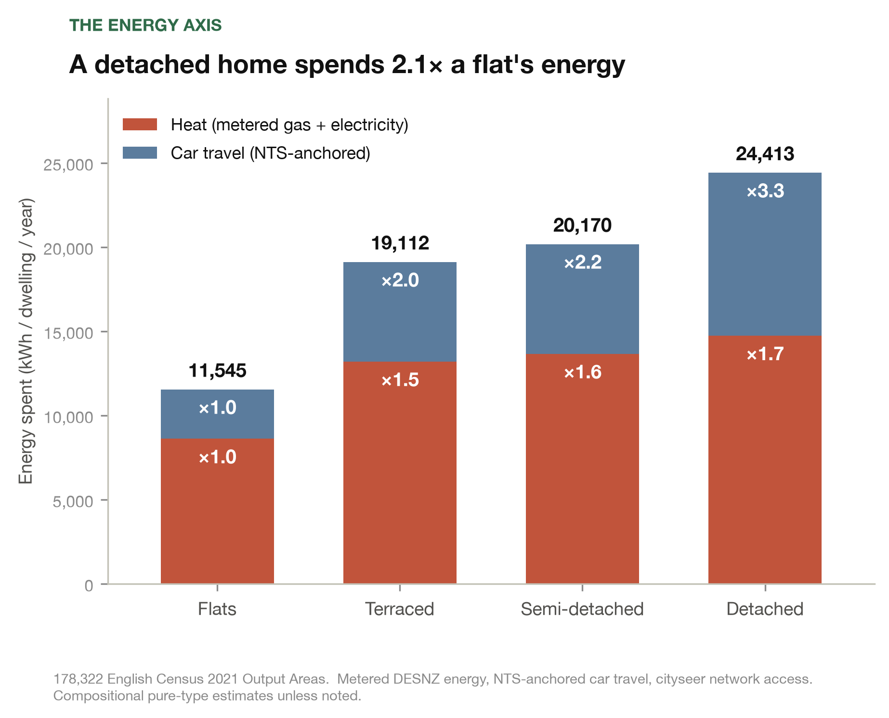
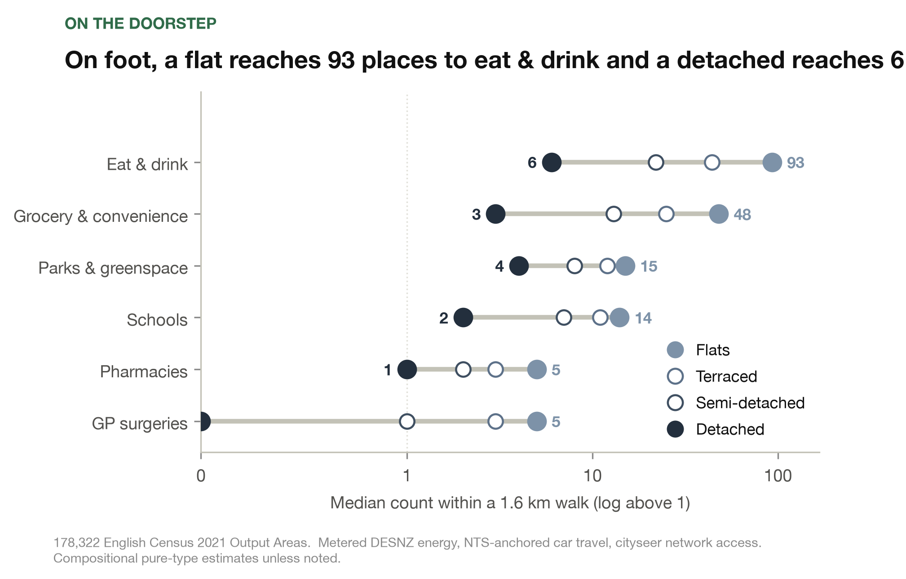
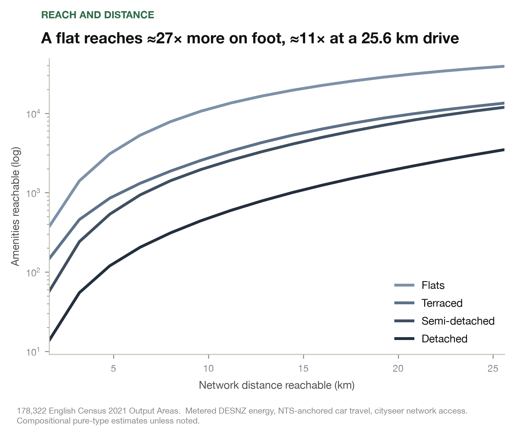
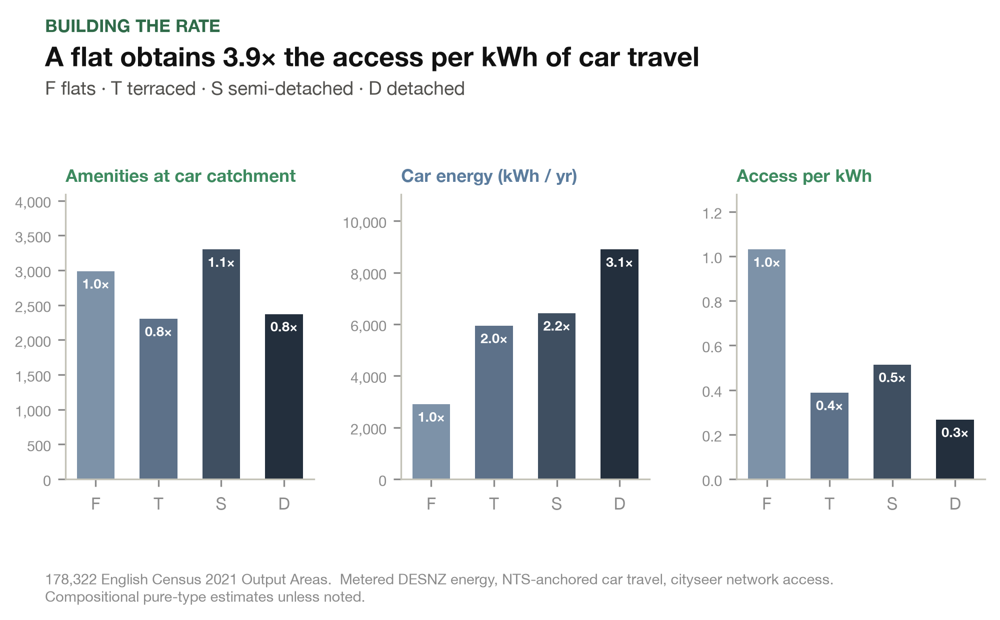
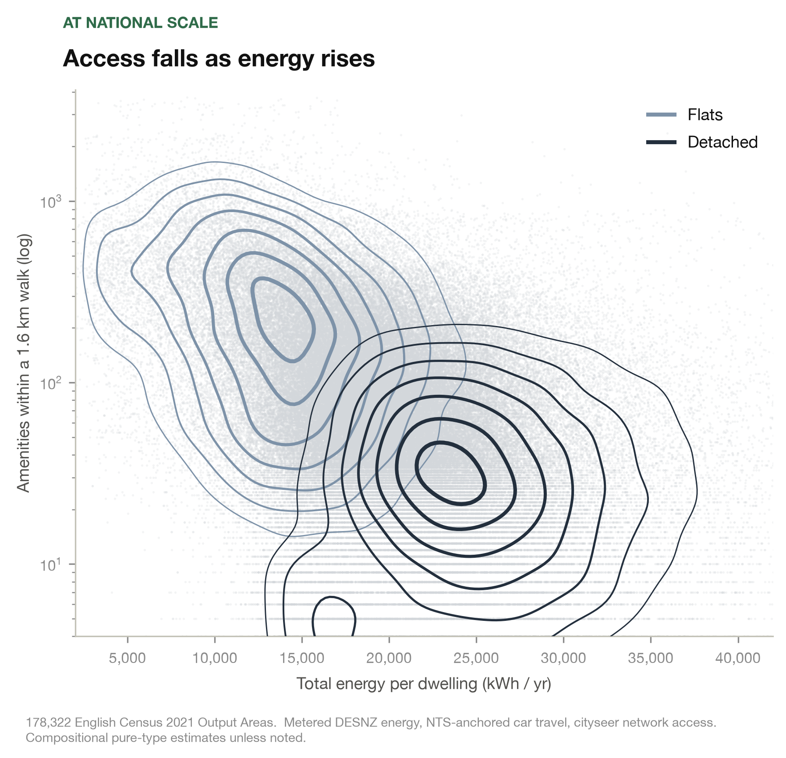
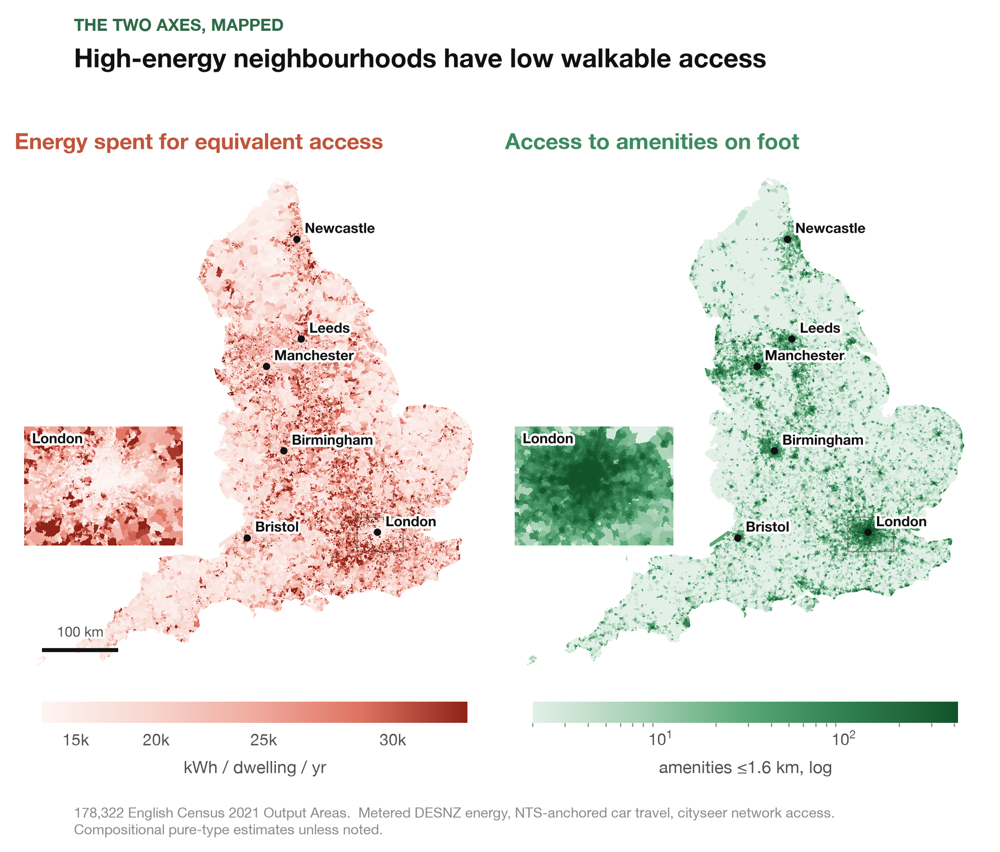
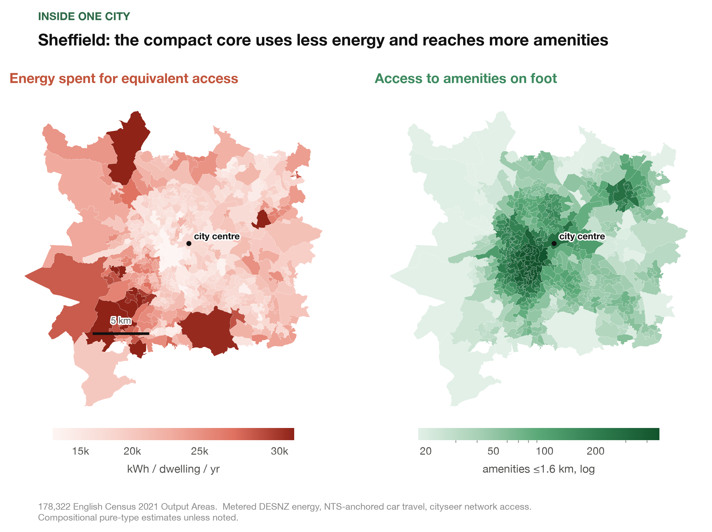

# NEPI: energy spent, access gained

The premise under test is a reframing: that a neighbourhood should be judged not by how much energy it consumes, but by how much access that energy buys, the everyday life a household can reach for the energy it spends. The framing draws on Jane Jacobs: ecosystems, and by extension cities, are more efficient when they are compact and complex, because energy then cascades from use to use through many exchanges before it dissipates, doing more work along the way. A rainforest moves a unit of energy through many such cycles and gets far more from it; a desert, given the same energy, gets less, because it cannot hold it and the energy runs straight through. The test rests on two measured quantities, energy spent and access gained, and the rate between them, across roughly 178,000 English neighbourhoods (Census Output Areas), comparing flat-type against detached-type neighbourhoods.

## Method

Every "×" in this document is a flat-versus-detached gap, computed the same way.

- The unit is the Census 2021 Output Area, the smallest area the census publishes, about 300 residents (~125 households). England has roughly 178,000 of them. Wales is left out for now: the energy, EPC, census and OS inputs all cover it, but the deprivation control used here (England's Index of Multiple Deprivation) has no directly comparable Welsh equivalent, so it would need a harmonised Welsh source.
- The whole dwelling mix is used rather than a single label. The census gives each area its full mix, for example 60% flats, 25% terraced, 10% semi-detached, 5% detached. Rather than labelling each area by its most common type, every area's full mix enters one regression (a compositional model), which reads off the energy or access of a pure all-flat and a pure all-detached area. The gap between those two is the reported figure. Using every proportion is sharper than a one-type label.
- The model holds deprivation (the overall Index of Multiple Deprivation and its income domain), tenure, building age and local climate constant, and weights by the number of households, so the gap reflects the difference the form makes, not differences in deprivation, tenure, the age of the stock or how cold the place is. Access is the exception (see that section): there compactness is the mechanism, so it is not held constant.
- Energy is reported per dwelling, the unit at which it is metered, billed and emitted. To separate the form from the household that lives in it, family size and floor area enter the model as controls with freely estimated effects, not as denominators. Per-person normalisation is avoided deliberately: heating is a property of the building, so energy rises with household size only sub-linearly (to a power of about 0.5, not 1 — an economy of scale; Huebner and Shipworth, 2017), and dividing by residents would silently impose a power of 1, crediting detached homes for nothing more than housing the larger families that self-select into low-density areas. Holding family size as a control, rather than dividing it away, both estimates that power and keeps the self-selection visible.
- In every table the Flat and Detached columns are observed medians (metered energy, reachable counts), shown to ground the numbers. The ratio columns are the compositional estimate, so they need not equal the quotient of the two columns.
- The model reads the gap at the extremes, a wholly flat area against a wholly detached one, which few real areas are. Each ratio is therefore the sharp end of the estimate: the gap is at least this large.

*The regression has no intercept and is weighted by households; the flat-to-detached ratio is the exponentiated gap between the pure-flat and pure-detached coefficients. The energy axes are fitted with a log model, the access counts with a Poisson model (household counts enter as analytic weights, so the effective sample is the number of areas, not the summed household count). Standard errors are clustered by local-authority district (about 309 in England) to allow for spatial dependence between neighbouring areas, and every headline ratio carries a 95% confidence interval on this basis; composite quantities (the rate, the surviving-gap share, the mediated fraction) carry cluster-bootstrap intervals. The intervals are reported in [results_snapshot.txt](results_snapshot.txt).*

## Counting: per dwelling, not per person

Whether a low-density home looks profligate or efficient depends entirely on the unit, and the choice is not neutral. Per dwelling, a detached home uses much more energy; per person, the gap shrinks toward parity; per square metre, it can even appear to reverse. Each fixed denominator smuggles in an assumption about how energy scales — per person assumes energy is proportional to the number of residents, per square metre that it is proportional to floor area — and neither holds for heating, which is a property of the building's envelope, not of how many people stand inside it or how the floor is partitioned. The unit is therefore not a presentational choice but a modelling one, and it is made here by holding family size and floor area as controls with freely estimated effects, so the data set the scaling rather than the denominator assuming it.

The literature is explicit, and the result agrees with it. Huebner and Shipworth (2017) find that home size per capita is the single strongest predictor of per-capita energy, and that household size is *negatively* associated with per-capita demand: adding a person lowers energy per person, an economy of scale. Druckman and Jackson (2008) report the same sub-linearity for the UK stock. Here the estimated elasticity of heat with respect to household size is about 0.5 — energy rises with people, but far less than proportionally — so dividing by residents forces that elasticity to 1 and credits detached homes for nothing more than the larger families that, by self-selection, tend to occupy them. Per person is therefore reported, if at all, only as a description of lived per-resident cost, never as the basis for the form comparison.

This puts the finding *with* the density-energy literature, not against it. Norman, MacLean and Kennedy (2006) found low-density development uses 2.0–2.5 times the energy per capita of compact form, and that per square metre the advantage narrows to a factor of 1.0–1.5 but does *not* reverse — the narrowing is a normalisation effect (low-density dwellings simply provide more space per person), not efficient fabric. The apparent per-square-metre or per-person "parity" of detached homes is exactly that artefact. Held like-for-like — equal family size, equal floor area — detached neighbourhoods remain more heat-intensive at every comparison (about 1.27× at equal family size, about 1.17× at equal floor area). No published evidence supports the stronger claim that a detached home is *more* energy-efficient than a flat; the figures that seem to suggest it are unit artefacts. The same reasoning governs the use of metered rather than EPC energy: SAP ratings over-predict consumption, and most for the largest, least efficient dwellings (Few et al., 2023; Firth et al., 2024) — the detached stock — so an EPC-based gap would overstate the penalty through model bias.

## Energy

Household energy is measured in kilowatt-hours per dwelling per year, in two parts: the home's metered gas and electricity, and car travel. The home part is *metered, not modelled*: DESNZ's actual gas and electricity, not the modelled SAP ratings behind a building's EPC, which over-predict consumption (the performance gap) and do so most for the largest, least efficient dwellings. Most of it is space and water heating; appliances, lighting and cooking are the smaller, steadier remainder.

How the energy figure is built:

- Every figure is delivered energy, the energy that arrives at the home to be used: gas and electricity for the home, fuel or electricity for the car. It is not primary energy or carbon, so no conversion factors enter; the units are kilowatt-hours per year.
- DESNZ publishes metered gas and electricity as two separate datasets at postcode level, each as a meter count and a mean per meter. Each fuel is aggregated to the Output Area by a meter-weighted mean (postcodes with more meters count for more), and the two are then summed as delivered energy (gas kWh plus electricity kWh) before dividing by census households. Gas is weather-corrected, electricity is not, and both cover domestic meters only.
- An EPC rating is a design estimate of how a building should perform; metered consumption is what households actually use. The two diverge (the performance gap), so the metered figure is the more reliable measure of energy spent.

## Heat

A detached neighbourhood uses about 1.60 times a flat's heat per dwelling. The gap has three parts: detached homes are bigger, hold more people, and have a leakier shape (more exposed wall, no shared party walls). Holding family size equal, it is about 1.27×; holding floor area equal as well, the shape alone accounts for about 1.17× (roughly 17%); the rest is the larger homes and households that low density brings. The figure is per dwelling, not per resident, on purpose: heat rises with household size only to a power of about 0.5, so dividing by people would compress the gap toward a false parity (see *Counting* above).

| heat, kWh per dwelling/yr | Flat | Terraced | Semi | Detached | flat→detached |
| --- | --: | --: | --: | --: | --: |
| gas + electricity | 10,194 | 12,995 | 13,876 | 15,020 | 1.60× |

Flats record fewer domestic gas meters than households (about 0.81 per household, against 0.94 for detached), for two reasons the measure treats differently. An all-electric flat heats with electricity, which is summed into the total energy figure, so its heat is captured. A block on communal heating is metered as non-domestic, so that gas is genuinely missing and the flat's heat understated. Only this second, smaller case is a true undercount, and it does not drive the result: restricting to well-measured areas (gas-meter coverage at least 0.9) leaves the heat gap at 1.61×, essentially the 1.60× headline, and restricting instead to areas whose electricity-meter count is within half the household count leaves it at 1.55×. If anything, the measurement issue slightly understates the gap.

Separating shape from size:

- The detached-versus-flat heat gap blends three effects of low density: bigger homes, more people per home, and a leakier shape. The quantity of interest is the part attributable to shape alone.
- From the compositional model (the full dwelling mix, with deprivation, tenure, building age and climate held equal), controls are added one at a time — first family size, then floor area — and the gap shrinks from 1.60× to 1.27× to 1.17×. Family and dwelling size together account for about two-thirds (66%) of the gap, as a descriptive covariate adjustment rather than an identified causal mediation. What survives once both are held fixed (about 1.17×, roughly 17%) is the direct effect of the form: exposed walls and no shared surfaces. Family size enters as a freely estimated effect (an elasticity of about 0.5), not as a per-person denominator, so the household is held without forcing energy to scale one-for-one with residents.
- Local climate (heating-degree-days, from HadUK-Grid, 1991–2020) is now held alongside the others: colder northern and rural siting is part of why detached areas use more heat, and netting it out is built into the direct term above.

*Reproduce: `stats/form_size_decomposition.py` (the shape-versus-size ladder and the gas-coverage checks).*

## Car travel

The target quantity is the total car energy associated with a home's location, not only the commute. The commute is about a sixth of car miles, so a commute-only figure understates driving by roughly sixfold. Total local driving per neighbourhood is not available directly from open data, so it is built by constrained disaggregation, starting from a measured total: the National Travel Survey (NTS9904) gives car-driver miles per person by 2021 rural-urban class, the average distance driven in a dense city, a town, or a village. Each class's total is distributed to its neighbourhoods using two local signals from the Census, car ownership and commute distance, so lower-ownership and shorter-commute places receive fewer miles. Each class's population-weighted mean is held to the survey figure, so the totals stay as measured and only their distribution across neighbourhoods is estimated. Miles are then converted to energy using the local fleet's energy per mile, allowing for the share of electric versus petrol cars (DVLA).

Building the estimate:

- Total driving by the residents of one neighbourhood is not recorded in open data. The census records the journey to work but not other car travel, and that journey is about a sixth of all car miles, so a commute-only figure understates driving by roughly sixfold.
- Constrained disaggregation takes a quantity that is measured reliably, the average miles driven per person across a whole class of places, and distributes it among the neighbourhoods in that class using local signals, in a way that preserves the class average. The class totals are held fixed; only their distribution between neighbourhoods is estimated.
- The anchor is NTS9904: car-driver miles per person by 2021 rural-urban class of residence, about 2,500 miles per person in dense cities rising to roughly 5,200 in the countryside. Because it is measured by where people live, it carries the urban-to-rural driving gradient without through-traffic.
- Within each class, a neighbourhood's share is raised or lowered by its car ownership (cars per person, Census TS045) and, more gently, its commute distance (Census TS058), so lower-ownership, shorter-commute places receive fewer miles.
- The population-weighted average of the distributed miles in each class is constrained to the survey figure, so the class marginal is reproduced exactly.
- Energy is miles times household size times the local fleet's energy per mile, where a petrol car uses about 0.93 kWh per mile and an electric one about 0.32, blended by the area's share of electric vehicles (DVLA).
- One assumption is free: how strongly commute distance pulls the estimate, set by an elasticity of 0.30. The analysis reports how little the result moves when it is varied.

*Reproduce: `stats/travel_energy.py`.*

| car travel, kWh per dwelling/yr | Flat | Terraced | Semi | Detached | flat→detached |
| --- | --: | --: | --: | --: | --: |
| NTS-anchored | 3,240 | 5,088 | 6,660 | 9,272 | 3.07× |

Car travel accounts for about 24% of household energy in flat-dominated areas and 39% in detached (the ratio of the median columns above and below). Combining the two:

| total energy, kWh per dwelling/yr | Flat | Terraced | Semi | Detached | flat→detached |
| --- | --: | --: | --: | --: | --: |
| total household energy (per-OA median) | 13,674 | 18,265 | 20,564 | 23,832 | **2.12×** |

In each table the dwelling-type columns are observed medians; the ratio is the compositional flat-to-detached estimate per dwelling, so it is not the quotient of the columns.

## Access

Access is the count of things reachable from a neighbourhood, measured as network distance along the road (OS Open Roads, via cityseer) rather than straight-line. Because it is a property of the location, it is the same however the household is counted: per home or per person makes no difference to what is within reach. Three kinds of thing are counted, each in its own unit: amenities (everyday destinations: GPs, pharmacies, hospitals, schools, food outlets, supermarkets, greenspace), jobs (the total number of jobs reachable, summing the job count at each workplace), and people (the total resident population reachable). Each is read at three points on one ruler: a short walk (1.6 km), the area's own car catchment (how far its residents typically drive), and a long drive (25.6 km). What is reachable on foot is a subset of the catchment, which is a subset of the long drive.

How access is measured:

- Every count is measured as network distance over Ordnance Survey Open Roads, using the cityseer routing engine. The England street network is built once (about 3.6 million junctions), and reach is measured outward from each neighbourhood along it.
- From each Output Area, the reachable count is read at every step from a short walk (1,600 m) out to a long drive (25,600 m). The on-foot figure is a subset of the drivable one, the same ruler read closer in.
- Amenities are a count of seven everyday destinations (GPs, pharmacies and hospitals from the NHS; schools from GIAS; food outlets and supermarkets from the FSA; greenspace from Ordnance Survey). Jobs are the total jobs reachable: each workplace contributes the number of jobs it holds (Census WP101EW), so a large employer counts for more than a small one, rather than each workplace counting as one. People are likewise the total residents reachable.
- The access ratios come from the same compositional model, holding income equal but not density. Density is the mechanism by which compact form delivers access, so controlling for it would remove the effect under study. Access counts are non-negative with frequent zeros (many detached areas have no GP within a walk), so the model uses a Poisson count form, whose fitted values are constrained to be positive.

Where the counted destinations come from, and how each layer is filtered (England; the greenspace layer is Great Britain, clipped to England by the Output Area extent):

| destination | source | records | filter applied |
| --- | --- | --: | --- |
| GP surgeries | NHS ODS (`epraccur`) | 12,664 | active GP practices |
| Pharmacies | NHS ODS | 11,268 | community pharmacies |
| Schools | GIAS | 50,631 | open establishments (status Open, or Open-but-proposed-to-close) |
| Food outlets | FSA food-hygiene register | 190,359 | restaurants and cafes, takeaways, pubs |
| Food shops | FSA food-hygiene register | 93,071 | supermarkets and hypermarkets, plus other food retailers (convenience) |
| Parks and greenspace | OS Open Greenspace | 102,773 | public parks and gardens, playing fields, play spaces, allotments |
| Jobs | Census 2021 WP101EW | — | workplace jobs, each site weighted by its job count |
| People | Census 2021 TS001 | — | resident population |
| ~~Hospitals~~ (excluded) | NHS ETS (trusts and sites) | 34,670 | excluded: the file lists every trust *site* (wards, clinics, community units), not hospitals, so its count is not a credible amenity |

The seven amenity types (the first six rows plus, before it was dropped, hospitals) are summed into the amenity count; jobs and people are reported separately.

| within reach (median) | Flat | Terraced | Semi | Detached | flat:det |
| --- | --: | --: | --: | --: | --: |
| amenities, on foot | 184 | 101 | 57 | 19 | **27.2×** |
| amenities, own catchment | 2,234 | 1,935 | 2,357 | 2,313 | 1.3× |
| amenities, 25 km | 18,021 | 8,520 | 7,460 | 3,906 | 11× |
| jobs, on foot | 6,927 | 3,790 | 2,100 | 598 | **52.4×** |
| jobs, own catchment | 102,652 | 87,077 | 107,065 | 101,215 | 1.7× |
| jobs, 25 km | 807,658 | 382,638 | 337,938 | 173,447 | 14.3× |
| people, on foot | 17,838 | 11,861 | 8,207 | 2,766 | **12.5×** |
| people, own catchment | 255,216 | 236,228 | 285,772 | 270,115 | 1.2× |
| people, 25 km | 2,343,165 | 1,032,734 | 913,638 | 472,236 | 11.1× |

The dwelling-type columns are observed medians; the flat:det ratio is the compositional estimate. The own-catchment row reads each area at its own typical car-trip distance: a detached area reaches a similar raw count there, because it drives much further to do so, so the on-foot gap nearly closes on count and the rate below prices that extra driving in energy. For context, a flat neighbourhood holds about 79 people per hectare against a detached one's 14, a factor of 5.7.

*Reproduce: `stats/access_profile.py` (network access and the rate).*

## The rate

The rate is the access a neighbourhood buys for the car energy it spends: everyday amenities reachable per kilowatt-hour of driving. A flat returns about **3.9 times** the access per kilowatt-hour of a detached neighbourhood.

For each area the rate is a division — amenities reachable within its *own car catchment* (its NTS car-driver distance per person ÷ about 370 trips per person per year, capped between 1.6 km and 25.6 km), divided by its car-travel energy. The flat-to-detached comparison of that division works out to the **product of the two axes already reported**:

- **Access advantage** — at their own catchments a flat and a detached area reach a *similar* number of amenities: flat-to-detached **1.26×**.
- **Energy saving** — the detached area gets there only by spending about **3.1×** the car energy (the travel figure from the energy section).
- Dividing one area's rate by the other's flips the energy term over, so the two multiply: **1.26 × 3.07 = 3.9×**. Same reach, a third of the fuel.

This is reconstructable straight from the access and energy tables — it is not a separate model. (An earlier version modelled the per-area ratio directly and reported a spurious 6.3×; that double-counted and did not reconcile with the two axes.)

For the wider picture: on foot a flat reaches roughly 27 times the amenities, 52 times the jobs and 12 times the people of a detached neighbourhood; at a 25 km drive, where a detached home can reach into denser places, the flat is still 11 to 14 times ahead. For energy the direction reverses — a detached home spends about 1.6 times the heat, 3.1 times the car energy, and 2.1 times the total per dwelling.

The pattern is not a matter of a few pure-type extremes: it holds across every neighbourhood in the country. Plotting all 178,353 Output Areas by energy spent against amenities reached, the median falls as spending rises, and the flat and detached areas sit at opposite corners.

## Decarbonisation scenarios and lock-in

To test whether decarbonisation closes the gap, the energy is recomputed under a ladder of technology scenarios: each home's heat and car energy re-priced under insulation, heat pumps and electric vehicles, alone and in combination. Access is unchanged in every scenario, because no technology moves a destination closer.

The three levers act differently, and reporting them separately is what shows why the gap holds:

- **Insulation** scales each home's metered gas by its own EPC fabric-improvement ratio (potential over current intensity, both EPC-modelled so the performance gap cancels; median about half). Detached homes carry more headroom, so insulation closes the gap, from 2.12× to 1.83× fully deployed, about a fifth of it.
- **Heat pumps** deliver the heat as electricity instead of gas, at the pump's efficiency (boiler efficiency over a seasonal coefficient of performance of about 2.8, so roughly a third of the delivered energy). This cuts the smaller-gap heat sharply and leaves the larger-gap car travel, so heat pumps do not close the form gap; fully deployed they leave it marginally wider, at 2.16×. They are essential on the carbon axis, since the electricity that drives them is increasingly clean, but they do not fix the neighbourhood gap.
- **Electric vehicles** re-price car energy at the electric fleet's energy per mile, miles unchanged. This attacks travel, where the gap is largest, and closes the most of any single lever, to 1.85×, about a fifth.

| total energy gap (per dwelling, as-lived, compositional) | Det:Flat | closed |
| --- | --: | --: |
| status quo | 2.12× | — |
| insulation only (100%) | 1.83× | 20% |
| heat pumps only (100%) | 2.16× | −2% |
| electric vehicles only (100%) | 1.85× | 18% |
| CCC Balanced Pathway 2040 (50% heat pumps, 75% EVs) | 1.89× | 16% |
| full rollout (100% of all three) | 1.68× | 31% |

Anchored to the Climate Change Committee's Seventh Carbon Budget Balanced Pathway, half of homes on heat pumps and three-quarters of cars electric by 2040 leaves the gap at 1.89×, a sixth of it closed. Even full deployment of all three levers leaves 1.68×, two-thirds of the gap surviving. Insulation and electrification lower the energy per unit but not the floor area or the distance, so the structural quantities, and the gap they set, remain.

The access gap does not move at all, because neither insulation, nor a heat pump, nor an electric car brings a school, a job or a shop closer to a house built far from them. On foot a flat still reaches about 27× the amenities of a detached area, before and after, in every scenario. The inefficiency of dispersed form is fixed in the street layout, which changes only when places are rebuilt, over generations rather than product cycles. Access therefore has to be measured and planned for directly.

*Reproduce: `stats/scenarios.py` (the scenario ladder); `stats/lock_in.py` (the fabric-plus-EV bound, 1.51×).*

## Self-selection

Households are not assigned to dwelling types at random; people who choose detached homes may differ in unmeasured ways (a taste for space and driving) that also raise energy use. This residential self-selection is the main threat to reading the energy gaps causally. Three things bound how far it can reach, and the estimand is framed to match.

- **Access is a property of the location, not its residents.** A detached neighbourhood has about 27× fewer amenities on foot whoever lives there and however they came to live there, so the access axis — the hard, technology-immune result — is immune to self-selection by construction.
- **The observed selection channels are already held.** The comparison conditions on deprivation (overall IMD and its income domain), tenure, building age and climate; adding occupational class (Census NS-SeC) on top moves the gap by essentially nothing, so selection on these observables is not what drives it.
- **A coefficient-stability bound (Oster, 2019)** asks how strong selection on *unobservables* would have to be, relative to those observed confounds, to explain the gap away. The total-energy gap is the robust part (δ* ≈ 1: unobserved sorting would have to be about as strong as everything already measured combined), because much of it is the structural travel gap — a function of where destinations sit, not who occupies the house. The heat sub-component is more entangled with deprivation and tenure, so the case rests on total energy and access rather than on the heat figure alone.

The estimand throughout is therefore a *place-level* one, the energy and access profile of a neighbourhood type conditional on observed confounds, not a household treatment effect. The definitive test of the latter would difference out fixed household preferences using homes observed before and after a move (panel microdata such as Understanding Society); that mover-panel test is out of scope here and is reported as the principal limitation of the place-level estimand.

*Reproduce: `stats/form_size_decomposition.py` (section 6 — the Oster bound and NS-SeC control).*

## The pattern in space

The two-axis result is national and structural, visible from the whole of England down to a single city. Across England, dispersed high-energy form covers most of the land, with the compact, low-energy cities as pale islands. Inside one city, the same inversion shows over a few kilometres: the compact core spends less energy and reaches more access, the sprawling edge the reverse.

*Reproduce: `stats/map_figures.py`.*

## The NEPI scorecard, Atlas and models

The measure will be provided as three things: a NEPI scorecard, an EPC-style rating for neighbourhoods rather than buildings; an Atlas to explore the ratings; and XGBoost models that predict a neighbourhood's NEPI from its form, fabric and fleet, so different combinations of those inputs can be simulated. The models also carry a set of pre-defined scenarios, such as full electrification of the vehicle fleet or buildings brought to best-practice thermal efficiency, applied to a neighbourhood's inputs and re-scored so its NEPI under each can be read off.

*Status: these three are planned outputs, not yet built. The measured findings above stand on their own; the scorecard, Atlas and models are the intended means of delivering them.*
