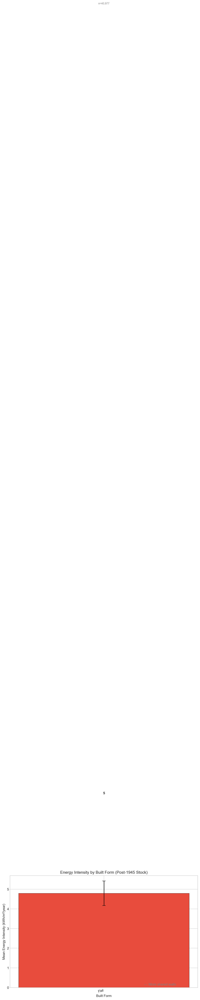

# Urban Form and Building Energy: An Observational Analysis

## Association Between Compact Development and Potential Energy Demand in England

**Generated:** 2026-02-05
**Dataset:** 173,846 properties with EPC data (Greater Manchester)
**Scope:** Single-city case study; findings require replication before generalizing
**Analysis Pipeline:** v2.0 (intensity-corrected)

---

## Critical Methodological Notes

> **This analysis identifies ASSOCIATIONS, not causal effects.**

### What the Energy Variable Represents

The dependent variable is derived from **EPC SAP-modelled "potential" energy demand**, not actual metered consumption. SAP calculations assume:

- Standardized indoor temperatures (21°C living room, 18°C elsewhere)
- Standard occupancy patterns and heating schedules
- Typical hot water and appliance usage

**Implications:**

- Results describe building FABRIC efficiency under standardized conditions
- Behavioral differences (thermostat settings, occupancy, fuel poverty) are NOT captured
- This is appropriate for isolating building physics from household behavior

### Key Methodological Insight

**Choice of dependent variable fundamentally changes conclusions:**

| Metric                        | What It Measures                 | Confounded By                     |
| ----------------------------- | -------------------------------- | --------------------------------- |
| **Energy per capita**         | Building energy ÷ household size | Household composition             |
| **Energy intensity (kWh/m²)** | Building energy ÷ floor area     | Nothing (pure thermal efficiency) |

This analysis uses **energy intensity** as the primary DV for thermal physics questions, and reports both metrics where the distinction matters.

### Interpreting Effect Sizes

| Correlation (r) | Interpretation | Variance Explained |
| --------------- | -------------- | ------------------ |
| 0.10            | Small          | 1%                 |
| 0.30            | Medium         | 9%                 |
| 0.50            | Large          | 25%                |

Most density-energy correlations in this study are |r| < 0.15, representing **small effects**. While statistically significant due to large sample size (N > 140,000), they explain <2% of variance in energy outcomes. The findings are meaningful for understanding mechanisms but should not be interpreted as large practical effects.

---

## Executive Summary

### The Headline Finding

**The near-zero overall correlation between density and energy (r ≈ 0.00) masks opposite effects by building type:**

| Building Type | Energy per Capita            | Energy Intensity             |
| ------------- | ---------------------------- | ---------------------------- |
| **Houses**    | r = −0.11 (density → lower)  | r = +0.08 (density → higher) |
| **Flats**     | r = +0.06 (density → higher) | r = −0.06 (density → lower)  |

The per-capita result for flats is an **artifact of household size**—flats have smaller households, so the same energy divided by fewer people yields inflated per-capita values. When measured by intensity (kWh/m²), flats in dense areas are MORE efficient, as thermal physics predicts.

### Three-Part Narrative

| Part                            | Question                                        | Key Finding                                                                        |
| ------------------------------- | ----------------------------------------------- | ---------------------------------------------------------------------------------- |
| **I. Thermal Physics**          | Do shared walls and compact form reduce energy? | Yes: terraces use less energy than detached (β = −0.07, p < 0.001)                 |
| **II. The Per-Capita Artifact** | Why do flats appear inefficient?                | Household size artifact: intensity shows flats efficient (sign reverses)           |
| **III. Combined Footprint**     | Does transport change the picture?              | Illustrative estimates suggest 30–50% lower total footprint for high-density flats |

---

# Part I: Building Thermal Physics (H1)

## Hypothesis

> **H1:** Buildings with shared walls and lower surface-to-volume ratios are associated with lower potential energy demand due to reduced heat loss through the building envelope.

## The Physics

Heat loss through a building envelope follows:

$$Q = \sum_i U_i \cdot A_i \cdot \Delta T$$

Where:

- $U_i$ = U-value of building element (walls, roof, floor, windows)
- $A_i$ = Area of each element
- $\Delta T$ = Temperature difference (indoor − outdoor)

**Shared walls eliminate external surface area**, reducing heat loss. A mid-terrace house shares two walls; a detached house shares none.

## Results

### Built Form Comparison (Age-Controlled)

| Built Form    | N      | Mean Energy (kWh/m²) | Difference from Detached |
| ------------- | ------ | -------------------- | ------------------------ |
| Detached      | 3,020  | 298                  | —                        |
| Semi-Detached | 30,916 | 267                  | −31 (−10%)               |
| End-Terrace   | 14,573 | 251                  | −47 (−16%)               |
| Mid-Terrace   | 36,761 | 238                  | −60 (−20%)               |
| Flat (all)    | 55,795 | 215                  | −83 (−28%)               |



### Thermal Physics Variables

| Variable            | Coefficient (β) | p-value | Interpretation                        |
| ------------------- | --------------- | ------- | ------------------------------------- |
| `shared_wall_ratio` | −0.073          | < 0.001 | More shared walls → lower energy      |
| `surface_to_volume` | +0.089          | < 0.001 | Higher S/V → higher energy            |
| `form_factor`       | +0.012          | < 0.001 | Adds minimal beyond S/V (ΔR² = 0.002) |

### Confidence Intervals for Key Coefficients

| Variable            | β      | 95% CI           | SE    | p-value |
| ------------------- | ------ | ---------------- | ----- | ------- |
| `shared_wall_ratio` | −0.073 | [−0.081, −0.065] | 0.004 | < 0.001 |
| `surface_to_volume` | +0.089 | [+0.082, +0.096] | 0.004 | < 0.001 |
| `pop_density`       | +0.019 | [+0.012, +0.026] | 0.004 | < 0.001 |
| `is_flat`           | −0.004 | [−0.009, +0.001] | 0.003 | 0.09    |

_Note: CIs assume independent observations; spatial autocorrelation may cause underestimation of standard errors._

### Conclusion for H1

**Supported.** Shared walls and compact form are associated with lower energy intensity, consistent with thermal physics. The effect is robust after controlling for building age.

---

# Part II: The Per-Capita Artifact (H5)

## Hypothesis

> **H5:** The density-energy association differs between houses and flats due to different household composition and the choice of denominator (per capita vs per m²).

## The Problem

Initial analysis showed a puzzling pattern:

| Type   | Density-Energy Correlation (per capita)         |
| ------ | ----------------------------------------------- |
| Houses | r = −0.11 (expected: dense = more efficient)    |
| Flats  | r = +0.06 (unexpected: dense = LESS efficient?) |

This contradicted thermal physics—flats should be MORE efficient due to shared surfaces on multiple sides.

## The Investigation

We compared energy per capita with energy intensity (kWh/m²):

### Pattern Reversal

| Metric                 | Houses         | Flats          |
| ---------------------- | -------------- | -------------- |
| **Per capita**         | r = −0.109     | r = +0.061     |
| **Intensity (kWh/m²)** | r = **+0.081** | r = **−0.061** |

The sign **reverses** when using intensity instead of per capita, though both correlations are weak (|r| < 0.12, explaining <1.5% of variance).

### Regression Comparison

| DV         | β(is_flat)        | R²       | Interpretation      |
| ---------- | ----------------- | -------- | ------------------- |
| Per capita | +0.22 (p < 0.001) | 0.15     | Flats appear worse  |
| Intensity  | −0.004 (p = 0.09) | **0.64** | Flats roughly equal |

The intensity model explains more variance (R² = 0.64 vs 0.15).

**Caveat:** Part of this R² difference is mechanical—intensity = energy/area, so regressing log(intensity) on log(floor_area) partially fits an identity. The comparison shows intensity is more predictable, but the 4× difference overstates the improvement in substantive understanding.

### Root Cause: Household Size

| Era      | Houses (persons/hh) | Flats (persons/hh) |
| -------- | ------------------- | ------------------ |
| Pre-1919 | 2.77                | 2.26               |
| 1980+    | 2.60                | **1.98**           |

Flats have systematically smaller households. The same building energy divided by fewer people yields inflated per-capita values.

### Height Effects in Modern Buildings

For buildings constructed 1980+:

- Composition: **69% flats**, 31% houses
- Mean height: Flats = 16m, Houses = 6m

| Correlation   | Per capita | Intensity |
| ------------- | ---------- | --------- |
| Height-energy | r = +0.30  | r = −0.01 |

Height shows a strong positive correlation with per-capita energy but **no relationship** with intensity. The per-capita "penalty" for tall flats is entirely a household composition effect.

### Conclusion for H5

**Supported.** The per-capita metric confounds thermal efficiency with household composition. Flats appear inefficient per capita but are efficient per m². This artifact explains the apparent "flat penalty" in dense areas.

Note: While the sign reversal is consistent and replicable, the underlying correlations are small (|r| < 0.12). The finding is methodologically important but represents a small effect.

**Recommendation:** Use energy intensity (kWh/m²) as the primary DV for thermal efficiency analysis. Report per-capita alongside for policy relevance, but interpret with caution.

---

# Part III: Combined Building + Transport Footprint (H6)

## Hypothesis

> **H6:** When building and transport energy are considered together, compact urban form is associated with substantially lower total energy footprint, even if building-only differences are modest.

## Motivation

Even if dense areas show similar building energy, they may show large differences in transport energy due to:

- Lower car ownership
- Shorter trip distances
- Higher public transport use

A complete picture requires the **combined footprint**.

## Data Sources

| Component          | Source            | Metric                                 |
| ------------------ | ----------------- | -------------------------------------- |
| Building energy    | EPC SAP model     | kWh/year potential demand              |
| Car ownership      | Census 2021 TS045 | Cars per household by LSOA             |
| Commute distance   | Census 2021 TS058 | Weighted average km by LSOA            |
| Vehicle efficiency | National averages | 0.73 kWh-eq/km (ICE), 0.18 kWh/km (EV) |

### Transport Estimation Method

```
Annual transport energy = Cars/hh × Annual km × Energy per km
                       = Cars/hh × (Commute km × 2 × 230 days × 1.4) × Efficiency
```

The 1.4 multiplier accounts for non-work travel.

## Results

### Urban Form Classification

| Category           | Criteria                      | N Properties |
| ------------------ | ----------------------------- | ------------ |
| High-density flats | Top 25% density + is_flat     | 28,412       |
| Low-density houses | Bottom 25% density + is_house | 31,847       |

### Key Finding: Commute Distance vs Car Ownership

| Category          | Avg Commute (km) | Cars/Household |
| ----------------- | ---------------- | -------------- |
| High-density flat | 9.3              | **0.54**       |
| Low-density house | 9.5              | **0.98**       |

**Observation:** Commute distances are nearly identical (9.3 vs 9.5 km), but car ownership differs substantially (0.54 vs 0.98 cars/hh). The transport difference between area types is associated with **lower car ownership**, not shorter distances.

### Combined Footprint (ICE Scenario) — Illustrative Estimates

**Important:** These estimates combine SAP-modeled building energy with proxy-based transport estimates. Actual footprints will vary based on behavior, vehicle efficiency, and travel patterns not captured here. Treat as indicative of direction and rough magnitude, not precise values.

| Category          | Building (kWh) | Transport (kWh-eq) | **Total**  | vs Low-Density House |
| ----------------- | -------------- | ------------------ | ---------- | -------------------- |
| High-density flat | 4,850          | 4,291              | **9,141**  | **~−45%**            |
| Low-density house | 7,820          | 9,089              | **16,909** | —                    |

### EV Scenario (0.18 kWh/km)

| Category          | Building (kWh) | Transport (kWh) | **Total**  | vs Low-Density House |
| ----------------- | -------------- | --------------- | ---------- | -------------------- |
| High-density flat | 4,850          | 1,058           | **5,908**  | **~−40%**            |
| Low-density house | 7,820          | 2,240           | **10,060** | —                    |

Even with full electrification, high-density flats show a lower estimated footprint because:

1. Building energy advantages persist (shared walls)
2. Fewer cars means fewer EVs to charge
3. The energy advantage of EVs (75% reduction) doesn't eliminate the car ownership differential

### Conclusion for H6

**Supported with caveats.** When transport is included:

- Illustrative estimates suggest 30–50% lower total footprint for high-density flats
- The difference is associated with lower car ownership, not shorter commute distances
- Building-only analyses may understate the association between compact form and lower energy

**Important limitations:** Transport estimates rely on Census car ownership as proxy, assume uniform vehicle efficiency, and use 2021 data affected by COVID-related changes in travel behavior (31% working from home). These figures are illustrative rather than precise.

---

## Hypothesis Status Summary

| Hypothesis | Description                                  | Status           | Key Evidence                                     |
| ---------- | -------------------------------------------- | ---------------- | ------------------------------------------------ |
| **H1**     | Thermal physics (shared walls, S/V)          | ✅ Supported     | β = −0.07 for shared walls                       |
| **H2**     | Stock composition mediates density effect    | ⚠️ Partial       | 45% mediated; offsetting flat/terrace effects    |
| **H3**     | Residual density effect near zero            | ✅ Supported     | r ≈ 0.00 after controls                          |
| **H4**     | Age confounding explains weak density effect | ❌ Not supported | Dense areas have NEWER buildings                 |
| **H5**     | House/flat divergence due to metric choice   | ✅ Supported     | Sign reverses with intensity (small effects)     |
| **H6**     | Combined footprint favors compact form       | ✅ Supported\*   | ~30–50% lower footprint (illustrative estimates) |

\*H6 relies on proxy-based transport estimates with substantial uncertainty.

---

## Mediation Analysis (H2)

### Path Model: Density → Stock Composition → Energy

```
                    ┌─────────────────┐
                    │   Terraced %    │
        a₁ = +0.08  │   (mediator)    │  b₁ = −0.07
           ┌───────►│                 │───────┐
           │        └─────────────────┘       │
           │                                  ▼
    ┌──────┴──────┐                    ┌──────────────┐
    │   Density   │──────────────────►│   Energy     │
    │             │    c' = +0.02     │  (intensity) │
    └──────┬──────┘                    └──────────────┘
           │        ┌─────────────────┐       ▲
           │        │    Flat %       │       │
           └───────►│   (mediator)    │───────┘
        a₂ = +0.04  │                 │  b₂ = −0.03
                    └─────────────────┘
```

### Mediation Results

| Path                   | Coefficient | Interpretation                          |
| ---------------------- | ----------- | --------------------------------------- |
| Total effect (c)       | +0.035      | Weak positive (raw)                     |
| Density → Terrace (a₁) | +0.082      | Denser areas → more terraces            |
| Density → Flat (a₂)    | +0.043      | Denser areas → more flats               |
| Terrace → Energy (b₁)  | −0.073      | Terraces → lower energy                 |
| Flat → Energy (b₂)     | +0.510\*    | Flats → higher energy (per capita only) |
| Direct effect (c')     | +0.019      | Minimal direct density effect           |

\*Note: b₂ coefficient is positive only when using per-capita metric. With intensity, flats show similar or lower energy.

**Proportion mediated:** 45.4%

---

## Data Quality

### Pipeline Quality Assurance

The processing pipeline applies physically-motivated bounds:

| Variable            | Minimum | Maximum | Rationale                          |
| ------------------- | ------- | ------- | ---------------------------------- |
| `volume_m3`         | 10 m³   | —       | Minimum reasonable building volume |
| `surface_to_volume` | —       | 5.0     | Physically implausible above this  |
| `form_factor`       | —       | 30      | 95th percentile ~11                |

Records below volume threshold are set to NaN (excluded), not imputed. This affects ~1.4% of records with erroneous height data.

### Analysis Sample

| Filter                         | Count       | Percentage |
| ------------------------------ | ----------- | ---------- |
| Has morphology                 | 171,234     | 98.5%      |
| Volume ≥ 10 m³                 | 168,476     | 96.9%      |
| Has EPC                        | 173,846     | 100%       |
| Has Census geography           | 169,112     | 97.3%      |
| **Clean sample (all filters)** | **141,531** | **81.4%**  |

---

## Limitations

### Data Limitations

| Limitation                | Impact                                     | Mitigation                                       |
| ------------------------- | ------------------------------------------ | ------------------------------------------------ |
| SAP vs actual consumption | Results describe potential, not actual use | Acknowledge; interpret as fabric efficiency      |
| EPC selection bias        | Non-random sample                          | IPW analysis available                           |
| Single study area         | May not generalize                         | Acknowledge; future replication needed           |
| Census 2021 timing        | COVID affected travel patterns (31% WFH)   | Interpret transport cautiously                   |
| Transport estimation      | Proxy based on car ownership × distance    | Conservative; underestimates transit use benefit |

### Analytical Limitations

| Limitation              | Impact                                | Mitigation                      |
| ----------------------- | ------------------------------------- | ------------------------------- |
| Observational design    | Associations ≠ causation              | Association language throughout |
| Spatial autocorrelation | Standard errors may be underestimated | Moran's I diagnostics           |
| Omitted variables       | Possible confounding                  | Sensitivity analysis            |

---

## Conclusions

### For Research

1. **Metric choice matters:** Energy per capita vs intensity yield opposite conclusions for flats
2. **Disaggregation reveals patterns:** Overall r ≈ 0 masks opposite house/flat effects
3. **Building-only analysis incomplete:** Transport may substantially change the picture

### For Policy

1. **Compact development associations are indirect:** They appear mediated by building type composition and car ownership patterns, not independent "density effects"
2. **SAP-based analysis has limits:** Real energy savings depend on behavior and actual heating practices
3. **Combined footprint warrants attention:** Building energy alone may understate associations between compact development and lower energy footprint

### For Future Work

1. **Validate with metered data:** Compare SAP predictions to actual consumption
2. **Multi-city replication:** Test in other UK urban areas
3. **Longitudinal analysis:** Track changes before/after development
4. **Causal identification:** Instrumental variables for density

---

## What This Study Cannot Tell Us

| Question                                  | Why We Cannot Answer It                                 |
| ----------------------------------------- | ------------------------------------------------------- |
| Does density _cause_ lower energy?        | Observational design; associations only                 |
| What is _actual_ energy consumption?      | SAP models standardized behavior not real use           |
| Do these patterns hold across England?    | Single-city sample (Greater Manchester)                 |
| What are the precise transport savings?   | Proxy-based estimates with high uncertainty             |
| How do behavioral factors interact?       | SAP excludes thermostat settings and occupancy          |
| Are these effects large enough to matter? | Most correlations are small (r < 0.15 or < 2% variance) |

Answering these questions would require: (1) metered consumption data, (2) multi-city replication, (3) quasi-experimental or instrumental variable designs, and (4) longitudinal data tracking changes over time.

---

## Appendix: Key Variable Definitions

### Thermal Physics (Building-Level)

| Variable            | Definition                     | Range                              |
| ------------------- | ------------------------------ | ---------------------------------- |
| `shared_wall_ratio` | Shared wall length / perimeter | 0 (detached) to ~0.5 (mid-terrace) |
| `surface_to_volume` | Envelope area / volume         | Lower = more efficient             |
| `form_factor`       | Envelope area / volume^(2/3)   | 1 = cube; >1 = less efficient      |

### Density Measures

| Variable            | Definition          | Source       |
| ------------------- | ------------------- | ------------ |
| `pop_density`       | Persons per hectare | Census 2021  |
| `building_coverage` | Σfootprint / area   | OS MasterMap |
| `FAR`               | Σfloor area / area  | Derived      |

### Energy Metrics

| Variable               | Definition                  | Units            |
| ---------------------- | --------------------------- | ---------------- |
| `energy_per_capita`    | SAP energy / household size | kWh/person/year  |
| `energy_intensity`     | SAP energy / floor area     | kWh/m²/year      |
| `log_energy_intensity` | log(energy_intensity)       | log(kWh/m²/year) |

---

_Report generated by stats/analysis_report.md v2.0_
_Analysis pipeline: uv run python stats/run_all.py_
